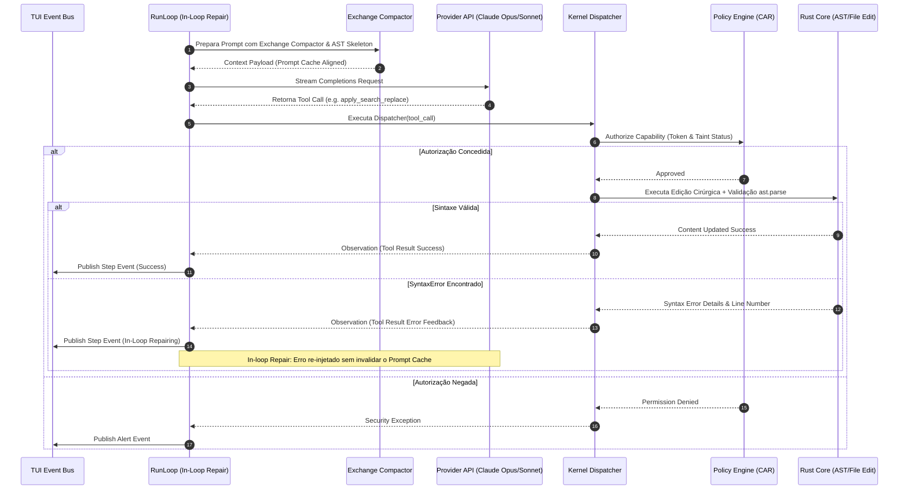

# BLUEPRINT COMPLETO DA ARQUITETURA DO AETHER v3.0.0B

> **Autor:** Tech Lead 2 (PhD) / Principal Software Architect  
> **Data:** 05 de Agosto de 2026  
> **Target:** `docs/rationale/rewrite_b/rewrite_v300_blueprint_arquitetura_B.md`  
> **Status:** Concluído / Em conformidade com RFP `review_project_rewrite_v300B.md`  
> **Tom de Escrita:** Analítico, baseado em evidências empíricas e propositivo (sem imperativos).

---

## 1. VISÃO GERAL DA ARQUITETURA HEXAGONAL & MODELO BRAIN/HANDS/EVOLVER

O **AETHER v3.0.0B** é estruturado sob os princípios de **Arquitetura Hexagonal (Ports & Adapters)**, **Capability Authorization (CAR Model)**, o desacoplamento **Brain / Hands / Session Log** (especificação *Anthropic Managed Agents 2026*) e o **GEPA Reflective Auto-Evolution Engine** (inspirado no *Hermes Self-Evolution*). O namespace final de produção é **`src/aether`**.

### Invariantes Estritos de Engenharia:
1. **Domínio Puro (`src/aether/domain/`):** Modelos Pydantic v2 puros, sem dependências de I/O, banco de dados ou APIs de terceiros.
2. **Portas Remotáveis (`src/aether/ports/`):** Interfaces `Protocol` totalmente assíncronas (`async`), cujos payloads são 100% serializáveis via Pydantic.
3. **Desacoplamento Brain vs. Hands vs. Evolver:**
   * **Brain (Agência & Prompting):** Orquestração e tomadas de decisão.
   * **Hands (Sandbox & Execução):** Camada estritamente isolada sem acesso não-autorizado.
   * **Evolver (Auto-Evolução Reflexiva):** Otimização offline baseada em análise de trajetórias de erro (GEPA).
4. **Módulo Nativo Rust (`src/aether/core_rs/`):** Biblioteca de alta performance exportada via **PyO3** para parsing AST Tree-sitter, indexação FTS5 e manipuladores nativos de Git Worktree.

---

## 2. ESTRUTURA GLOBAL DE DIRETÓRIOS (`src/aether/`)

```
src/aether/
├── __init__.py
├── cli.py                        # Entrypoint da linha de comando
├── core_rs/                      # Módulo nativo Rust (PyO3)
│   ├── Cargo.toml
│   └── src/
│       ├── ast_treesitter.rs     # AST Parsing de altíssima velocidade
│       ├── fast_indexer.rs       # Walk & FTS5 em Rust
│       └── worktree_native.rs    # Operações de Git Worktree nativas
├── domain/                       # Pure Domain Models (Zero I/O)
│   ├── __init__.py
│   ├── config.py
│   ├── content.py
│   ├── control.py
│   ├── events.py
│   └── trajectory.py
├── ports/                        # Interfaces Protocol (Contratos Hexagonais)
│   ├── __init__.py
│   ├── code_graph.py
│   ├── evaluator.py
│   ├── governor.py
│   ├── indexer.py
│   ├── memory.py
│   ├── model.py
│   ├── policy.py
│   ├── sandbox.py
│   ├── search.py
│   ├── tool_registry.py
│   ├── trajectory.py
│   └── workspace.py
├── kernel/                       # Trusted Computing Base (TCB)
│   ├── __init__.py
│   ├── bus.py                    # Event Bus Assíncrono
│   ├── dispatch.py               # Choke-point seguro de ferramentas
│   ├── governor.py               # Resource & Budget Governor
│   └── policy/
│       ├── engine.py             # Capability Authorization Register (CAR)
│       └── effects.py
├── adapters/                     # Implementações concretas das Portas
│   ├── code_graph/               # Adaptação Rust PyO3 Tree-sitter
│   ├── indexer/                  # Adaptação FTS5 & Search Service
│   ├── model/                    # Adaptação LLM (Opus / Sonnet / DeepSeek)
│   ├── sandbox/                  # Adaptação Docker/Podman Container
│   ├── search/                   # Adaptação Best-of-N & RRF Scoring
│   ├── tools/                    # Ferramentas nativas do sistema
│   ├── trajectory/               # Adaptação SQLite Engine
│   └── workspace/                # Adaptação Git Worktrees
├── agency/                       # Agência, Loop de Execução e Contexto
│   ├── __init__.py
│   ├── architect.py              # Modelo Arquiteto (Planejamento Conceitual)
│   ├── editor.py                 # Modelo Editor (Search/Replace cirúrgico)
│   ├── freeze.py                 # Hibernação FrozenRunState
│   ├── run_loop.py               # Real-Time In-Loop Repair Engine
│   └── context/
│       ├── assembler.py          # Montador de Contexto Alinhado a Cache
│       ├── compactor.py          # Exchange-Granular Compactor
│       ├── dynamic_dispatch.py   # Tool Search on Demand
│       └── taint_gate.py         # Sanitizador TaintGate
├── evolution/                    # Módulo de Auto-Evolução Reflexiva (SOTA)
│   ├── __init__.py
│   ├── gepa_evolver.py           # Otimizador Reflexivo de Prompts & Skills
│   ├── trace_miner.py            # Mineração de Trajetórias de Produção
│   └── dataset_exporter.py       # Exportador SFT / DPO
└── tui/                          # Terminal User Interface
    ├── __init__.py
    ├── app.py                    # Aplicação Rich/Textual
    ├── components/               # Painéis de Diff, Status e Logs
    └── view_model.py             # Adaptador de Eventos para a UI
```

---

## 3. DIAGRAMA ARQUITETURAL E FLUXO DE DADOS (MERMAID)

```mermaid
graph TB
    subgraph TUI_LAYER [Camada de Interface & UX (src/aether/tui)]
        TUI[Terminal UI - Rich / Textual App]
        CLI[CLI Commands Parser]
    end

    subgraph BRAIN_LAYER [Camada de Agência & Raciocínio - BRAIN (src/aether/agency)]
        RL[RunLoop Real-Time Repair Engine]
        ARCH[Architect Model - Planing]
        EDIT[Editor Model - Search/Replace]
        CTX[Context Assembler & Exchange Compactor]
        TAINT[TaintGate Sanitizer]
        DISPATCH[Tool Search on Demand]
    end

    subgraph EVOLVER_LAYER [Camada de Auto-Evolução Reflexiva (src/aether/evolution)]
        GEPA[GEPA Reflective Evolver]
        MINER[SessionDB Trace Miner]
        DPO[Dataset Exporter SFT/DPO]
    end

    subgraph KERNEL_LAYER [Trusted Computing Base - TCB (src/aether/kernel)]
        DISP[Kernel Dispatch Choke-Point]
        CAR[Capability Authorization Engine - Policy]
        BUS[Async Event Bus]
        GOV[Resource & Budget Governor]
    end

    subgraph HANDS_LAYER [Camada de Execução Isolada - HANDS (src/aether/adapters & core_rs)]
        A_LLM[LLM API Adapters - Opus/Sonnet/DeepSeek]
        A_WORK[Git Worktrees Adapter]
        A_RUST[Rust Core PyO3 - Tree-sitter & FTS5]
        A_CONTAINER[Docker/Podman Sandbox]
    end

    CLI --> RL
    TUI <--> BUS
    RL --> ARCH
    RL --> EDIT
    RL --> CTX
    CTX --> TAINT
    CTX --> DISPATCH
    
    RL --> DISP
    DISP --> CAR
    DISP --> GOV
    CAR --> BUS

    BUS --> MINER
    MINER --> GEPA
    GEPA -->|Otimiza Texto de Skills & Prompts| CTX
    MINER --> DPO

    DISP --> A_LLM
    DISP --> A_WORK
    DISP --> A_RUST
    DISP --> A_CONTAINER
```

---

## 4. FLUXO DO REAL-TIME IN-LOOP REPAIR ENGINE COM RUST AST CHECK

O diagrama a seguir detalha a execução do loop de reparo em tempo real com validação AST em Rust:



---

## 5. REQUISITOS DE CONFORMIDADE E REGRAS DE QUALIDADE

1. **Async I/O Concurrency:** Utilização exclusiva de `anyio` ou `asyncio` não-bloqueante em todas as operações de I/O.
2. **Type Hints & Rigor:** 100% de cobertura de tipagem estrita com `pyright` no modo strict e `ruff`.
3. **Zero Legacy Bloat:** Abstrações de terceiros genéricas são vedadas no núcleo. O harness do **AETHER v300B** é minimalista, desacoplado e customizado para alta performance.
