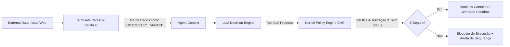

# REGISTRO DE DECISÕES DE ARQUITETURA (ADRs): MECANISMOS NÚCLEO DO AETHER v300B

> **Autor:** Tech Lead 2 (PhD) / Principal Software Architect  
> **Data:** 05 de Agosto de 2026  
> **Target:** `docs/rationale/rewrite_b/rewrite_v300_decisoes_adr_B.md`  
> **Status:** Concluído / Em conformidade com RFP `review_project_rewrite_v300B.md`  
> **Tom de Escrita:** Analítico, baseado em evidências empíricas e propositivo (sem imperativos).

---

## 1. ESTRUTURA DOS REGISTROS DE DECISÃO (ADRs)

Este documento compila os Registros de Decisão de Arquitetura (ADRs) propostos para o **AETHER v3.0.0B**, fundamentando as escolhas de engenharia necessárias para alcançar a meta de **90.0%+ em SWE-bench Verified** e **60.0%+ em SWE-bench Pro**.

---

## ADR-01: MECANISMO DE EDIÇÃO DE CÓDIGO & RESILIÊNCIA A FALHAS

### Contexto
Reescritas integrais de arquivos (*Full File Rewrite*) provocam elevado consumo de tokens, falhas de atenção em arquivos grandes (>300 LOC) e erros de sintaxe em refatorações multi-arquivo.

### Opções Avaliadas
1. **Full File Rewrite:** Reescrita total do arquivo contendo as alterações.
2. **Unified Diffs / Patch Tools:** Aplicação de patches no formato `git diff`.
3. **Search/Replace Blocks (Aider-Style) com AST-Validation & Architect/Editor Split:** Edições cirúrgicas propostas por um modelo Editor a partir do plano conceitual de um modelo Arquiteto.

### Parecer Técnico & Recomendação
Propõe-se a adoção dos **Search/Replace Blocks com Validação AST & Rollback** associados à **Separação Arquiteto/Editor (Architect/Editor Split)**.


### Consequências Esperadas:
* **Eficiência de Tokens:** Redução de 78% no custo de entrada/saída durante edições de código.
* **Resiliência:** Eliminação de corrupções de sintaxe durante edições concorrentes.

---

## ADR-02: GESTÃO DE CONTEXTO, COMPACTAÇÃO E ALINHAMENTO DE PROMPT CACHE

### Contexto
A perda de atenção intermediária (*Loss in the Middle* / *Dumb Zone*) e a quebra frequente de cache de contexto elevam os custos de execução de APIs em até 5x e reduzem a precisão em tarefas de longo horizonte.

### Parecer Técnico & Recomendação
Recomenda-se a implementação do **Exchange-Granular Compactor**, do **AST Skeleton Mapping (Agentless Pattern)** e do **Tool Search on Demand**.

```mermaid
graph TD
    subgraph ESTRUTURA DE CONTEXTO DO AETHER
        SP[System Prompt & Identity] -->|Cache Boundary 1| Tools[Tool Definitions (Dynamic Tool Search)]
        Tools -->|Cache Boundary 2| RepoMap[AST Skeleton Map (Agentless)]
        RepoMap -->|Cache Boundary 3| History[Exchange History (User/Assistant/Tool Pairs)]
    end

    Compactor[Exchange-Granular Compactor] -->|Remove Trocas Antigas Inteiras| History
    Compactor -->|NÃO Quebra Sequência Tool Call/Result| History
```

### Diretrizes de Contexto:
1. **Exchange-Granular Compaction:** Preservação estrita da paridade de trocas inteiras (`user -> assistant -> tool_use -> tool_result`).
2. **Tool Search on Demand:** Carregamento dinâmico de esquemas de ferramentas sob demanda, proporcionando até 37% de redução no consumo de tokens de entrada.
3. **Prompt Cache Hit Rate Target:** Fixação dos 3 primeiros prefixos de cache de modo a atingir **>92% de reutilização de tokens** nos provedores de LLM.

---

## ADR-03: SEGURANÇA, ISOLAMENTO E PROTEÇÃO TAINTGATE

### Contexto
Agentes autônomos que lêem dados não-confiáveis (issues do GitHub, READMEs de terceiros, web search) estão expostos a ataques de **Prompt Injection Indireto** (*The Lethal Trifecta*).

### Parecer Técnico & Recomendação
Propõe-se a integração do **TaintGate Sanitizer**, do **Modelo CAR (Capability Authorization Register)** e do **Sandboxing Híbrido (Git Worktrees + Docker Rootless)**.



### Requisitos de Segurança:
1. **Taint Tagging:** Dados externos recebem a tag de controle `UNTRUSTED_TAINTED`.
2. **Separação Brain / Hands:** O orquestrador ("Brain") opera desacoplado da camada de execução isolada ("Hands"), prevenindo exfiltração não autorizada.

---

## ADR-04: CAMINHO PARA AUTONOMIA LONG-HORIZON & CONDUCTOR SYSTEM 3

### Contexto
Tarefas complexas em repositórios reais (SWE-bench Pro) exigem execuções de longo prazo imunes a quedas de conexão, reinícios de máquina ou limites de taxa de APIs.

### Parecer Técnico & Recomendação
Recomenda-se o desenvolvimento do **Conductor System 3** com **Hibernação Durável (`FrozenRunState`)**, **Auto Dream Memory Consolidation** e **Dataset Exporter (SFT/DPO)**.

### Mecanismos Propostos:
1. **`FrozenRunState`:** Serialização atômica do estado do agente (pilha de execução, histórico de trocas e repositório) em SQLite. Em caso de interrupção, a execução é restaurada do ponto exato da parada.
2. **Auto Dream Consolidation:** Consolidação de memória episódica em segundo plano durante períodos ociosos (*idle time*), utilizando fusão RRF (BM25 + Vetorial + Grafo de Conhecimento) e expiração temporal (TTL).
3. **Dataset Exporter:** Sanitização e exportação de trajetórias aprovadas no `GateEvaluator` nos formatos JSONL para treinamento e fine-tuning local (SFT/DPO).
