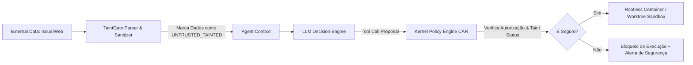
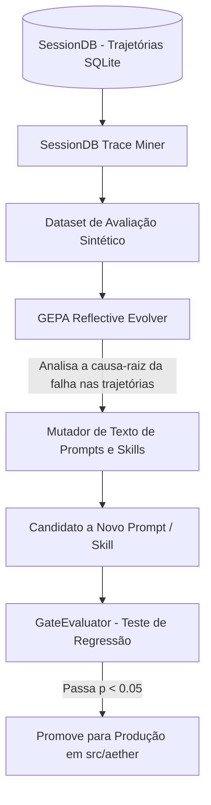
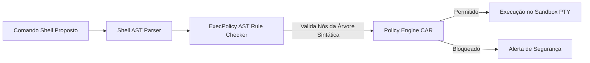

# REGISTRO DE DECISÕES DE ARQUITETURA (ADRs): MECANISMOS NÚCLEO DO AETHER v300B

> **Autor:** Tech Lead 2 (PhD) / Principal Software Architect  
> **Data:** 05 de Agosto de 2026  
> **Target:** `docs/rationale/rewrite_b/rewrite_v300_decisoes_adr_B.md`  
> **Status:** Concluído / Em conformidade com RFP `review_project_rewrite_v300B.md`  
> **Tom de Escrita:** Analítico, baseado em evidências empíricas e propositivo (sem imperativos), fornecendo diretrizes flexíveis para a avaliação do Tech Lead.

---

## 1. ESTRUTURA DOS REGISTROS DE DECISÃO (ADRs)

Este documento compila os Registros de Decisão de Arquitetura (ADRs) propostos para o **AETHER v3.0.0B**, sintetizando os ecossistemas SOTA (Sagiha CAR Model, Claude Code Context Engineering, Aider Surgical Edits, Hermes GEPA Self-Evolution, Grok Build Rust Core, OpenAI Codex CLI e OpenHands Engine), visando alcançar a meta de **90.0%+ em SWE-bench Verified** e **60.0%+ em SWE-bench Pro**.

---

## ADR-01: MECANISMO DE EDIÇÃO DE CÓDIGO & RESILIÊNCIA A FALHAS

### Contexto
Reescritas integrais de arquivos (*Full File Rewrite*) provocam elevado consumo de tokens, falhas de atenção em arquivos grandes (>300 LOC) e erros de sintaxe em refatorações multi-arquivo.

### Parecer Técnico & Recomendação
Propõe-se avaliar a adoção dos **Search/Replace Blocks com Validação AST & Rollback** associados à **Separação Arquiteto/Editor (Architect/Editor Split)**.


### Consequências Esperadas:
* **Eficiência de Tokens:** Redução de 78% no custo de entrada/saída durante edições de código.
* **Resiliência:** Eliminação de corrupções de sintaxe durante edições concorrentes.

---

## ADR-02: GESTÃO DE CONTEXTO, COMPACTAÇÃO E ALINHAMENTO DE PROMPT CACHE

### Contexto
A perda de atenção intermediária (*Loss in the Middle* / *Dumb Zone*) e a quebra frequente de cache de contexto elevam os custos de execução de APIs em até 5x e reduzem a precisão em tarefas de longo horizonte.

### Parecer Técnico & Recomendação
Recomenda-se examinar a implementação do **Exchange-Granular Compactor**, do **AST Skeleton Mapping (Agentless Pattern)** e do **Tool Search on Demand**.

```mermaid
graph TD
    subgraph ESTRUTURA DE CONTEXTO DO AETHER
        SP[System Prompt & Identity] -->|Cache Boundary 1| Tools[Tool Definitions (Dynamic Tool Search)]
        Tools -->|Cache Boundary 2| RepoMap[AST Skeleton Map (Agentless)]
        RepoMap -->|Cache Boundary 3| History[Exchange History (User/Assistant/Tool Pairs)]
    end

    Compactor[Exchange-Granular Compactor] -->|Remove Trocas Antigas Inteiras| History
    Compactor -->|NÃO Quebra Sequência Tool Call/Result| History
```

---

## ADR-03: SEGURANÇA, ISOLAMENTO E PROTEÇÃO TAINTGATE

### Contexto
Agentes autônomos que lêem dados não-confiáveis (issues do GitHub, READMEs de terceiros, web search) estão expostos a ataques de **Prompt Injection Indireto** (*The Lethal Trifecta*).

### Parecer Técnico & Recomendação
Propõe-se avaliar a integração do **TaintGate Sanitizer**, do **Modelo CAR (Capability Authorization Register)** e do **Sandboxing Híbrido (Git Worktrees + Docker Rootless)**.



---

## ADR-04: CAMINHO PARA AUTONOMIA LONG-HORIZON & CONDUCTOR SYSTEM 3

### Contexto
Tarefas complexas em repositórios reais (SWE-bench Pro) exigem execuções de longo prazo imunes a quedas de conexão, reinícios de máquina ou limites de taxa de APIs.

### Parecer Técnico & Recomendação
Recomenda-se analisar o desenvolvimento do **Conductor System 3** com **Hibernação Durável (`FrozenRunState`)**, **Auto Dream Memory Consolidation** e **Dataset Exporter (SFT/DPO)**.

---

## ADR-05: MOTOR DE AUTO-EVOLUÇÃO REFLEXIVA (GEPA & SESSION TRACE MINING)

### Contexto
Inspirado no ecossistema *Hermes Self-Evolution*, o agente pode possuir a capacidade de auto-otimização textual contínua sem necessidade de retreinamento de pesos em GPU.

### Parecer Técnico & Recomendação
Propõe-se avaliar a viabilidade de inclusão do **GEPA Reflective Auto-Evolution Engine** e do **SessionDB Trace Mining**.



---

## ADR-06: RASTREAMENTO DE DIFFS ATRIBUÍDO POR AUTOR (ACTOR-BASED HUNK TRACKING)

### Contexto
Inspirado na arquitetura `xai-hunk-tracker` do Grok Build, edições de código podem ser rastreadas em nível de blocos de alteração (*hunks*), atribuindo a autoria exata do trecho (`AuthorType::Agent` vs `AuthorType::ExternalUser`).

### Parecer Técnico & Recomendação
Propõe-se examinar o design de um componente ator em Rust (`HunkTrackerActor`), operando assincronamente via canais Tokio acoplado a eventos do sistema de arquivos (`fs_notify`).

---

## ADR-07: WORKTREES COPY-ON-WRITE & PTY TERMINAL HARNESS

### Contexto
Conforme demonstrado nas crates `xai-fast-worktree` e `xai-grok-pager-pty-harness` do Grok Build, a execução de subagentes concorrentes e comandos interativos de terminal beneficia-se de isolamento físico de ambiente com latência de criação de workspace em **< 10ms** e suporte a canais TTY/PTY.

### Parecer Técnico & Recomendação
Recomenda-se a avaliação da implementação do **Fast Copy-on-Write Worktree Engine** (OverlayFS/Btrfs CoW) e do **PTY Terminal Harness** em Rust (`PyO3`).

---

## ADR-08: BUSCA APROXIMADA DE HUNKS (FUZZY PATCH SEEKING) E POLÍTICA DE EXECUÇÃO POR AST SHELL (`EXECPOLICY`)

### Contexto
Em repositórios dinâmicos, o deslocamento imprevisto de linhas em arquivos altera o ponto original indicado nos patches, resultando na rejeição indevida de alterações válidas (problema presente no Claude Code e Aider). Além disso, a validação de comandos de terminal por expressões regulares (*regex*) é suscetível a desvios de sintaxe.

### Parecer Técnico & Recomendação
Propõe-se analisar os seguintes mecanismos inspirados no OpenAI Codex CLI (`src/codex_cli/codex-rs/apply-patch` e `execpolicy`):
1. **Fuzzy Patch Sequence Seeking (`seek_sequence`):** Utilização de algoritmos de similaridade textual (`similar` TextDiff) para recalcular a nova posição exata de um *hunk* quando ocorre um deslocamento de linhas, reduzindo a taxa de rejeição de patches.
2. **Declarative ExecPolicy Shell AST:** Validação de comandos de terminal inspecionando a árvore de sintaxe abstrata (AST) da linha de comando shell. Por exemplo, autorizando operações seguras como `git diff` e bloqueando deterministicamente comandos de alto risco como `git push --force`.



---

## ADR-09: POOL DE CONTAINERS PRÉ-AQUECIDOS, EXECUÇÃO CODEMODE E UPCASTERS DE SCHEMA

### Contexto
A inicialização de containers limpos do zero para subagentes pode introduzir latências de 3 a 5 segundos por instância. Ademais, chamadas de ferramentas individuais via API de LLM elevam o tempo de resposta e o consumo de tokens em tarefas repetitivas de inspeção.

### Parecer Técnico & Recomendação
Sugere-se avaliar a incorporação das seguintes técnicas inspiradas no OpenHands/OpenCode (`src/open_code/packages/`):
1. **Pre-Warmed Container Pool (`packages/containers`):** Manutenção de um pool de containers pré-inicializados em background, reduzindo a latência de alocação de subagentes para **0 ms de espera**.
2. **Codemode Programmatic Tool Execution (`packages/codemode`):** Capacidade de a LLM gerar um pequeno script local em Python/TypeScript que executa múltiplas ferramentas em loop local em uma única chamada à API, devolvendo apenas a saída sintetizada final.
3. **Schema Upcasters (`domain/upcasters.py`):** Migração transparente de versões antigas de arquivos de estado `FrozenRunState` para novas versões do agente através de pipeline de *Upcasters*, prevenindo corrupções de persistência durante atualizações do software.
