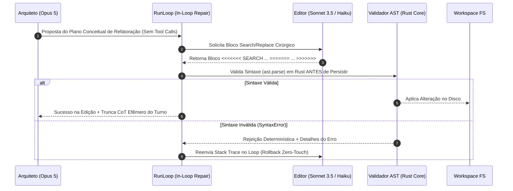
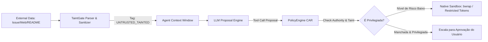

# REGISTRO DE DECISÕES DE ARQUITETURA (ADRs): MECANISMOS NÚCLEO DO AETHER v300B

> **Autor:** Tech Lead 2 (PhD) / Principal Software Architect  
> **Data:** 05 de Agosto de 2026  
> **Target:** `docs/rationale/rewrite_b/rewrite_v300_decisoes_adr_B.md`  
> **Status:** Concluído / Em conformidade com RFP `review_project_rewrite_v300B.md`  
> **Tom de Escrita:** Analítico, baseado em evidências empíricas e propositivo (sem imperativos), fornecendo diretrizes flexíveis para a avaliação do Tech Lead.

---

## 1. ESTRUTURA DOS REGISTROS DE DECISÃO (ADRs)

Este documento compila os Registros de Decisão de Arquitetura (ADRs) propostos para o **AETHER v3.0.0B**, sintetizando os avanços dos ecossistemas SOTA analisados (Claude Code / Ultimate Guide, paper arXiv 2605.18747, paper arXiv 2602.11988 da ETH Zürich, Sagiha CAR Engine, Hermes GEPA Self-Evolution, Grok Build Rust Core, OpenAI Codex CLI e OpenHands Engine), visando alcançar a meta de **90.0%+ em SWE-bench Verified** e **60.0%+ em SWE-bench Pro**.

---

## ADR-01: MECANISMO DE EDIÇÃO DE CÓDIGO, ARCHITECT/EDITOR SPLIT E TRUNCAÇÃO DE CoT EFÊMERO

### Contexto
Reescritas integrais de arquivos (*Full File Rewrite*) provocam elevado consumo de tokens, falhas de atenção em arquivos grandes (>300 LOC) e erros de sintaxe em refatorações multi-arquivo. Ademais, o raciocínio intermediário prolongado (*Chain-of-Thought - CoT*) polui o contexto de turnos subsequentes.

### Parecer Técnico & Recomendação
Propõe-se avaliar a adoção dos **Search/Replace Blocks com Validação AST em Rust & Rollback** associados à **Separação Arquiteto/Editor (Architect/Editor Split)** e à **Truncação de CoT Efêmero**.



### Mecanismos Propostos:
1. **Architect/Editor Split (`guide/workflows/dual-instance-planning.md`):** O modelo Arquiteto (Opus 5) dedica-se ao raciocínio conceitual de alto nível sem emitir chamadas diretas de escrita. O modelo Editor (Sonnet 3.5 / Haiku) gera os blocos *Search/Replace* cirúrgicos.
2. **Truncação de CoT Efêmero:** O histórico de contexto retém apenas as propostas de ferramentas e os resultados de execução (*observations*), descartando o raciocínio intermediário verboso de turnos passados.
3. **Rollback Zero-Touch:** SyntaxErrors são reinjetados no contexto do Editor em tempo real sem descartar o cache de prefixo do sistema.

---

## ADR-02: GESTÃO DE CONTEXTO, COMPACTAÇÃO GRANULAR E PREVENÇÃO DA "DUMB ZONE" (arXiv 2602.11988)

### Contexto
A pesquisa empírica da ETH Zürich (arXiv 2602.11988) e os estudos de atenção revelam que janelas de contexto longas (>100k tokens) sofrem atenuação de atenção par-a-par $O(n^2)$ na faixa intermediária dos 40%-60% da janela (**"Dumb Zone"**). Além disso, a geração automática de regras de configuração genéricas (`/init`) eleva os custos em **23%** e reduz a taxa de sucesso em **3%**.

### Parecer Técnico & Recomendação
Recomenda-se examinar a implementação do **Exchange-Granular Compactor**, do **AST Skeleton Mapping (Agentless Pattern)**, do **Tool Search on Demand** e de **Regras Curadas de Contexto**.

```mermaid
graph TD
    subgraph ESTRUTURA DE CONTEXTO DO AETHER (>92% CACHE HIT RATE)
        SP[System Prompt & Identity] -->|Cache Marker 1| Tools[Tool Definitions (Dynamic Tool Search)]
        Tools -->|Cache Marker 2| RepoMap[AST Skeleton Map (Agentless)]
        RepoMap -->|Cache Marker 3| History[Exchange History (User/Assistant/Tool Pairs)]
    end

    Compactor[Exchange-Granular Compactor] -->|Remove Trocas Antigas Inteiras| History
    Compactor -->|Preserva Paridade user->assistant->tool->result| History
```

### Diretrizes de Contexto:
1. **Exchange-Granular Compaction:** O compactador remove estritamente trocas completas (*user -> assistant -> tool_use -> tool_result*), garantindo a paridade da API e evitando corrupções no estado da LLM.
2. **Prompt Cache Hit Rate Target (>92%):** Estruturação do payload em 3 marcadores fixos de cache (Identity, Tool Definitions e AST Skeleton Map).
3. **Tool Search on Demand:** Carregamento dinâmico de esquemas de ferramentas diferidas, reduzindo os tokens de entrada iniciais em até 37%.
4. **Curadoria Determinística de Regras (`AGENTS.md`):** Regras de instrução devem ser curadas e concisas, evitando dumps genéricos de código.

---

## ADR-03: SEGURANÇA CONTRA A TRIFETA LETAL, TAINTGATE E SANDBOXING NATIVO EM RUST

### Contexto
Conforme documentado em `guide/security/security-hardening.md`, agentes autônomos que lêem dados externos estão expostos à **Trifeta Letal** (Dados Privados + Ingestão de Dados Externos Não-Confiáveis + Canal de Comunicação/Execução), abrindo vetor para **Prompt Injection Indireto**.

### Parecer Técnico & Recomendação
Propõe-se avaliar a integração do **TaintGate Sanitizer**, do **Modelo CAR (Capability Authorization Register)** e do **Sandboxing Nativo em Nível de SO**.



### Requisitos de Segurança:
1. **Taint Tagging (`UNTRUSTED_TAINTED`):** Todo conteúdo lido da web ou de repositórios de terceiros é etiquetado. Ferramentas sensíveis (`git push`, execução shell arbitrária) são bloqueadas ou exigem confirmação quando recebem parâmetros manchados.
2. **Sandboxing Nativo sem Docker:** Utilização de **Bubblewrap (`bwrap`)** no Linux (isolando namespaces de PID, rede e arquivos) e **Windows Restricted Tokens / Job Objects** no Windows nativamente em Rust (`core_rs`), reduzindo a latência de inicialização.

---

## ADR-04: AUTONOMIA LONG-HORIZON, CONDUCTOR SYSTEM 3 E MEMÓRIA BITEMPORAL AUTO DREAM

### Contexto
Tarefas complexas em repositórios reais (SWE-bench Pro) exigem execuções autônomas de múltiplos dias imunes a falhas de rede, reboots ou esgotamento de taxa de API.

### Parecer Técnico & Recomendação
Recomenda-se analisar o desenvolvimento do **Conductor System 3** com **Hibernação Durável (`FrozenRunState`)**, **Auto Dream Memory Consolidation** e **Dataset Exporter (SFT/DPO)**.

```mermaid
graph TD
    subgraph CONDUCTOR_SYSTEM_3 [Conductor System 3 Multi-Agent Engine]
        Task[Master Task] --> Conductor[Conductor Manager]
        Conductor -->|DAG Decomposition| Sub1[Subagent 1: Spec]
        Conductor -->|DAG Decomposition| Sub2[Subagent 2: Test Writer]
        Conductor -->|DAG Decomposition| Sub3[Subagent 3: Implementation]
        
        Sub1 -->|Serialized Run State| SQLiteDB[(SQLite Session Store WAL)]
        Sub2 -->|Serialized Run State| SQLiteDB
        Sub3 -->|Serialized Run State| SQLiteDB
    end

    SQLiteDB -->|Idle Time Worker| AutoDream[Auto Dream Memory Consolidation]
    AutoDream -->|RRF Fusion: BM25 + SQLite-vec| CuratedMemory[Curated MEMORY.md]
```



### Mecanismos Propostos:
1. **`FrozenRunState`:** Serialização atômica do estado do agente (pilha de execução, histórico de trocas e repositório) em SQLite. Permite suspender e retomar a execução sem perda de progresso.
2. **Auto Dream Consolidation Engine:** Consolidação em segundo plano durante períodos ociosos (*idle time*), utilizando fusão RRF (Reciprocal Rank Fusion: BM25 + Vetores + Grafo de Conhecimento) e expiração temporal (TTL).

---

## ADR-05: MOTOR DE AUTO-EVOLUÇÃO REFLEXIVA (GEPA & SESSION TRACE MINING)

### Contexto
Inspirado no ecossistema *Hermes Self-Evolution*, o agente pode possuir a capacidade de auto-otimização textual contínua sem necessidade de retreinamento de pesos em GPU.

### Parecer Técnico & Recomendação
Propõe-se avaliar a viabilidade de inclusão do **GEPA Reflective Auto-Evolution Engine** e do **SessionDB Trace Mining**.

---

## ADR-06: RASTREAMENTO DE DIFFS ATRIBUÍDO POR AUTOR (ACTOR-BASED HUNK TRACKING)

### Contexto
Inspirado na arquitetura `xai-hunk-tracker` do Grok Build, edições de código podem ser rastreadas em nível de blocos de alteração (*hunks*), atribuindo a autoria exata do trecho (`AuthorType::Agent` vs `AuthorType::ExternalUser`).

### Parecer Técnico & Recomendação
Propõe-se examinar o design de um componente ator em Rust (`HunkTrackerActor`), operando assincronamente via canais Tokio acoplado a eventos do sistema de arquivos (`fs_notify`).

---

## ADR-07: WORKTREES COPY-ON-WRITE & PTY TERMINAL HARNESS

### Contexto
Conforme demonstrado nas crates `xai-fast-worktree` e `xai-grok-pager-pty-harness` do Grok Build, a execução de subagentes concorrentes e comandos interativos de terminal beneficia-se de isolamento físico de ambiente com latência de criação de workspace em **< 10ms** e suporte a canais TTY/PTY.

### Parecer Técnico & Recomendação
Recomenda-se a avaliação da implementação do **Fast Copy-on-Write Worktree Engine** (OverlayFS/Btrfs CoW) e do **PTY Terminal Harness** em Rust (`PyO3`).

---

## ADR-08: BUSCA APROXIMADA DE HUNKS (FUZZY PATCH SEEKING) E POLÍTICA DE EXECUÇÃO POR AST SHELL (`EXECPOLICY`)

### Contexto
Em repositórios dinâmicos, o deslocamento imprevisto de linhas em arquivos altera o ponto original indicado nos patches. Além disso, a validação de comandos de terminal por expressões regulares (*regex*) é suscetível a desvios de sintaxe.

### Parecer Técnico & Recomendação
Propõe-se analisar os seguintes mecanismos inspirados no OpenAI Codex CLI (`src/codex_cli/codex-rs/apply-patch` e `execpolicy`):
1. **Fuzzy Patch Sequence Seeking (`seek_sequence`):** Utilização de algoritmos de similaridade textual (`similar` TextDiff) para recalcular a nova posição exata de um *hunk* quando ocorre deslocamento de linhas.
2. **Declarative ExecPolicy Shell AST:** Validação de comandos de terminal inspecionando a árvore de sintaxe abstrata (AST) da linha de comando shell.

---

## ADR-09: POOL DE CONTAINERS PRÉ-AQUECIDOS, EXECUÇÃO CODEMODE E UPCASTERS DE SCHEMA

### Contexto
A inicialização de containers limpos do zero para subagentes pode introduzir latências de 3 a 5 segundos por instância.

### Parecer Técnico & Recomendação
Sugere-se avaliar a incorporação das seguintes técnicas inspiradas no OpenHands/OpenCode (`src/open_code/packages/`):
1. **Pre-Warmed Container Pool (`packages/containers`):** Pool de containers pré-inicializados em background, reduzindo a latência de alocação de subagentes para **0 ms de espera**.
2. **Codemode Programmatic Tool Execution (`packages/codemode`):** Capacidade de a LLM gerar um pequeno script local em Python/TypeScript que executa múltiplas ferramentas em loop local em uma única chamada à API.
3. **Schema Upcasters (`domain/upcasters.py`):** Migração transparente de versões antigas de arquivos de estado `FrozenRunState` para novas versões através de pipeline de *Upcasters*.
