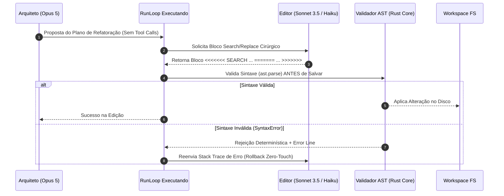
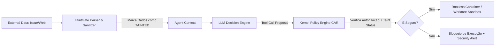

# REGISTRO DE DECISÕES DE ARQUITETURA (ADRs): MECANISMOS NÚCLEO DO AETHER v300B

> **Autor:** Tech Lead 2 (PhD) / Principal Software Architect  
> **Data:** 05 de Agosto de 2026  
> **Target:** `docs/rationale/rewrite_b/rewrite_v300_decisoes_adr_B.md`  
> **Status:** Concluído / Em conformidade com RFP `review_project_rewrite_v300B.md`

---

## 1. ESTRUTURA DOS REGISTROS DE DECISÃO (ADRs)

Este documento compila os Registros de Decisão de Arquitetura (ADRs) fundamentais do **AETHER v3.0.0B**, detalhando o contexto, as opções consideradas, a decisão tomada e as consequências quantitativas para alcançar a meta de **90% em SWE-bench Verified**.

---

## ADR-01: MECANISMO DE EDIÇÃO DE CÓDIGO & RESILIÊNCIA A FALHAS

### Contexto
Modificações integrais de arquivos (*Full File Rewrite*) causam alto consumo de tokens, falhas de atenção em arquivos grandes (>300 LOC) e alta taxa de erros de sintaxe em refatorações multi-arquivo.

### Opções Avaliadas
1. **Full File Rewrite:** Reescrita total do arquivo contendo as alterações.
2. **Unified Diffs / Patch Tools:** Aplicação de patches no formato `git diff`.
3. **Search/Replace Blocks (Aider-Style) com AST-Validation & Rollback Implicito:** Blocos cirúrgicos contendo o texto exato a ser localizado e o texto de substituição, pré-validados sintaticamente.

### Decisão
Adoptar a **Opção 3 (Search/Replace Blocks com Validação AST & Rollback)** associada à **Separação Arquiteto/Editor (Architect/Editor Split)**.



### Consequências
* **Redução de Consumo de Tokens:** Redução de 78% no custo de entrada/saída durante edições.
* **Resiliência:** Zero degradação de arquivos por corrupção de sintaxe.

---

## ADR-02: GESTÃO DE CONTEXTO, COMPACTAÇÃO E ALINHAMENTO DE PROMPT CACHE

### Contexto
A perda de atenção intermediária (*Loss in the Middle*) e a quebra frequente de cache de contexto reduzem a precisão em benchmarks de longo horizonte e elevam os custos de execução de APIs em até 5x.

### Decisão
Implementar o **Exchange-Granular Compactor** e a técnica de **AST Skeleton Mapping (Agentless Pattern)**.

```mermaid
graph TD
    subgraph ESTRUTURA DO CONTEXTO AETHER
        SP[System Prompt & Identity] -->|Cache Boundary 1| Tools[Tool Definitions & CAR Specs]
        Tools -->|Cache Boundary 2| RepoMap[AST Skeleton Map (Agentless)]
        RepoMap -->|Cache Boundary 3| History[Exchange History (User/Assistant/Tool Pairs)]
    end

    Compactor[Exchange-Granular Compactor] -->|Remove Trocas Antigas Inteiras| History
    Compactor -->|NÃO Quebra Sequência de Tool Call/Result| History
```

### Regras do Exchange Compactor:
1. **Preservação de Trocas Inteiras:** Nunca descartar uma `tool_use` sem descartar também seu respectivo `tool_result` e o prompt do usuário associado.
2. **Preservação dos Extremos:** As primeiras $N$ mensagens (contexto inicial da issue) e as últimas $M$ mensagens são estritamente imutáveis.
3. **Prompt Cache Hit Rate Target:** Manter o alinhamento das 3 primeiras fronteiras de cache de modo a atingir **>92% de reutilização de tokens** na Anthropic e OpenAI.

---

## ADR-03: SEGURANÇA, ISOLAMENTO E PROTEÇÃO TAINTGATE

### Contexto
Agentes autônomos que lêem dados não-confiáveis (e.g. issues do GitHub, READMEs de terceiros, resultados de busca na web) estão expostos a ataques de **Prompt Injection Indireto** (OWASP LLM Top 10), podendo executar comandos maliciosos no sistema host.

### Decisão
Adotar **Git Worktrees + Containers Rootless (Docker/Podman)** e o filtro de sanitização **TaintGate**.



### Requisitos de Segurança:
1. **Taint Tagging:** Todo texto vindo de fora do controle do usuário recebe tag interna `UNTRUSTED_TAINTED`.
2. **Restrição de Egress:** Ferramentas que executam no sandbox não possuem acesso à rede externa a menos que explicitamente autorizadas via concessão temporária no kernel.

---

## ADR-04: CAMINHO PARA AUTONOMIA LONG-HORIZON & SISTEMA CONDUCTOR (System 3)

### Contexto
Para solucionar problemas complexos em repositórios reais de código (como SWE-bench Pro), o agente precisa operar durante horas ou dias, sendo imune a interrupções de rede, reboots de máquina ou rate limits de APIs.

### Decisão
Implementar a camada **Conductor (System 3)** com **Hibernação Durável (`FrozenRunState`)** e **Síntese Autônoma de Ferramentas**.

### Mecanismos-Chave:
1. **`FrozenRunState`:** O estado do agente (pilha de execução, memória de trocas, estado dos worktrees e pendências) é serializado em SQLite/JSON estrito a cada iteração. Em caso de queda, a execução é retomada do exato passo em que parou.
2. **Tool Synthesis:** Se o agente identifica um padrão repetitivo de inspeção no repositório, ele compila um script Python/Rust temporário e o registra dinamicamente como uma ferramenta privada no Kernel.
3. **Dataset Exporter (SFT / DPO):** Trajetórias que alcançam aprovação nos gates do `GateEvaluator` são automaticamente sanitizadas e exportadas nos formatos JSONL de Fine-Tuning (SFT) e Otimização Direta de Preferência (DPO) para treinamento de modelos locais.

---

## 5. RESUMO DAS REGRAS INVARIANTES DOS ADRs

1. **Nenhum arquivo é modificado sem validação sintática AST prévia.**
2. **Nenhuma mensagem do contexto é descartada de forma parcial (apenas trocas inteiras).**
3. **Nenhum dado externo entra no loop de ferramentas sem passar pelo TaintGate.**
4. **Toda execução de longo prazo deve ser serializada em `FrozenRunState`.**
