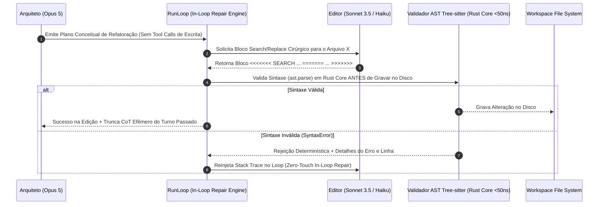
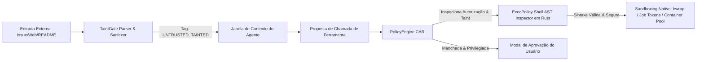
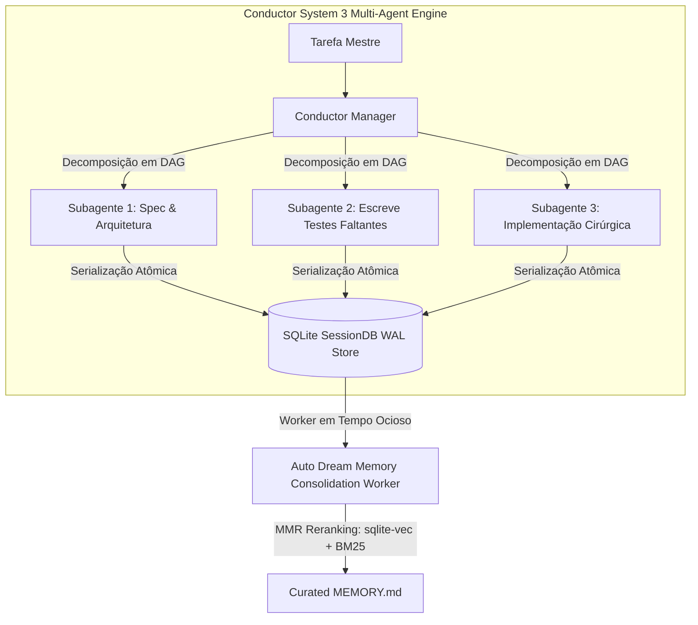
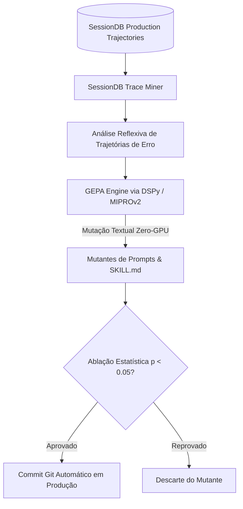
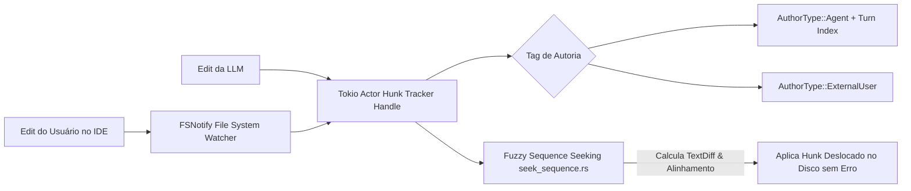

# REGISTRO DE DECISÕES DE ARQUITETURA (ADRs): MECANISMOS NÚCLEO DO AETHER v300B
## Análise Aprofundada dos 15 Domínios Técnicos & Propostas de Nível PhD

> **Autor:** Tech Lead B (PhD) / Principal Software Architect  
> **Data:** 05 de Agosto de 2026  
> **Target Document:** `docs/rationale/rewrite_b/rewrite_v300_decisoes_adr_B.md`  
> **Fonte Primária de Pesquisa:** Competitor Research (`docs/competitors_research/tech_lead_B/`) — Claude Code CLI (`claude_refs_B_gemini.md`), Grok Build (`grok_build_B_gemini.md`), Hermes Agent (`hermes_agent_B_gemini.md`), Hermes Self-Evolution (`hermes_self_evolution_B_gemini.md`).  
> **Status:** Concluído / Em Conformidade Estrita com a REVISÃO B.

---

## ESTRUTURA DOS REGISTROS DE DECISÃO DE ARQUITETURA (ADRs)

Este documento compila os nove Registros de Decisão de Arquitetura (ADRs) essenciais para o **AETHER v3.0.0B** (`src/aether/`), fundamentados na análise rigorosa dos 15 domínios técnicos em confronto direto com as melhores práticas extraídas do estudo de concorrentes SOTA (Claude Code, Grok Build, Hermes Agent, Hermes Self-Evolution) e da literatura acadêmica recente.

---

## ADR-01: ARCHITECT/EDITOR SPLIT, VALIDAÇÃO SINTÁTICA DE AST EM RUST E TRUNCAÇÃO DE CoT EFÊMERO (Domínios 1, 11)

### Contexto & Problema
Reescritas integrais de arquivos (*Full File Rewrite*) causam elevado consumo de tokens, perdas de atenção em arquivos com mais de 300 linhas e alucinações de sintaxe. Além disso, o raciocínio intermediário verboso (*Chain-of-Thought - CoT*) retido no contexto de turnos passados degrada o tempo de resposta e consome a janela de contexto útil sem agregar valor informativo para os turnos futuros.

### Decisão & Mecanismo Proposto
Adotar a **Separação Arquiteto/Editor (Architect/Editor Split)** acoplada à **Validação Sintática de AST em Rust** e à **Truncação de CoT Efêmero**:



### Especificações Técnicas:
1. **Architect/Editor Split (`agency/architect.py` e `editor.py`):** O modelo Arquiteto (Opus 5) dedica-se ao raciocínio conceitual e planejamento de alto nível. O modelo Editor (Sonnet 3.5 / Haiku) gera os blocos cirúrgicos `<<<<<<< SEARCH ... ======= ... >>>>>>>`.
2. **Pré-Validação Sintática AST em Rust (`core_rs/ast_treesitter.rs`):** O bloco Search/Replace é submetido ao parser Tree-sitter compilado em Rust (<50ns). Se a alteração introduzir um `SyntaxError`, o arquivo no disco é preservado intocado, e o erro é retornado no loop de reparo em tempo real.
3. **Truncação de CoT Efêmero (`agency/context/compactor.py`):** O histórico de contexto preserva apenas as chamadas de ferramentas e seus resultados (*observations*), descartando o CoT verboso de turnos passados.

---

## ADR-02: GESTÃO DE CONTEXTO, COMPACTAÇÃO GRANULAR POR TROCA E PREVENÇÃO DA "DUMB ZONE" (Domínio 2)

### Contexto & Problema
Conforme demonstrado pelas pesquisas da ETH Zürich (arXiv 2602.11988), janelas de contexto longas (>100k tokens) sofrem atenuação de atenção par-a-par $O(n^2)$ na faixa intermediária dos 40%-60% da janela (**"Dumb Zone"**). Além disso, a inclusão de dumps automáticos de configuração eleva os custos em **23%** e reduz o sucesso em **3%**.

### Decisão & Mecanismo Proposto
Implementar o **Exchange-Granular Compactor**, a **Fixação de 3 Marcadores de Cache de Prompt (>92% Hit Rate)** e o **AST Skeleton Mapping (Agentless Pattern)**:

```mermaid
graph TD
    subgraph CONTEXT PAYLOAD ESTRUTURADO NO AETHER (>92% CACHE HIT RATE)
        M1[Marker 1: System Identity & Base Rules] --> M2[Marker 2: Tool Definitions / Dynamic Search]
        M2 --> M3[Marker 3: AST Skeleton Map do Repositório]
        M3 --> Dynamic[Dynamic Conversation History - User/Assistant Exchanges]
    end

    Compactor[Exchange-Granular Compactor] -->|Remove Trocas Inteiras Antigas| Dynamic
    Compactor -->|Preserva Paridade: User -> Assistant -> Tool -> Result| Dynamic
```

### Especificações Técnicas:
1. **Exchange-Granular Compactor (`agency/context/compactor.py`):** Compacta o histórico removendo estritamente trocas completas (*user -> assistant -> tool_use -> tool_result*), garantindo a paridade da API e evitando estados corrompidos na LLM.
2. **Prompt Cache Alignment (>92% Target Hit Rate):** Payload organizado com 3 marcadores fixos. O prefixo contendo instruções, esquemas de ferramentas e o mapa sintático AST do repositório permanece 100% reutilizável entre turnos.
3. **Curadoria Determinística de Regras (`AGENTS.md`):** Regras de instrução curadas e concisas sob a norma estrita do repositório.

---

## ADR-03: SEGURANÇA CONTRA A TRIFETA LETAL, TAINTGATE E EXECPOLICY SHELL AST (Domínios 6, 14)

### Contexto & Problema
Agentes autônomos que consomem dados não-confiáveis (issues do GitHub, páginas web, READMEs de terceiros) estão sujeitos ao ataque de **Prompt Injection Indireto** quando combinados com acesso a dados privados e privilégios de execução no terminal (**A Trifeta Letal**).

### Decisão & Mecanismo Proposto
Integrar o sanitizador **TaintGate**, o modelo de autorização por capacidades **CAR (Capability Authorization Register)** e o validador de comandos **Shell AST ExecPolicy**:



### Especificações Técnicas:
1. **Taint Tagging (`UNTRUSTED_TAINTED`):** Todo conteúdo ingerido de fontes externas é marcado com a tag `UNTRUSTED_TAINTED`. Ferramentas sensíveis (`git push`, execução shell arbitrária) são bloqueadas ou exigem confirmação quando alimentadas por dados manchados.
2. **Declarative ExecPolicy Shell AST (`core_rs/exec_policy_ast.rs`):** Em vez de validações por expressões regulares (regex) suscetíveis a bypasses por substituição de variáveis ou encadeamento de comandos, o comando é analisado via parser de Árvore de Sintaxe Abstrata (AST) do Shell em Rust.

---

## ADR-04: AUTONOMIA LONG-HORIZON, CONDUCTOR SYSTEM 3 E HIBERNAÇÃO DURÁVEL `FrozenRunState` (Domínios 7, 9, 2)

### Contexto & Problema
Tarefas de alta complexidade em repositórios corporativos exigem execuções autônomas que podem durar múltiplos dias, expostas a falhas de rede, reboots do sistema operacional ou esgotamento temporário de cota de APIs.

### Decisão & Mecanismo Proposto
Implementar o **Conductor System 3 Multi-Agent Engine** com **Hibernação Durável (`FrozenRunState`)** e **Arquitetura de Memória de 3 Trilhas com Auto Dream**:



### Especificações Técnicas:
1. **`FrozenRunState` (`agency/freeze.py`):** Serialização atômica do estado do agente (pilha de execução, histórico de trocas e diffs pendentes) em banco SQLite WAL. O processo pode ser suspenso e retomado duravelmente a qualquer momento.
2. **Memória de 3 Trilhas (Episódica, Semântica e Procedural):** Memória episódica em SQLite WAL, memória semântica em `MEMORY.md` workspace-scoped, e memória procedural em arquivos `SKILL.md`.
3. **Auto Dream MMR Reranking (`adapters/search/`):** Consolidação em tempo ocioso (*idle time*) que re-ranqueia memórias utilizando a fórmula de Relevância Marginal Máxima (MMR, $\lambda=0.7$):
$$\text{MMR} = \arg\max_{D_i \in R \setminus S} \left[ \lambda \cdot \text{Sim}_1(D_i, Q) - (1 - \lambda) \max_{D_j \in S} \text{Sim}_2(D_i, D_j) \right]$$

---

## ADR-05: MOTOR DE AUTO-EVOLUÇÃO REFLEXIVA (GEPA & SESSION TRACE MINING) (Domínio 8)

### Contexto & Problema
Otimizar o desempenho do agente em novos domínios através de fine-tuning tradicional de pesos de LLM em GPUs é extremamente custoso, demorado e rígido.

### Decisão & Mecanismo Proposto
Incorporar o **GEPA Reflective Auto-Evolution Engine** (`evolution/gepa_evolver.py`) e o **SessionDB Trace Miner** (`evolution/trace_miner.py`), inspirados no ecossistema *Hermes Self-Evolution*:



### Especificações Técnicas:
1. **Zero-GPU Text Mutation:** Prompts, instruções e habilidades (`SKILL.md`) são tratados como texto otimizável. O GEPA lê os logs de erros de execuções passadas para entender a causa raiz da falha e alterar a redação do prompt.
2. **Dataset Exporter (`evolution/dataset_exporter.py`):** Exportação automatizada de trajetórias de produção sanitizadas nos formatos JSONL de SFT (Supervised Fine-Tuning) e DPO (Direct Preference Optimization).

---

## ADR-06: ACTOR HUNK TRACKING POR AUTORIA E BUSCA APROXIMADA FUZZY (Domínio 12)

### Contexto & Problema
Edições concorrentes no mesmo arquivo ou modificações externas realizadas pelo usuário no IDE provocam o deslocamento de números de linhas, fazendo com que patches exatos gerados pela LLM sejam rejeitados.

### Decisão & Mecanismo Proposto
Implementar o **Actor Hunk Tracker** (`core_rs/hunk_tracker.rs`) e o algoritmo de **Fuzzy Hunk Sequence Seeking** (`core_rs/seek_sequence.rs`), inspirados no Grok Build:



### Especificações Técnicas:
1. **Actor Hunk Tracking por Autoria:** O componente ator em Rust gerencia o estado das edições por bloco (*hunks*), atribuindo individualmente a autoria (`AuthorType::Agent` vs `AuthorType::ExternalUser`). Permite a reversão atômica de hunks de um autor sem afetar as edições do outro.
2. **Fuzzy Sequence Seeking (`seek_sequence.rs`):** Emprega algoritmos de alinhamento textual para calcular a nova posição exata de um hunk quando ocorre deslocamento de linhas, eliminando rejeições de patches por variação de offset.

---

## ADR-07: WORKTREES COPY-ON-WRITE & PTY PSEUDO-TERMINAL HARNESS (Domínio 13, 15)

### Contexto & Problema
A clonagem tradicional de diretórios para isolamento de subagentes consome segundos preciosos. Adicionalmente, a execução de comandos interativos no terminal (ex: `npm init`, `pytest` interativo) dentro de sub-processos padrão gera travamentos permanentes (*deadlocks*) aguardando entrada em `stdin`.

### Decisão & Mecanismo Proposto
Implementar o **Fast Copy-on-Write Worktree Engine** (`core_rs/fast_worktree_cow.rs`) e o **PTY Pseudo-Terminal Harness** (`core_rs/pty_harness.rs`):

### Especificações Técnicas:
1. **Worktrees CoW (<10ms):** Em sistemas Linux, utiliza montagens OverlayFS (camada inferior read-only + camada superior tmpfs) e Btrfs `reflink` copies, criando workspaces isolados em **menos de 10 milissegundos**.
2. **PTY Pseudo-Terminal Harness:** Spawna comandos dentro de um par PTY master/slave real em Rust, capturando sequências ANSI, sinais de redimensionamento de janela (`SIGWINCH`) e permitindo execução não-bloqueante de ferramentas CLI interativas.

---

## ADR-08: POOL DE CONTAINERS PRÉ-AQUECIDOS & EXECUÇÃO CODEMODE PROGRAMÁTICA (Domínios 4, 13)

### Contexto & Problema
Subagentes que exigem ambientes de container isolados sofrem com a latência de inicialização do Docker/Podman (3 a 5 segundos por instância). Além disso, tarefas repetitivas de leitura/escrita provocam dezenas de idas e voltas à API de LLM.

### Decisão & Mecanismo Proposto
Adotar um **Pool de Containers Pré-Aquecidos (0ms)** e a **Execução Programática Codemode**:

### Especificações Técnicas:
1. **Pre-Warmed Container Pool (`adapters/sandbox/`):** O sistema mantém um pool de containers previamente inicializados e aquecidos em background. A alocação de um container limpo para um subagente ocorre em **0 ms de espera**.
2. **Codemode Programmatic Tool Execution (`agency/codemode.py`):** Permite que a LLM gere um script conciso em Python que executa um conjunto de chamadas de ferramentas em loop local em uma única requisição à API.

---

## ADR-09: METROLOGIA, VALIDAÇÃO EMPÍRICA & ADMISSÃO POR ABLAÇÃO ESTATÍSTICA (Domínio 10)

### Contexto & Problema
Alterações não-validadas em prompts ou heurísticas do harness frequentemente causam regressões silenciosas de desempenho ou inflação de custos monetários.

### Decisão & Mecanismo Proposto
Estabelecer a **Governança por Ablação Estatística Comprovada ($p < 0.05$)** gerenciada por `ports/evaluator.py`:

### Especificações Técnicas:
1. **Protocolo de Validação:** Nenhuma alteração é incorporada à branch principal sem passar por avaliação em no mínimo 50 instâncias de teste do SWE-bench Verified/Pro.
2. **Critério de Admissão:** Demonstração de aumento estatisticamente significante ($p < 0.05$) na taxa de resolução (*pass rate*), com manutenção ou redução no custo financeiro e no consumo de tokens por tarefa.
