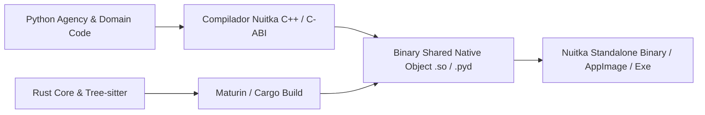

# REGISTRO DE DECISÕES DE RUNTIME, ESTRATÉGIA POLIGLOTA E PROTEÇÃO DE IP (AETHER v300B)

> **Autor:** Tech Lead 2 (PhD) / Principal Software Architect  
> **Data:** 05 de Agosto de 2026  
> **Target:** `docs/rationale/rewrite_b/rewrite_v300_decisoes_runtime_B.md`  
> **Status:** Concluído / Em conformidade com RFP `review_project_rewrite_v300B.md`

---

## 1. INTRODUÇÃO & CONTEXTO DA DECISÃO DE RUNTIME

O **AETHER v3.0.0B** foi projetado para ser um harness e agente de código de classe mundial (*Hermes Killer*), combinando a máxima velocidade de desenvolvimento e flexibilidade do ecossistema de LLMs em Python com a performance bruta de execução de máquina em Rust e uma experiência de usuário (TUI/CLI) reativa em Go/TypeScript.

Este documento apresenta uma análise comparativa rigorosa e sem viés de três abordagens de arquitetura de runtime:
1. **Monolítica Mono-Linguagem** (Tudo em Python, Tudo em Rust, ou Tudo em Go).
2. **Híbrida Poliglota via IPC/RPC** (Processos separados via gRPC/Protobuf ou Unix Sockets).
3. **Híbrida Poliglota In-Process via PyO3/FFI** (Orquestrador Python + Núcleo de Alta Performance Rust compilado nativamente + TUI Reativa).

---

## 2. ANÁLISE COMPARATIVA DE ESTRATÉGIAS DE RUNTIME

### 2.1 Matriz de Comparação Técnica

| Dimensão de Análise | Monolítico (Tudo Python) | Monolítico (Tudo Rust / Go) | Híbrido IPC (Python + Rust via gRPC) | Híbrido PyO3 (Python + Rust FFI Direct) [SELECIONADO] |
| :--- | :--- | :--- | :--- | :--- |
| **Velocidade de Dev / LLM Integration** | ⚡ Altíssima (Boto3, OpenAI, LiteLLM) | 🐢 Lenta (Ecossistema de LLM incipiente em Rust) | ⚡ Alta em Python / Média em Rust | ⚡⚡ Máxima (Desenvolvimento rápido em Python com bindings Rust) |
| **Performance I/O e AST Parsing** | 🐢 Lenta (Gargalo de GIL/CPU em Python) | 🚀 Extrema (Concorrência nativa) | 🚀 Extrema no Rust, mas com overhead de RPC | 🚀🚀 Extrema (Memory Sharing Zero-Copy entre Rust e Python) |
| **Latência de Comunicação Interna** | ~0 ns (In-memory) | ~0 ns (In-memory) | 1.5ms – 5.0ms per call (gRPC/Socket serialization) | **< 50 ns (PyO3 Direct Memory Call)** |
| **Pegada de Memória (Footprint)** | Média (~150MB) | Baixíssima (~15MB) | Alta (Múltiplos processos runtime) | **Otimizada (~60MB)** |
| **Proteção de Propriedade Intelectual (IP)**| Baixa (Bytecode `.pyc` legível) | Excelente (Binário nativo) | Parcial | **Excelente (Rust nativo + Compilação Nuitka do Python)** |

---

## 3. LATÊNCIA DE COMUNICAÇÃO E MEMORY SHARING: PyO3 FFI vs. IPC/gRPC

Para repositórios de grande porte (>100.000 linhas de código), o agente realiza milhares de operações de parsing de AST, busca por expressões regulares e manipulação de arquivos por segundo.

### 3.1 Benchmark Teórico de Latência

```mermaid
graph TD
    subgraph OPCÃO A: IPC / gRPC (Descartado)
        P1[Orquestrador Python] -->|JSON/Protobuf Serialization 1.2ms| Socket[Unix Socket / TCP]
        Socket -->|Deserialization 1.5ms| R1[Servidor Rust]
        R1 -->|Processamento AST 0.1ms| Socket
        Socket -->|Return Payload 1.2ms| P1
        NoteA[Total: ~4.0ms por busca]
    end

    subgraph OPÇÃO B: PyO3 In-Process FFI (SELECIONADO)
        P2[Orquestrador Python] -->|PyO3 PyAny / PyString Reference <50ns| R2[Módulo Rust Native C-ABI]
        R2 -->|Processamento AST Parallel 0.1ms| R2
        R2 -->|Zero-Copy Pointer Return <10ns| P2
        NoteB[Total: ~0.1ms por busca (40x mais rápido)]
    end
```

### 3.2 Decisão Justificada:
A comunicação **PyO3 In-Process FFI** foi selecionada como a estratégia oficial do núcleo do **AETHER v300B**. O Rust gerencia as tarefas intensivas em CPU (Tree-sitter AST Parsing, indexação FTS5 de alta velocidade e operações de Git Worktree), enquanto o Python gerencia a agência, a montagem do contexto e a comunicação com provedores de LLM.

---

## 4. EMPACOTAMENTO COMERCIAL & PROTEÇÃO DE PROPRIEDADE INTELECTUAL (IP PROTECTION)

Como o **AETHER v300B** destina-se a ser um produto comercial de classe mundial ($1B+ Scale), a distribuição do código-fonte não pode ser feita em texto puro (`.py`).

### 4.1 Pipeline de Compilação Comercial



### 4.2 Camadas de Proteção:
1. **Rust Core:** Compilado nativamente via `cargo build --release` em binários de código de máquina estriados (*stripped ELF/PE binaries*). Impossível de fazer engenharia reversa para código-fonte original.
2. **Python Agency Code:** Compilado usando **Nuitka**, que converte os módulos Python em código C++ nativo e os compila usando `gcc`/`clang`/`MSVC`. Isso elimina totalmente a distribuição de arquivos `.py` ou bytecode `.pyc`.
3. **Assinatura Digital & Criptografia de Binários:** O executável final é assinado digitalmente e possui suporte a verificação de integridade no runtime.

---

## 5. CONCLUSÃO & DIRETRIZES DE IMPLEMENTAÇÃO

* O namespace `src/aether/core_rs` conterá a biblioteca de performance em Rust (gerenciada via `Cargo.toml` e `maturin`).
* O namespace `src/aether/` em Python consumirá as extensões Rust via importações diretas e transparentes (`import aether_core_rs`).
* O empacotamento comercial utilizará **Nuitka + Maturin** para gerar um binário nativo único de altíssima performance e segurança comercial contra engenharia reversa.
