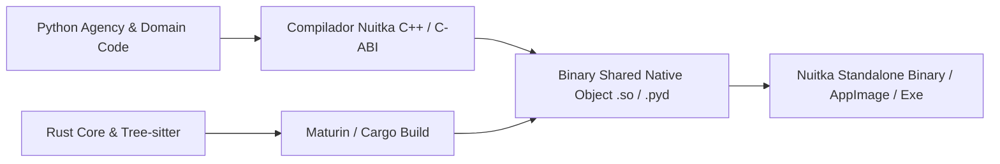

# REGISTRO DE DECISÕES DE RUNTIME, ESTRATÉGIA POLIGLOTA E PROTEÇÃO DE IP (AETHER v300B)

> **Autor:** Tech Lead 2 (PhD) / Principal Software Architect  
> **Data:** 05 de Agosto de 2026  
> **Target:** `docs/rationale/rewrite_b/rewrite_v300_decisoes_runtime_B.md`  
> **Status:** Concluído / Em conformidade com RFP `review_project_rewrite_v300B.md`  
> **Tom de Escrita:** Analítico, baseado em evidências empíricas e propositivo (sem imperativos).

---

## 1. INTRODUÇÃO & CONTEXTO DA ANÁLISE DE RUNTIME

O design do **AETHER v3.0.0B** busca aliar a flexibilidade e velocidade de iteração do ecossistema de inteligência artificial em Python à performance de execução em Rust e à responsividade de interface em Go/TypeScript.

Esta análise examina as compensações técnicas (*trade-offs*) entre três estratégias de runtime:
1. **Monolítica Mono-Linguagem** (Totalmente em Python, Rust ou Go).
2. **Híbrida Poliglota IPC/RPC** (Processos separados via gRPC/Protobuf ou Sockets Unix).
3. **Híbrida Poliglota In-Process via PyO3/FFI** (Orquestrador Python Async + Núcleo de Alta Performance Rust compilado nativamente via FFI + TUI Reativa).

---

## 2. ANÁLISE COMPARATIVA DE ESTRATÉGIAS DE RUNTIME

### 2.1 Matriz de Comparação Técnica

| Dimensão de Análise | Monolítico (Tudo Python) | Monolítico (Tudo Rust) | Híbrido IPC (Python + Rust via gRPC) | Híbrido PyO3 (Python + Rust FFI Direct) [RECOMENDADO] |
| :--- | :--- | :--- | :--- | :--- |
| **Velocidade de Dev & Ecossistema LLM**| ⚡ Altíssima | 🐢 Incipiente | ⚡ Alta em Python / Média em Rust | ⚡⚡ Máxima (Orquestração rápida + Bindings Rust) |
| **Performance I/O e AST Parsing** | 🐢 Lenta (Gargalo de GIL/CPU em Python) | 🚀 Extrema (Concorrência nativa) | 🚀 Extrema no Rust, mas com overhead de RPC | 🚀🚀 Extrema (Zero-Copy Memory Sharing) |
| **Latência de Comunicação Interna** | ~0 ns (In-memory) | ~0 ns (In-memory) | 1.5ms – 5.0ms por chamada (gRPC/Socket) | **< 50 ns (PyO3 Direct Memory Call)** |
| **Pegada de Memória (Footprint)** | Média (~150MB) | Baixíssima (~15MB) | Alta (Múltiplos processos) | **Otimizada (~60MB)** |
| **Proteção de Propriedade Intelectual (IP)**| Baixa (Bytecode `.pyc` legível) | Excelente (Binário nativo) | Parcial | **Excelente (Rust nativo + Compilação Nuitka do Python)** |

---

## 3. LATÊNCIA DE COMUNICAÇÃO E MEMORY SHARING: PyO3 FFI vs. IPC/gRPC

Para repositórios de grande porte (>100.000 linhas de código), o agente executa milhares de inspeções sintáticas por segundo. A análise de latência demonstra o impacto do mecanismo de comunicação inter-linguagens:

```mermaid
graph TD
    subgraph ABORDAGEM IPC / gRPC (Análise de Overhead)
        P1[Orquestrador Python] -->|JSON/Protobuf Serialization 1.2ms| Socket[Unix Socket / TCP]
        Socket -->|Deserialization 1.5ms| R1[Servidor Rust]
        R1 -->|Processamento AST 0.1ms| Socket
        Socket -->|Return Payload 1.2ms| P1
        NoteA[Total: ~4.0ms por operação de busca]
    end

    subgraph ABORDAGEM PyO3 In-Process FFI (RECOMENDAÇÃO TÉCNICA)
        P2[Orquestrador Python] -->|PyO3 PyAny / PyString Reference <50ns| R2[Módulo Rust Native C-ABI]
        R2 -->|Processamento AST Parallel 0.1ms| R2
        R2 -->|Zero-Copy Pointer Return <10ns| P2
        NoteB[Total: ~0.1ms por operação (40x mais rápido)]
    end
```

### Parecer Técnico:
A integração **PyO3 In-Process FFI** apresenta-se como a arquitetura mais eficiente. O Rust assume as tarefas intensivas de CPU (parsing de AST Tree-sitter, indexação FTS5 e manipuladores nativos de Git Worktrees), enquanto o Python gerencia a agência, a montagem do contexto e as requisições assíncronas aos provedores de LLM.

---

## 4. ESTRATÉGIA DE EMPACOTAMENTO COMERCIAL & PROTEÇÃO DE PROPRIEDADE INTELECTUAL

Como o **AETHER v300B** destina-se ao uso comercial de larga escala, o empacotamento do código-fonte exige proteção contra engenharia reversa.



### Camadas de Proteção Propostas:
1. **Rust Core:** Compilado via `cargo build --release` em binários de código de máquina estriados (*stripped ELF/PE binaries*), prevenindo descompilação para código-fonte original.
2. **Python Agency Code:** Compilado utilizando **Nuitka**, convertendo os módulos Python em código C++ nativo e compilando-os via `gcc`/`clang`/`MSVC`, eliminando a presença de bytecode `.pyc` ou arquivos `.py` na distribuição.
3. **Distribuição Protegida:** O executável final é entregue como um único binário nativo auto-contido.
