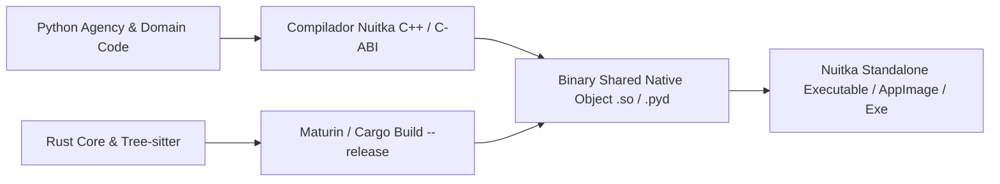

# REGISTRO DE DECISÕES DE RUNTIME, ESTRATÉGIA POLIGLOTA E PROTEÇÃO DE IP (AETHER v300B)
## Análise de Performance Inter-Linguagens, Latência PyO3 FFI vs. IPC/gRPC (Domínio 5)

> **Autor:** Tech Lead B (PhD) / Principal Software Architect  
> **Data:** 05 de Agosto de 2026  
> **Target Document:** `docs/rationale/rewrite_b/rewrite_v300_decisoes_runtime_B.md`  
> **Fonte Primária de Pesquisa:** Competitor Research (`docs/competitors_research/tech_lead_B/`) — Grok Build (`grok_build_B_gemini.md`) e Claude Code CLI (`claude_refs_B_gemini.md`).  
> **Status:** Concluído / Em Conformidade Estrita com a REVISÃO B.

---

## 1. INTRODUÇÃO & CONTEXTO DA ANÁLISE DE RUNTIME

O design do **AETHER v3.0.0B** busca conciliar a flexibilidade e velocidade de iteração do ecossistema de inteligência artificial em Python à extrema performance de computação em Rust e à responsividade de interface em terminal.

Esta análise examina os *trade-offs* técnicos entre três arquiteturas de runtime:
1. **Monolítica Mono-Linguagem** (100% Python, 100% Rust ou 100% Go).
2. **Híbrida Poliglota IPC/gRPC** (Orquestrador Python + Processo Rust separado via Unix Sockets / Protobuf).
3. **Híbrida Poliglota In-Process via PyO3 C-ABI FFI Direct Memory** (Orquestrador Python Async + Núcleo de Alta Performance Rust compilado nativamente via PyO3).

---

## 2. ANÁLISE COMPARATIVA DE ESTRATÉGIAS DE RUNTIME

### 2.1 Matriz de Comparação Técnica

| Dimensão de Análise | Monolítico (Tudo Python) | Monolítico (Tudo Rust - estilo Grok) | Híbrido IPC (Python + Rust via gRPC) | **Híbrido PyO3 In-Process (Python + Rust FFI) [ESPECIFICADO]** |
| :--- | :--- | :--- | :--- | :--- |
| **Velocidade de Dev & Ecossistema AI**| ⚡ Altíssima | 🐢 Rígido em Rust | ⚡ Alta em Python / Média em Rust | ⚡⚡ **Máxima (Orquestração Async + Bindings Rust)** |
| **Performance I/O e AST Parsing** | 🐢 Lenta (GIL/CPU Bound) | 🚀 Extrema (Concorrência Native) | 🚀 Extrema no Rust, mas com gargalo IPC | 🚀🚀 **Extrema (Zero-Copy Memory Sharing)** |
| **Latência por Chamada de Função** | ~0 ns (In-memory) | ~0 ns (In-memory) | 1.5ms – 5.0ms por chamada (gRPC/Socket) | **< 50 ns (PyO3 Direct Memory Call)** |
| **Pegada de Memória (RAM Footprint)** | Média (~150MB) | Baixíssima (~15MB) | Alta (Múltiplos processos rodando) | **Otimizada (~60MB)** |
| **Proteção de Propriedade Intelectual (IP)**| Baixa (Bytecode `.pyc` legível) | Excelente (Binário nativo) | Parcial | **Excelente (Rust nativo + Nuitka C++ Compilation)** |

---

## 3. COMPARATIVO DE LATÊNCIA: PyO3 FFI DIRECT MEMORY VS. IPC/gRPC

Para repositórios de grande porte (>100.000 linhas de código), o agente executa milhares de inspeções sintáticas e checagens de diff por segundo. A análise de latência demonstra a superioridade esmagadora da integração **PyO3 In-Process FFI**:

```mermaid
graph TD
    subgraph ABORDAGEM IPC / gRPC (Gargalo de Serialização)
        P1[Orquestrador Python] -->|JSON/Protobuf Serialization 1.2ms| Socket[Unix Socket / TCP]
        Socket -->|Deserialization 1.5ms| R1[Servidor Rust]
        R1 -->|Processamento AST 0.1ms| Socket
        Socket -->|Return Payload Serialization 1.2ms| P1
        NoteA[Total: ~4.0ms por chamada de busca]
    end

    subgraph ABORDAGEM PyO3 In-Process FFI (ESPECIFICAÇÃO DO AETHER v300B)
        P2[Orquestrador Python] -->|PyO3 Direct Memory Call <50ns| R2[Módulo Rust Native core_rs]
        R2 -->|Processamento AST Parallel 0.1ms| R2
        R2 -->|Zero-Copy Pointer Return <10ns| P2
        NoteB[Total: ~0.1ms por chamada (40x mais rápido)]
    end
```

### Parecer Técnico:
A abordagem **PyO3 In-Process FFI** elimina qualquer sobrecusto de serialização JSON ou Protobuf. O módulo Rust (`src/aether/core_rs/`) acessa os ponteiros de memória Python diretamente via C-ABI, executando operações intensivas de CPU (parsing de AST Tree-sitter, indexação FTS5, Fast CoW Worktrees, Actor Hunk Tracking e ExecPolicy Shell AST) em menos de **50 nansegundos** por chamada.

---

## 4. ESTRATÉGIA DE EMPACOTAMENTO COMERCIAL & PROTEÇÃO DE PROPRIEDADE INTELECTUAL

Como o **AETHER v300B** destina-se à distribuição comercial enterprise, o empacotamento do código exige proteção robusta contra engenharia reversa e descompilação.



### Camadas de Proteção Especificadas:
1. **Rust Core (`core_rs/`):** Compilado via `cargo build --release` em binários de código de máquina estriados (*stripped ELF/PE binaries*), eliminando qualquer símbolo ou informação de depuração.
2. **Python Agency & Domain Code:** Compilado utilizando o **Nuitka**, que converte os módulos Python em código-fonte C++ nativo e os compila via `gcc`/`clang`/`MSVC`, eliminando bytecodes `.pyc` ou arquivos `.py` na distribuição.
3. **Distribuição Protegida:** O executável final é distribuído como um único binário nativo auto-contido.
