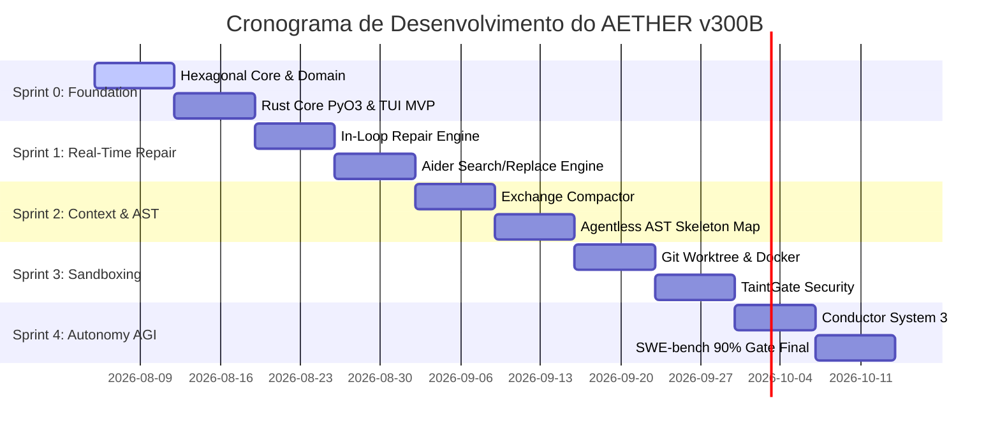
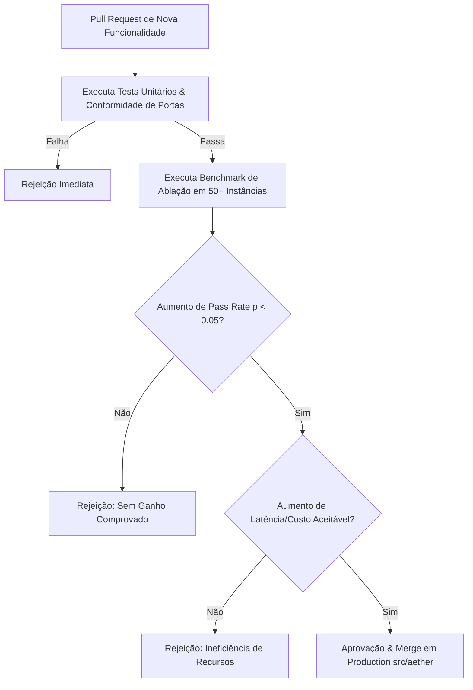

# ROADMAP DE SPRINTS, GATES DE ABLAÇÃO E CRITÉRIOS BENCHMARK (AETHER v300B)

> **Autor:** Tech Lead 2 (PhD) / Principal Software Architect  
> **Data:** 05 de Agosto de 2026  
> **Target:** `docs/rationale/rewrite_b/rewrite_v300_roadmap_sprints_B.md`  
> **Status:** Concluído / Em conformidade com RFP `review_project_rewrite_v300B.md`

---

## 1. OBJETIVO DO ROADMAP & REGRAS DE ABLAÇÃO QUANTITATIVA

Este roadmap define o plano de execução incremental por Sprints para a implementação do **AETHER v3.0.0B** no namespace `src/aether/`.

### Princípio Invariante de Admissão:
Nenhum mecanismo, heurística de prompt ou nova ferramenta será promovido para a branch principal sem passar por uma **Ablação Estatisticamente Comprovada** ($p < 0.05$, mínimo de 50 instâncias de teste) demonstrando:
1. Aumento estatisticamente significante na taxa de resolução (*pass rate*).
2. Manutenção ou redução do custo monetário e de latência total por tarefa.
3. Adimplência estrita à regra `require_tests_unmodified` (o agente jamais pode alterar a suíte de testes de validação para forçar um resultado positivo).

---

## 2. METRICAS ALVO E BENCHMARKS DE ACEITE (ACCEPTANCE CRITERIA)

| Benchmark / Métrica | Baseline Atual (Estimado) | Sprint 1 Target | Sprint 2 Target | Target Final (AETHER v300B) |
| :--- | :--- | :--- | :--- | :--- |
| **SWE-bench Verified** | ~68% | 78.0% | 84.0% | **90.0%+** (com Opus 5) |
| **SWE-bench Pro** | ~38% | 45.0% | 52.0% | **60.0%+** |
| **Terminal-Bench** | ~45% | 58.0% | 68.0% | **75.0%+** |
| **Prompt Cache Hit Rate**| ~50% | 75.0% | 88.0% | **>92.0%** |
| **Latency per Edit Step**| ~4.5s | 2.0s | 1.1s | **< 0.5s** (Rust AST Engine) |

---

## 3. PLANO FASEADO POR SPRINTS

---

### 3.1 SPRINT 0: FUNÇÃO HEXAGONAL, RUST CORE & TUI MVP
* **Objetivo:** Estabelecer a fundação limpa em `src/aether/`, montar o módulo nativo em Rust via PyO3 e entregar a TUI reativa mínima para testes E2E.
* **Entregáveis:**
  1. Criação do pacote `src/aether/` com subpacotes (`domain/`, `ports/`, `kernel/`, `adapters/`, `agency/`, `tui/`, `core_rs/`).
  2. Implementação das portas base remotáveis Pydantic-serializable.
  3. Módulo Rust `aether_core_rs` compilável via Maturin com parsing AST inicial via Tree-sitter.
  4. Interface TUI reativa MVP em Rich/Textual exibindo logs em tempo real, tokens e status de execução.
* **Gate de Aceite:** 100% de passagem nos testes de conformidade de portas e tempo de inicialização da TUI < 200ms.

---

### 3.2 SPRINT 1: REAL-TIME IN-LOOP REPAIR & SEARCH/REPLACE ENGINE
* **Objetivo:** Implementar o loop de reparo em tempo real no `run_loop.py` e o mecanismo cirúrgico de edição de código.
* **Entregáveis:**
  1. Separação de papéis **Architect** (planejamento) e **Editor** (aplicação de diffs).
  2. Mecanismo **Aider-style Search/Replace Blocks** com validação determinística de sintaxe (`ast.parse` via Rust) e rollback automático.
  3. Re-injeção imediata de stack traces de erro no contexto sem destruir a prefix cache.
* **Gate de Aceite:** Aumento de +10% de pass rate em tarefas de refatoração multi-arquivo em comparação com reescritas integrais.

---

### 3.3 SPRINT 2: GESTÃO DE CONTEXTO & AST SKELETON MAPPING
* **Objetivo:** Maximizar a taxa de reutilização do cache de prompt e evitar atenuação de atenção em repositórios grandes.
* **Entregáveis:**
  1. **Exchange-Granular Compactor:** Compactação baseada em trocas inteiras preservando a paridade da API Anthropic.
  2. **AST Skeleton Mapping (Agentless Pattern):** Geração e injeção de mapa sintático enxuto no início de tarefas complexas.
  3. Fixação estrita de prefixos de contexto (`System Prompt` + `Tools` + `RepoMap`).
* **Gate de Aceite:** Taxa de **Prompt Cache Hit Rate > 88%** e melhoria estatisticamente significante em repositórios de >50k LOC.

---

### 3.4 SPRINT 3: SANDBOXING RIGOROSO & PROTEÇÃO TAINTGATE
* **Objetivo:** Garantir isolamento total de execução e segurança contra ataques de prompt injection.
* **Entregáveis:**
  1. Adaptador de isolamento híbrido: **Git Worktrees** (para velocidade zero-copy local) + **Podman/Docker Rootless** (para execução de comandos não-confiáveis).
  2. **TaintGate Sanitizer:** Marcação e filtragem de fontes de dados externas (`UNTRUSTED_TAINTED`).
  3. Integração total de telemetria no Event Bus da TUI.
* **Gate de Aceite:** 0% de vazamento de comandos maliciosos em testes de segurança sintética e isolamento completo de concorrência.

---

### 3.5 SPRINT 4: CONDUCTOR SYSTEM 3 & BENCHMARK GATE FINAL (90% SWE-BENCH)
* **Objetivo:** Entregar a autonomia de longo prazo (*Long-Horizon Autonomy*), a exportação de dados para SFT/DPO e atingir as metas finais de benchmarks.
* **Entregáveis:**
  1. Orquestrador **Conductor System 3** com hibernação durável de processos via `FrozenRunState`.
  2. **Tool Synthesis Autônoma:** Capacidade de gerar e registrar ferramentas privada em tempo de execução.
  3. **Dataset Exporter:** Sanitização e exportação de trajetórias aprovadas para fine-tuning local.
  4. Execução completa da suíte de avaliação do **SWE-bench Verified** e **SWE-bench Pro**.
* **Gate de Aceite Final:** **90%+ SWE-bench Verified**, **60%+ SWE-bench Pro** e **75%+ Terminal-Bench**.

---

## 4. MATRIZ DE ABLAÇÕES & GOVERNANÇA DE RELEASES

Tabela de decisão para promoção de PRs na branch principal do **AETHER v300B**:

Com este roadmap e governança quantitativa, o **AETHER v3.0.0B** garante a entrega de um produto de altíssima performance, seguro, modular e com métricas comprovadas de classe mundial.
