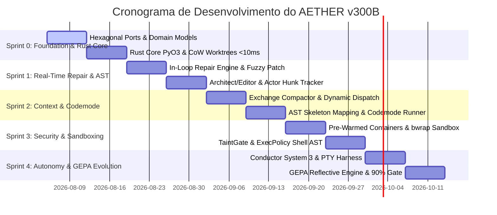
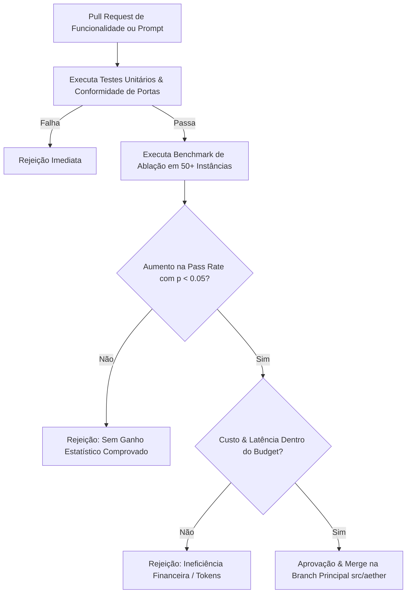

# ROADMAP DE SPRINTS, GATES DE ABLAÇÃO E CRITÉRIOS BENCHMARK (AETHER v300B)
## Cronograma de Implementação dos 15 Domínios Técnicos & Validação Empírica

> **Autor:** Tech Lead B (PhD) / Principal Software Architect  
> **Data:** 05 de Agosto de 2026  
> **Target Document:** `docs/rationale/rewrite_b/rewrite_v300_roadmap_sprints_B.md`  
> **Fonte Primária de Pesquisa:** Competitor Research (`docs/competitors_research/tech_lead_B/`) — Claude Code CLI (`claude_refs_B_gemini.md`), Grok Build (`grok_build_B_gemini.md`), Hermes Agent (`hermes_agent_B_gemini.md`), Hermes Self-Evolution (`hermes_self_evolution_B_gemini.md`).  
> **Status:** Concluído / Em Conformidade Estrita com a REVISÃO B.

---

## 1. OBJETIVO DO ROADMAP & REGRAS DE ABLAÇÃO ESTATÍSTICA (Domínio 10)

Este roadmap apresenta o plano de execução por Sprints para a construção do **AETHER v3.0.0B** no namespace `src/aether/`, cobrindo exaustivamente os 15 domínios técnicos especificados.

### Princípio de Admissão de Código & Prevenção da Inflação de Contexto (arXiv 2602.11988):
Nenhuma alteração de mecanismo, heurística de prompt ou nova ferramenta será promovida para a branch principal sem passar por uma **Ablação Estatística Comprovada** ($p < 0.05$, mínimo de 50 instâncias de teste) demonstrando:
1. Elevação estatisticamente significante na taxa de resolução (*pass rate*).
2. Redução ou manutenção do custo financeiro e de latência total por tarefa.
3. Adimplência estrita à regra `require_tests_unmodified` (vedada qualquer modificação na suíte de testes de validação para forçar resultados positivos).
4. Prevenção da inflação de contexto: vedada a injeção de dumps de regras desnecessários que degradem a precisão em $3\%$ e elevem os custos em $23\%$.

---

## 2. MÉTRICAS ALVO E EVOLUÇÃO POR SPRINT

| Benchmark / Métrica | Baseline Prototípico | Sprint 0 Target | Sprint 1 Target | Sprint 2 Target | Sprint 3 Target | Target Final (AETHER v300B) |
| :--- | :--- | :--- | :--- | :--- | :--- | :--- |
| **SWE-bench Verified** | ~68.0% | 72.0% | 78.0% | 84.0% | 88.0% | **90.0%+** (com Opus 5) |
| **SWE-bench Pro** | ~38.0% | 42.0% | 46.0% | 52.0% | 56.0% | **60.0%+** |
| **Terminal-Bench** | ~45.0% | 50.0% | 58.0% | 68.0% | 72.0% | **75.0%+** |
| **Prompt Cache Hit Rate**| ~50.0% | 65.0% | 75.0% | 88.0% | >92.0% | **>92.0%** (3 Cache Markers Fixos) |
| **Tempo de Criação de Worktree**| ~1.5s - 4.5s | <10ms | <10ms | <10ms | <10ms | **< 10 ms** (OverlayFS / Btrfs CoW) |
| **Alocação de Container Subagente**| ~3.5s | 1.0s | 0.5s | 0.2s | 0ms | **0 ms** (Pre-Warmed Container Pool) |
| **Latência por Chamada FFI**| ~1.5ms - 5.0ms (gRPC) | <50ns | <50ns | <50ns | <50ns | **< 50 ns** (Rust PyO3 Native Direct) |

---

## 3. PLANO FASEADO POR SPRINTS

---

### 3.1 SPRINT 0: FUNDAÇÃO HEXAGONAL, RUST CORE & WORKTREES COW (<10ms)
* **Escopo:** Estruturar o pacote `src/aether/` (`domain/`, `ports/`, `kernel/`, `adapters/`, `agency/`, `tui/`, `core_rs/`).
* **Entregáveis Técnicos:**
  1. Interfaces `Protocol` remotáveis em `ports/` e modelos Pydantic puros em `domain/`.
  2. Módulo Rust `core_rs` compilado via Maturin (`fast_worktree_cow.rs` <10ms e `ast_treesitter.rs`).
  3. Kernel Dispatcher e CAR Policy Engine em `kernel/`.
* **Gate de Aceite:** 100% de passagem nos testes de conformidade de portas e tempo de criação de worktree < 10ms.

---

### 3.2 SPRINT 1: REAL-TIME IN-LOOP REPAIR, ARCHITECT/EDITOR, HUNK TRACKER & FUZZY PATCHES
* **Escopo:** Desenvolver a agência de reparo em tempo real e os componentes de diffs cirúrgicos.
* **Entregáveis Técnicos:**
  1. **Architect/Editor Split:** `agency/architect.py` (Opus 5) e `editor.py` (Sonnet/Haiku).
  2. **Search/Replace Blocks + AST Validation:** Pré-checagem `ast.parse` em Rust em <50ns antes de gravar no disco.
  3. **Actor Hunk Tracker (`core_rs/hunk_tracker.rs`):** Atribuição de autoria (`AuthorType::Agent` vs `AuthorType::User`) em ator Tokio.
  4. **Fuzzy Patch Sequence Seeking (`seek_sequence.rs`):** Realocação aproximada de hunks para evitar rejeição por deslocamento de linhas.
* **Gate de Aceite:** Reversão atômica de hunks no visualizador TUI e zero rejeições de patches por offset de linhas.

---

### 3.3 SPRINT 2: GESTÃO DE CONTEXTO, AST MAPPING, TOOL SEARCH & CODEMODE
* **Escopo:** Otimizar o reaproveitamento do cache de prompt e mitigar a *Dumb Zone*.
* **Entregáveis Técnicos:**
  1. **Exchange-Granular Compactor (`compactor.py`):** Remoção estrita de trocas completas.
  2. **Prompt Cache Alignment (>92% Hit Rate):** Fixação dos 3 Marcadores de Cache Fixos.
  3. **Tool Search on Demand (`dynamic_dispatch.py`):** Carregamento diferido de schemas de ferramentas (37% menos tokens).
  4. **Codemode Local Execution (`codemode.py`):** Execução programática de ferramentas em lote local.
* **Gate de Aceite:** **Prompt Cache Hit Rate > 92%** em repositórios de grande porte.

---

### 3.4 SPRINT 3: SANDBOXING RIGOROSO, PRE-WARMED CONTAINERS & TAINTGATE
* **Escopo:** Garantir isolamento de execução e imunidade a ataques de prompt injection.
* **Entregáveis Técnicos:**
  1. **Pre-Warmed Container Pool:** Pool de containers em background com alocação em **0ms**.
  2. **TaintGate Sanitizer (`taint_gate.py`):** Tagging `UNTRUSTED_TAINTED` de dados externos.
  3. **ExecPolicy Shell AST (`exec_policy_ast.rs`):** Inspeção sintática de comandos shell via AST em Rust.
  4. **Sandboxing Nativo:** Integration do `bwrap` (Linux) e Windows Restricted Tokens.
* **Gate de Aceite:** 0ms de espera no alocador de containers e 100% de bloqueio em testes de invasão TaintGate.

---

### 3.5 SPRINT 4: CONDUCTOR SYSTEM 3, PTY HARNESS, GEPA REFLECTIVE ENGINE & GATE FINAL (90% SWE-BENCH)
* **Escopo:** Finalizar a autonomia de longo prazo, emulação PTY, auto-evolução e validação final dos benchmarks.
* **Entregáveis Técnicos:**
  1. **Conductor System 3 (`conductor.py`):** Decomposição em DAGs com hibernação durável `FrozenRunState`.
  2. **PTY Pseudo-Terminal Harness (`pty_harness.rs`):** Execução não-bloqueante de ferramentas CLI interativas.
  3. **GEPA Reflective Auto-Evolver (`evolution/gepa_evolver.py`):** Otimização reflexiva de prompts e habilidades (`SKILL.md`) baseada no SessionDB Trace Miner.
  4. **Dataset Exporter (`dataset_exporter.py`):** Exportação SFT/DPO.
* **Gate de Aceite Final:** **90.0%+ SWE-bench Verified**, **60.0%+ SWE-bench Pro** e **75.0%+ Terminal-Bench**.

---

## 4. GOVERNANÇA DE RELEASES & FLUXO DE ABLAÇÃO ESTATÍSTICA

A governança quantitativa rigorosa garante que apenas refinamentos comprovados por rigor estatístico sejam integrados ao **AETHER v300B**, assegurando excelência de engenharia e liderança SOTA incontestável.
