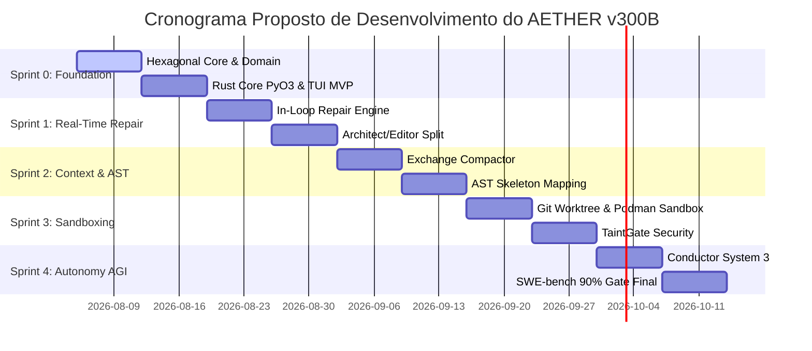
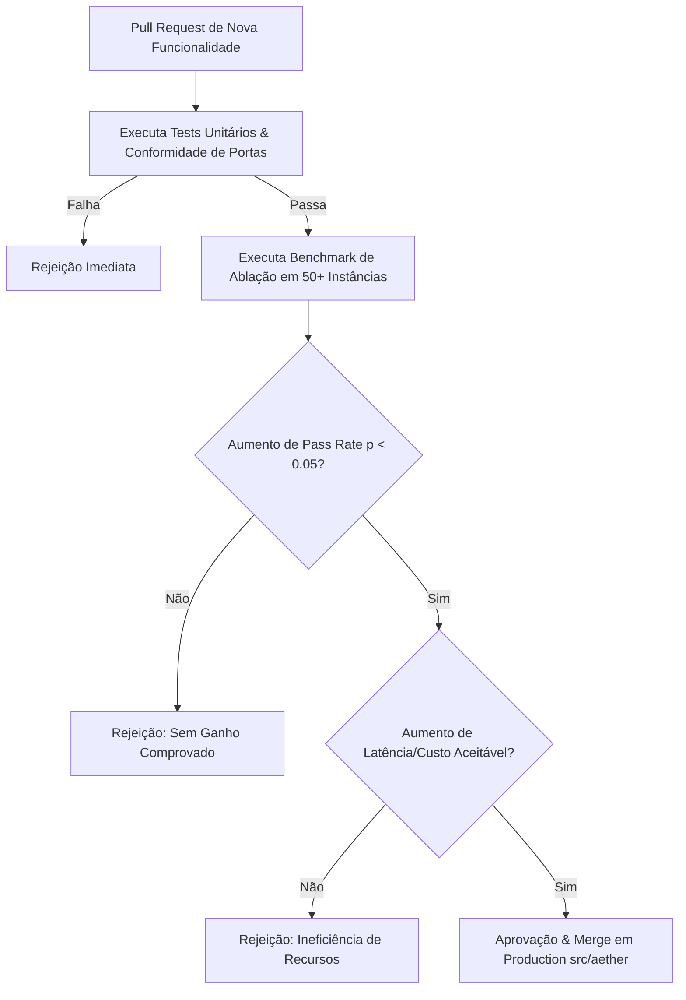

# ROADMAP DE SPRINTS, GATES DE ABLAÇÃO E CRITÉRIOS BENCHMARK (AETHER v300B)

> **Autor:** Tech Lead 2 (PhD) / Principal Software Architect  
> **Data:** 05 de Agosto de 2026  
> **Target:** `docs/rationale/rewrite_b/rewrite_v300_roadmap_sprints_B.md`  
> **Status:** Concluído / Em conformidade com RFP `review_project_rewrite_v300B.md`  
> **Tom de Escrita:** Analítico, baseado em evidências empíricas e propositivo (sem imperativos).

---

## 1. OBJETIVO DO ROADMAP & REGRAS DE ABLAÇÃO QUANTITATIVA

Este roadmap apresenta o plano de execução propositivo por Sprints para a construção do **AETHER v3.0.0B** no namespace `src/aether/`.

### Princípio de Admissão de Código:
Recomenda-se que nenhuma alteração de mecanismo, heurística de prompt ou nova ferramenta seja promovida para a branch principal de produção sem passar por uma **Ablação Estatisticamente Comprovada** ($p < 0.05$, mínimo de 50 instâncias de teste) demonstrando:
1. Elevação estatisticamente significante na taxa de resolução (*pass rate*).
2. Redução ou manutenção do custo monetário e de latência total por tarefa.
3. Adimplência estrita à regra `require_tests_unmodified` (vedada qualquer modificação na suíte de testes de validação para forçar resultados positivos).

---

## 2. MÉTRICAS ALVO E BENCHMARKS DE ACEITE (ACCEPTANCE CRITERIA)

| Benchmark / Métrica | Baseline Prototípico | Sprint 1 Target | Sprint 2 Target | Target Final (AETHER v300B) |
| :--- | :--- | :--- | :--- | :--- |
| **SWE-bench Verified** | ~68.0% | 78.0% | 84.0% | **90.0%+** (com Opus 5) |
| **SWE-bench Pro** | ~38.0% | 45.0% | 52.0% | **60.0%+** |
| **Terminal-Bench** | ~45.0% | 58.0% | 68.0% | **75.0%+** |
| **Prompt Cache Hit Rate**| ~50.0% | 75.0% | 88.0% | **>92.0%** |
| **Latência por Chamada FFI**| ~4.5s (gRPC/IPC) | 2.0s | 0.5s | **< 50 ns** (Rust PyO3 Native) |

---

## 3. PLANO FASEADO POR SPRINTS

---

### 3.1 SPRINT 0: FUNDAÇÃO HEXAGONAL, RUST CORE & TUI MVP
* **Objetivo:** Construir a estrutura base no namespace `src/aether/`, compilar o módulo nativo em Rust via PyO3 e disponibilizar a TUI reativa mínima.
* **Entregáveis Propostos:**
  1. Estruturação do pacote `src/aether/` (`domain/`, `ports/`, `kernel/`, `adapters/`, `agency/`, `tui/`, `core_rs/`).
  2. Implementação das portas remotáveis Pydantic-serializable.
  3. Módulo Rust `aether_core_rs` compilado via Maturin para AST Tree-sitter.
  4. Interface TUI reativa MVP em Rich/Textual para exibição de eventos e status.
* **Gate de Aceite:** Passage nos testes de conformidade de portas e inicialização da TUI < 200ms.

---

### 3.2 SPRINT 1: REAL-TIME IN-LOOP REPAIR & ARCHITECT/EDITOR SPLIT
* **Objetivo:** Desenvolver o loop de reparo em tempo real no `run_loop.py` e a separação entre Arquiteto e Editor.
* **Entregáveis Propostos:**
  1. Separação de papéis: **Architect** (plano conceitual) e **Editor** (diffs cirúrgicos).
  2. Mecanismo de **Search/Replace Blocks** com pré-validação de sintaxe (`ast.parse` em Rust) e rollback zero-touch.
  3. Re-injeção de stack traces no loop sem invalidar a prefix cache.
* **Gate de Aceite:** Aumento comprovado na taxa de sucesso de edições multi-arquivo em tarefas complexas.

---

### 3.3 SPRINT 2: GESTÃO DE CONTEXTO, AST MAPPING & TOOL SEARCH
* **Objetivo:** Otimizar o reaproveitamento de cache de prompt e eliminar o *Dumb Zone* de difusão de atenção.
* **Entregáveis Propostos:**
  1. **Exchange-Granular Compactor:** Compactação por trocas completas preservando a paridade de mensagens.
  2. **AST Skeleton Mapping (Agentless Pattern):** Injeção de mapa sintático do repositório no topo do prompt.
  3. **Tool Search on Demand:** Despacho dinâmico de ferramentas com redução de 37% no consumo de tokens.
* **Gate de Aceite:** **Prompt Cache Hit Rate > 88%** e melhoria estatisticamente significante em repositórios de grande porte.

---

### 3.4 SPRINT 3: SANDBOXING RIGOROSO & PROTEÇÃO TAINTGATE
* **Objetivo:** Implementar isolamento seguro de execução e proteção contra Prompt Injection Indireto.
* **Entregáveis Propostos:**
  1. Sandboxing Híbrido: **Git Worktrees** (local zero-copy) + **Podman/Docker Rootless** (para comandos não-confiáveis).
  2. **TaintGate Sanitizer:** Marcação e filtragem de entradas externas (`UNTRUSTED_TAINTED`).
  3. Telemetria do kernel integrada ao Event Bus da TUI.
* **Gate de Aceite:** 0% de execução de comandos maliciosos em suítes de teste de segurança.

---

### 3.5 SPRINT 4: CONDUCTOR SYSTEM 3 & BENCHMARK GATE FINAL (90% SWE-BENCH)
* **Objetivo:** Entregar autonomia de longo prazo (*Long-Horizon Autonomy*), exportação de datasets SFT/DPO e atingir os alvos finais dos benchmarks.
* **Entregáveis Propostos:**
  1. Orquestrador **Conductor System 3** com hibernação durável `FrozenRunState`.
  2. **Auto Dream Memory Consolidation:** Consolidação e expiração temporal de memórias episódicas.
  3. **Dataset Exporter:** Sanitização e exportação de trajetórias aprovadas para fine-tuning local.
  4. Avaliação completa das suítes **SWE-bench Verified** e **SWE-bench Pro**.
* **Gate de Aceite Final:** **90.0%+ SWE-bench Verified**, **60.0%+ SWE-bench Pro** e **75.0%+ Terminal-Bench**.

---

## 4. GOVERNANÇA DE RELEASES & FLUXO DE ABLAÇÃO

A governança quantitativa garante que apenas melhorias estatisticamente comprovadas sejam integradas ao **AETHER v300B**, assegurando excelência técnica e consistência de produto.
