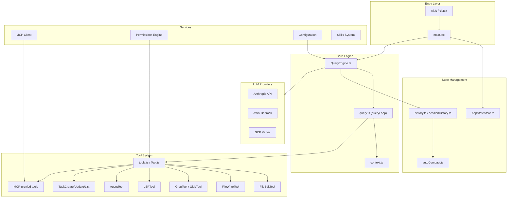
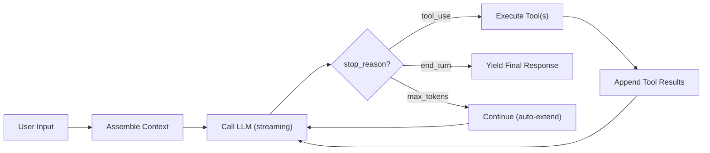

# Claude Code — Architectural Overview

> **Project**: Claude Code (by Anthropic)
> **Language**: TypeScript (Node.js / Bun)
> **License**: Proprietary (source-available)
> **Source Path**: `src/claude_code/`
> **Source Files**: ~1,915 TypeScript files

---

## 1. Project Identity

Claude Code is Anthropic's flagship autonomous coding agent, shipped as a CLI tool
that brings Claude's capabilities directly into a developer's terminal. It is written
in TypeScript targeting Node.js with Bun compatibility shims, and renders its terminal
UI using React via the Ink library.

| Attribute | Value |
|-----------|-------|
| Language | TypeScript |
| Runtime | Node.js / Bun |
| UI Framework | React (Ink) for terminal rendering |
| Package Manager | npm / bun |
| Build System | Custom `build.mjs` (esbuild-based) |
| Key Dependencies | `@anthropic-ai/sdk`, AWS Bedrock SDK, GCP Vertex SDK, `@modelcontextprotocol/sdk`, `zod`, `chokidar`, `commander`, `ink` |

---

## 2. Architecture Overview

Claude Code follows a **layered service architecture** with clear separation between
CLI entry, state management, the query engine (LLM orchestration), tools, and UI
rendering.



**Key architectural traits:**
- **Monolithic core**: The query engine (`QueryEngine.ts` + `query.ts`) concentrates
  most orchestration logic in ~1,700 lines.
- **Tool-first design**: Nearly all agent capabilities are exposed as tools with
  `zod`-validated schemas.
- **React-based TUI**: The terminal UI is a full React component tree rendered via Ink.

---

## 3. Execution Loop

The core agent loop lives in `src/query.ts` as an **async generator** function:

```
export async function* query() → AsyncGenerator<StreamEvent | Message>
```

This delegates to `queryLoop()`, which implements the classic agentic cycle:



**Loop mechanics:**
- The loop checks `stop_reason` from the LLM response after each streaming completion.
- If `stop_reason === 'tool_use'`, it executes the requested tools and appends results
  back to the message array, then re-calls the LLM.
- If `stop_reason === 'end_turn'`, the loop terminates and yields the final message.
- If `stop_reason === 'max_tokens'`, it auto-extends by continuing the conversation.
- **Error recovery**: Tool execution errors are caught and returned as tool error
  results to the LLM, allowing self-correction.
- **Recursive tool handling**: Multiple tool calls in a single response are executed
  and their results batched before the next LLM call.

---

## 4. Context Management

Context assembly is handled by `src/context.ts` and the `QueryEngine`:

| Context Layer | Source | Description |
|---------------|--------|-------------|
| **System Context** | `context.ts` → `SystemContext` | Git branch, repo status snapshot, working directory |
| **User Context** | `context.ts` → `UserContext` | Reads `CLAUDE.md` files (project-level instructions, similar to `.cursorrules`) |
| **Tool Definitions** | `tools.ts` | All registered tool schemas are serialized into the system prompt |
| **Conversation History** | `history.ts` | Rolling message array with dynamic truncation |

**Token budgeting:**
- The `QueryEngine` dynamically manages the context window size.
- When the conversation grows too large, **auto-compaction** kicks in
  (`src/services/compact/autoCompact.ts`), which summarizes older messages to
  reclaim token budget.
- System and user context are reconstructed on each call to ensure freshness.

---

## 5. Short-Term Memory

Short-term memory is the **in-session conversation history** — the array of messages
passed to the LLM on each turn.

| Component | File | Role |
|-----------|------|------|
| Message history | `src/history.ts` | Maintains the ordered list of user/assistant/tool messages |
| Session history | `src/assistant/sessionHistory.ts` | Manages session-level conversation state |
| Auto-compaction | `src/services/compact/autoCompact.ts` | Dynamically summarizes old messages to fit within token limits |
| App state | `src/bootstrap/AppStateStore.ts` | React-managed state for the active session |

**Auto-compaction strategy:**
- When the message array approaches the context window limit, older messages are
  collapsed into a summary message.
- This preserves recent context while compressing historical context.
- The compaction is transparent to the LLM — it sees a coherent conversation.

---

## 6. Long-Term Memory

Claude Code implements **file-based persistent memory** across sessions:

| Mechanism | Storage | Description |
|-----------|---------|-------------|
| Session transcripts | `~/.claude/sessions/` | Full conversation logs persisted to disk |
| Task data | `.claude/` (project dir) | Shared task board files for multi-agent coordination |
| CLAUDE.md | Project root / directories | User-authored persistent instructions read on every session |
| Project config | `.claude.json` | Per-project configuration persisted between sessions |

**Notable:** There is no embedding-based vector store or database-backed long-term
memory. Persistence is entirely file-based, relying on `CLAUDE.md` files as the
primary mechanism for cross-session knowledge.

---

## 7. Indexing & Code Intelligence

**Claude Code does NOT implement custom AST parsers or tree-sitter integration.**

Instead, it takes a brilliant shortcut: **it delegates code intelligence entirely to
the Language Server Protocol (LSP)**.

| Component | File | Description |
|-----------|------|-------------|
| LSP Tool | `src/tools/LSPTool/LSPTool.ts` | Exposes standard LSP methods as tools |

**LSP methods exposed to the LLM:**
- `workspace/symbol` — find symbols across the workspace
- `textDocument/definition` — go to definition
- `textDocument/references` — find all references
- `textDocument/hover` — get type information

This means the LLM can leverage the same code intelligence that IDEs use (TypeScript
language server, Pyright, gopls, etc.) without the agent needing to implement any
language-specific parsing.

**Design insight:** This is a highly pragmatic approach — instead of reinventing code
analysis, it piggybacks on the mature LSP ecosystem.

---

## 8. Search Capabilities

| Capability | Tool | Implementation |
|------------|------|----------------|
| Text search | `GrepTool.ts` | Wraps `ripgrep` via `src/utils/ripgrep.ts` |
| File discovery | `GlobTool.ts` | Glob-based file pattern matching |
| Symbol search | `LSPTool.ts` | LSP `workspace/symbol` |
| File reading | `ReadFileTool.ts` | Direct file content reading with line ranges |

**Ripgrep integration:**
- The `ripgrep.ts` utility wraps the `rg` binary with structured output parsing.
- Results are formatted for LLM consumption with file paths, line numbers, and
  context lines.
- The `GrepTool` supports regex patterns, case-insensitive search, and include/exclude
  glob filters.

---

## 9. File Editing & Patching

Claude Code uses a **literal string replacement** approach for file editing:

| Tool | File | Strategy |
|------|------|----------|
| FileEditTool | `src/tools/FileEditTool/FileEditTool.ts` | `old_string` → `new_string` exact replacement |
| FileWriteTool | `src/tools/FileWriteTool/` | Full file creation/overwrite |

**FileEditTool mechanics:**
1. The LLM provides an `old_string` (exact text to find) and `new_string` (replacement).
2. The tool searches for the literal `old_string` in the file.
3. If exactly one match is found, it replaces it with `new_string`.
4. If zero or multiple matches are found, an error is returned.

**No unified diffs, no AST-aware edits, no patch files.** The approach is simple but
has known failure modes:
- LLM whitespace hallucination (indentation mismatches)
- Ambiguous matches when the same code pattern appears multiple times
- No semantic understanding of the edit's impact

**Rollback:** No built-in undo mechanism — the agent relies on git for rollback.

---

## 10. Tool System

Tools are the primary extension point for Claude Code's capabilities.

**Tool registration (`src/tools.ts` + `src/Tool.ts`):**

```typescript
// Conceptual tool interface
interface Tool {
  name: string;
  description: string;
  inputSchema: ZodSchema;      // zod-validated input
  checkPermissions(): boolean;  // capability-based authorization
  execute(input): Promise<ToolResult>;
}
```

Tools are built using `buildTool()` from `Tool.ts`, which enforces:
- `zod` schema validation for all inputs/outputs
- Permission checks before execution
- Structured result formatting

**Built-in tools include:**
| Tool | Purpose |
|------|---------|
| `FileEditTool` | Edit files via string replacement |
| `FileWriteTool` | Create/overwrite files |
| `ReadFileTool` | Read file contents |
| `GrepTool` | Ripgrep-based text search |
| `GlobTool` | File pattern matching |
| `LSPTool` | Language server integration |
| `AgentTool` | Spawn sub-agents |
| `TaskCreateTool` | Create tasks for coordination |
| `TaskUpdateTool` | Update task status |
| `TaskListTool` | List active tasks |
| `BashTool` | Execute shell commands |
| MCP-proxied tools | Dynamically loaded from MCP servers |

---

## 11. LLM Integration

| Component | File | Description |
|-----------|------|-------------|
| Model config | `src/utils/model/model.ts` | Model selection, parameter defaults |
| Providers | `src/utils/model/providers.ts` | Multi-provider abstraction |

**Supported providers:**
- **Anthropic API** (first-party) — primary provider
- **AWS Bedrock** — enterprise deployment
- **GCP Vertex AI** — enterprise deployment

**Model defaults:** Claude Opus 4.6 / Sonnet 4.6 (configurable).

**Streaming:** All LLM calls use streaming responses. The async generator in
`query.ts` yields `StreamEvent` objects as tokens arrive, enabling real-time
UI updates.

**Token counting:** Built-in token estimation for context window management,
used by the auto-compaction system to decide when to summarize older messages.

---

## 12. Permissions & Security

Claude Code has a sophisticated **pluggable permission system**:

| Component | File | Description |
|-----------|------|-------------|
| Permission modes | `src/utils/permissions/` | Configurable permission policies |
| YOLO classifier | `yoloClassifier.ts` | Heuristic/LLM classifier for dangerous operations |
| Tool-level checks | `Tool.ts` → `checkPermissions` | Per-tool permission gates |

**Permission modes:**
- **`plan`** mode — read-only, no file modifications or command execution
- **`auto`** mode — automatic approval for safe operations, prompt for dangerous ones
- **Custom** modes — configurable via settings

**YOLO classifier:**
- A heuristic classifier that analyzes shell commands to detect potentially
  dangerous operations (e.g., `rm -rf`, `sudo`, network access).
- Can be backed by an LLM call for more nuanced classification.
- Acts as a safety net even in permissive modes.

---

## 13. Multi-Agent / Sub-Agent Support

Claude Code has **first-class sub-agent support** with a standout feature:

| Component | File | Description |
|-----------|------|-------------|
| Agent tool | `src/tools/AgentTool/AgentTool.tsx` | Spawns sub-agents |
| Task tools | `src/utils/tasks.ts` | Shared task board for coordination |
| Lock files | `src/utils/lockfile.ts` | File-system locks for concurrent access |

**Git Worktree Isolation:**
The most innovative feature — sub-agents are spawned in **isolated git worktrees**:
- When `isolation: 'worktree'` is specified, a temporary git worktree is created.
- The sub-agent operates in this isolated copy of the repository.
- File edits by the sub-agent don't corrupt the parent agent's working directory.
- On success, changes can be merged back into the main worktree.
- On failure, the worktree is simply discarded.

**Swarm Task Board:**
- `TaskCreateTool`, `TaskUpdateTool`, and `TaskListTool` implement a shared task
  coordination system.
- Tasks are serialized to disk with file-system locks (`lockfile.ts`) enabling
  multiple concurrent agents to coordinate.
- Agents can create tasks, claim them, update status, and mark completion.

---

## 14. Workflow & Task Management

Beyond the sub-agent task board, Claude Code supports:

| Feature | Description |
|---------|-------------|
| Task creation | LLM can decompose work into discrete tasks |
| Task status tracking | States: pending, in-progress, completed, failed |
| File-based persistence | Tasks survive process restarts |
| Lock-based concurrency | Multiple agents can safely read/write the task board |

**No built-in planning/goal decomposition algorithm** — the LLM itself decides how
to decompose tasks. The infrastructure provides the coordination primitives.

---

## 15. CLI & User Interface

| Component | File | Description |
|-----------|------|-------------|
| CLI entry | `src/entrypoints/cli.tsx` | Commander-based CLI argument parsing |
| Main render | `src/main.tsx` | React (Ink) root component |
| Components | `src/ink/` | Reusable Ink components |

**Terminal UI features:**
- Full React component tree rendered in the terminal via Ink
- Streaming LLM output displayed in real-time
- Interactive permission prompts
- Tool execution status display
- Multi-line input handling

**Modes:**
- Interactive terminal mode (default)
- Headless/pipe mode (`--print` flag for non-interactive use)
- Daemon mode for background operation
- MCP server mode

---

## 16. MCP (Model Context Protocol) Support

| Component | File | Description |
|-----------|------|-------------|
| MCP client | `src/services/mcp/client.ts` | Connects to external MCP servers |
| Tool proxy | MCP → native tools | MCP resources mapped to Claude tools |
| MCP server mode | `src/entrypoints/` | Claude Code itself can run as an MCP server |

**MCP integration:**
- Claude Code acts as an **MCP client**, connecting to configured MCP servers.
- Tools exposed by MCP servers are dynamically discovered and registered as native
  Claude tools.
- The LLM can invoke MCP tools transparently — no special syntax needed.
- Claude Code can also run **as an MCP server**, exposing its own tools to other
  MCP clients.

---

## 17. Configuration & Extensibility

| Mechanism | File | Scope |
|-----------|------|-------|
| Global config | `~/.claude.json` | User-wide settings |
| Project config | `.claude.json` | Per-project settings |
| Project instructions | `CLAUDE.md` | Per-project/directory instructions for the agent |
| Skills | `src/skills/` | Reusable skill definitions |
| MCP plugins | Via MCP config | External tool providers |

**`CLAUDE.md` system:**
- `CLAUDE.md` files at the project root and in subdirectories provide persistent
  instructions to the agent.
- These are read on every session start and included in the system prompt.
- Acts as a project-specific "memory" that persists across sessions.

---

## 18. Testing & Quality

**No test files** (`*.test.ts`, `*.spec.ts`) are present in the distributed source
tree. Tests were stripped before packaging/distribution.

The build system (`build.mjs`) uses esbuild for bundling. TypeScript type checking
is configured via `tsconfig.json` with strict mode.

---

## 19. Key Strengths

1. **Git Worktree Isolation** — Spawning sub-agents in isolated worktrees is a
   genius approach to safe parallel execution. Sub-agents can freely edit files
   without risk of corrupting the main workspace.

2. **LSP Delegation** — Instead of building custom language parsers, Claude Code
   leverages the mature LSP ecosystem. This gives it world-class code intelligence
   for every language with an LSP server, with zero maintenance burden.

3. **Swarm Task Board** — The file-system-based, lock-protected task board enables
   multi-agent coordination without requiring a database or message broker.

4. **React Terminal UI** — Using Ink for the terminal UI enables a rich, responsive
   interface with the same component model used in web development.

5. **Auto-Compaction** — Dynamic conversation summarization keeps the agent
   functional over very long sessions without losing important context.

6. **MCP Ecosystem** — Full MCP client+server support makes Claude Code extensible
   through the emerging standard protocol.

---

## 20. Key Weaknesses / Gaps

1. **File Editing Fragility** — The literal `old_string` → `new_string` replacement
   is brittle. LLM whitespace hallucination frequently causes edit failures.
   No fallback to diff-based or AST-aware editing.

2. **Monolithic Core** — `QueryEngine.ts` and `query.ts` concentrate ~1,700 lines
   of orchestration logic. This makes the core loop hard to test, extend, or
   reason about independently.

3. **No Semantic Search** — Despite being a code agent, there is no embedding-based
   semantic search. All search is literal (ripgrep) or LSP-based.

4. **No Database-Backed Memory** — Long-term memory relies entirely on flat files
   (`CLAUDE.md`, session logs). No structured query capabilities over history.

5. **No Test Suite** — The distributed source contains no tests, making it
   impossible to verify correctness or run regression tests.

6. **Single-Model Lock-in** — While it supports Bedrock/Vertex, the system is
   deeply optimized for Claude models. Switching to non-Anthropic models would
   require significant adaptation.

---

## 21. Lessons for SAGIHA

### Patterns to Adopt

| Pattern | Rationale |
|---------|-----------|
| **LSP as a tool** | Delegate code intelligence to LSP servers rather than building custom parsers. Map LSP methods to agent tools. |
| **Git worktree isolation** | Give sub-agents isolated worktrees for safe parallel file editing. Merge on success, discard on failure. |
| **Shared task board** | Implement a lock-protected, file-based task board for multi-agent coordination. |
| **Auto-compaction** | Dynamic conversation summarization to manage long sessions within token limits. |
| **`CLAUDE.md`-style project files** | Let users provide persistent per-project instructions via markdown files. |
| **Zod-validated tool schemas** | Use strong schema validation (Pydantic in SAGIHA's case) for all tool inputs/outputs. |

### Anti-Patterns to Avoid

| Anti-Pattern | Why |
|--------------|-----|
| **Literal string replacement for edits** | Too fragile — SAGIHA should use diff-based or AST-aware editing. |
| **Monolithic query loop** | Decompose the agent loop into composable, testable stages via the microkernel. |
| **No persistent structured memory** | SAGIHA should implement database-backed long-term memory. |
| **Stripping tests from distribution** | SAGIHA's evaluation gates and test suites must be part of the distribution. |
