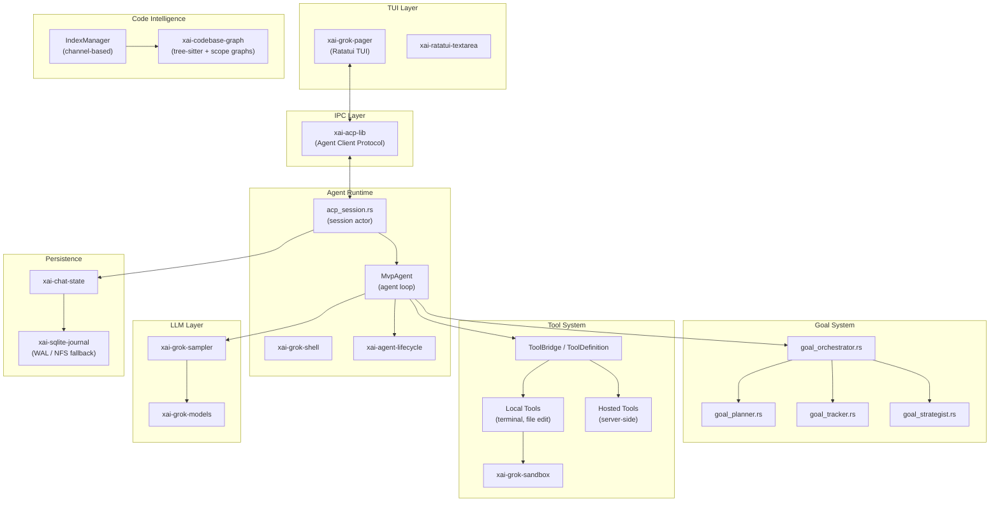
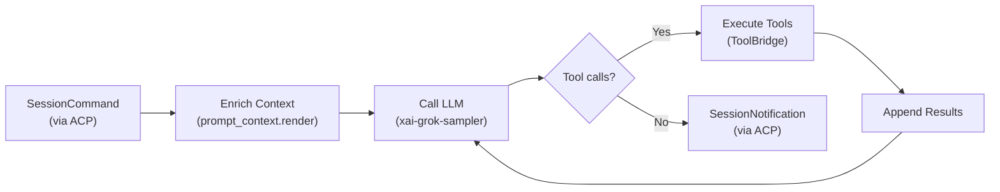
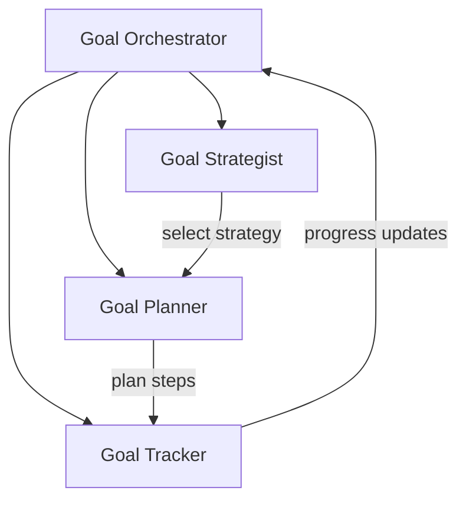

# Grok Build — Architectural Overview

> **Project**: Grok Build (by xAI)
> **Language**: Rust
> **License**: Custom (source-available, see LICENSE)
> **Source Path**: `src/grok_build/`
> **Source Files**: ~2,325 Rust files across ~63 crates

---

## 1. Project Identity

Grok Build is xAI's Rust-based coding agent infrastructure powering Grok's autonomous
coding capabilities. It is organized as a large Cargo workspace with ~63 crates
providing modular, strongly-typed components for every aspect of an AI coding agent.

| Attribute | Value |
|-----------|-------|
| Language | Rust |
| Runtime | Tokio async runtime |
| UI Framework | Ratatui (full-screen TUI) |
| Package Manager | Cargo |
| Build System | Cargo workspace |
| Key Dependencies | `tokio`, `tree-sitter`, `ratatui`, `async-openai` (fork), `agent-client-protocol`, `sqlite` |

**Workspace structure (key crate categories):**

| Category | Crates | Purpose |
|----------|--------|---------|
| **TUI Layer** | `xai-grok-pager`, `xai-ratatui-textarea` | Full-screen terminal UI |
| **Agent Runtime** | `xai-grok-shell`, `xai-agent-lifecycle` | Core agent loop and lifecycle |
| **Tools** | `xai-grok-tools`, `xai-grok-sandbox` | Tool execution and sandboxing |
| **Code Intelligence** | `xai-codebase-graph` | Tree-sitter AST parsing, scope graphs |
| **State** | `xai-chat-state` | Conversation state, token tracking |
| **IPC Protocol** | `xai-acp-lib` | Agent Client Protocol for UI↔agent communication |
| **Sampling** | `xai-grok-sampler`, `xai-grok-models` | LLM API integration |
| **Workspace** | `xai-grok-workspace`, `xai-fast-worktree` | File system operations |
| **MCP** | `xai-grok-mcp` | Model Context Protocol integration |
| **Persistence** | `xai-sqlite-journal` | SQLite-based persistent storage |
| **Sub-agents** | `xai-grok-subagent-resolution` | Sub-agent coordination |
| **PTY Control** | `ptyctl`, `ptyctl-cli` | Terminal multiplexing |
| **Testing** | `xai-grok-test-support`, `xai-test-utils` | Hermetic test infrastructure |

---

## 2. Architecture Overview

Grok Build follows a **strict layered architecture** with clean IPC boundaries
between the TUI and the agent core. Communication flows through the Agent Client
Protocol (ACP), providing complete decoupling.

**Key architectural traits:**
- **IPC-first design**: The TUI and agent core communicate exclusively through ACP,
  enabling remote/distributed deployment.
- **Actor/channel concurrency**: All async work uses Tokio channels — no `Arc<Mutex>`
  patterns in hot paths.
- **~63 crates**: Extreme modularity with clear dependency boundaries.

---

## 3. Execution Loop

The core agent loop is implemented across two key components:

| Component | File | Role |
|-----------|------|------|
| `MvpAgent` | `xai-grok-shell/src/agent/mvp_agent/` | The main agent logic |
| `acp_session` | `xai-grok-shell/src/session/acp_session.rs` | Session actor managing turns |

**Loop mechanics:**
- `SessionCommand` messages drive turns — received via ACP channels.
- The `acp_session` actor evaluates tool calls, invokes the LLM via `xai-grok-sampler`,
  and returns `SessionNotification` events.
- The `MvpAgent` coordinates the higher-level agent behavior within turns.
- Lifecycle hooks (`TurnStart`, `TurnDone`, `TurnAbort`) fire via the
  `ExtensionRegistry` at each phase boundary.

---

## 4. Context Management

Context assembly happens in `xai-grok-shell/src/session/`:

| Layer | Mechanism | Description |
|-------|-----------|-------------|
| **Prompt context** | `prompt_context.render()` | Enriches prompts with environmental context |
| **Injected blocks** | `<memory-context>` tags | File snippets and context blocks with canonical tags to prevent deduplication bugs |
| **Token tracking** | `xai-chat-state` | Per-message token estimates for budget management |
| **Pruning** | `PruningConfig` | Configurable soft-trim or hard-clear of old/large tool outputs |

**Design insight:** Injected context blocks use canonical XML-like tags
(`<memory-context>`) to mark boundaries. This prevents a subtle bug where identical
content from different sources gets silently deduplicated.

---

## 5. Short-Term Memory

Managed by the `xai-chat-state` crate:

| Component | File | Role |
|-----------|------|------|
| `ChatStateSnapshot` | `xai-chat-state/src/types.rs` | Full conversation state snapshot |
| `ConversationItem` | `xai-chat-state/src/types.rs` | Individual message/tool result entries |
| `PruningConfig` | `xai-chat-state/` | Strategy for trimming conversation history |

**Pruning strategy:**
- **Soft-trim**: Large tool outputs are truncated (e.g., grep results exceeding
  token thresholds).
- **Hard-clear**: Old conversation items beyond a configurable window are removed
  entirely.
- Token estimates are tracked per-item to enable precise budget management.
- The state also tracks `edited_paths` — files the agent has modified during the
  session.

---

## 6. Long-Term Memory

Grok Build uses **SQLite** for persistent cross-session storage:

| Component | File | Description |
|-----------|------|-------------|
| `xai-sqlite-journal` | Dedicated crate | SQLite persistence layer |

**NFS resilience (standout feature):**
- The system detects if the SQLite database file resides on an NFS mount
  (common in clustered development environments).
- On NFS, it automatically degrades from WAL (Write-Ahead Logging) mode to
  Truncate rollback journal mode.
- This prevents `SIGBUS` panics caused by peer NFS clients truncating the WAL
  file, which is a known SQLite failure mode on network filesystems.

**This is brilliant production engineering** — most coding agents silently crash
in NFS-mounted home directories.

---

## 7. Indexing & Code Intelligence

The `xai-codebase-graph` crate provides **sophisticated code intelligence**:

| Component | File | Description |
|-----------|------|-------------|
| `xai-codebase-graph` | Dedicated crate | Tree-sitter parsing + scope graphs |
| `IndexManager` | `index_manager.rs` | Incremental index management |
| Language modules | `src/languages/` | Per-language tree-sitter grammars |
| Scope graph | `src/scope_graph/` | Symbol resolution via scope analysis |

**Indexing architecture:**
- Uses **tree-sitter** for multi-language AST parsing.
- Builds **scope graphs** for symbol resolution — understanding where symbols are
  defined, referenced, and how scopes nest.
- The `IndexManager` processes file events **strictly via channels** (no `Arc<Mutex>`
  contention), ensuring the indexing never blocks the agent loop.
- File system events are **debounced** via FSNotify to avoid re-indexing on rapid
  file changes.
- Files larger than **5MB are explicitly skipped** to prevent OOM conditions.

**Design insight:** The channel-based architecture for indexing is a significant
improvement over mutex-based approaches. The index can be rebuilt incrementally
without ever blocking tool execution.

---

## 8. Search Capabilities

| Capability | Component | Description |
|------------|-----------|-------------|
| File tree traversal | `xai-fast-worktree` | Rapid file tree enumeration |
| Local search | `xai-grok-tools` | grep, file find, glob matching |
| AST/semantic search | `xai-codebase-graph` | Symbol-aware search via scope graphs |
| Web search | `xai-grok-tools` | `web_search` tool implementation |

**Notable:** The `xai-fast-worktree` crate is purpose-built for rapid file tree
traversal, likely using parallel directory walking and gitignore-aware filtering.

---

## 9. File Editing & Patching

Grok Build supports **multiple configurable file editing strategies**:

| Strategy | File | Description |
|----------|------|-------------|
| `codex` | `xai-grok-tools/src/implementations/codex/` | Codex-style editing |
| `opencode` | `xai-grok-tools/src/implementations/opencode/` | OpenCode-style editing |
| `grok_build` | `xai-grok-tools/src/implementations/grok_build/` | Native Grok editing |
| `grok_build_concise` | Same directory | Concise variant |
| `grok_build_hashline` | Same directory | Hash-line variant |

**Edit tracking:**
- `xai-hunk-tracker` tracks individual edit hunks for undo/redo and conflict
  detection.
- Multiple editing strategies can be swapped or compared — this suggests active
  experimentation to find the optimal approach.

**Design insight:** Having multiple pluggable edit strategies is sophisticated.
It enables A/B testing different approaches and selecting the best per-language
or per-context.

---

## 10. Tool System

Tools are registered and invoked via a strongly-typed bridge:

| Component | Description |
|-----------|-------------|
| `ToolDefinition` | Schema definition (name, description, parameters) |
| `ToolBridge` | Registration and dispatch layer |
| Local tools | Terminal execution, file editing — run in-process |
| `HostedTool`s | Forwarded to backend server via the sampler |

**Local vs. Hosted distinction:**
- **Local tools** (terminal, file edit, search) run directly on the client machine.
- **Hosted tools** are forwarded to the backend server/sampler for execution,
  enabling server-side capabilities without client-side dependencies.

This separation allows the agent to leverage both local resources and remote
compute transparently.

---

## 11. LLM Integration

| Component | Crate | Description |
|-----------|-------|-------------|
| Sampler | `xai-grok-sampler` | LLM sampling wrapper |
| Models | `xai-grok-models` | Model management and prefetching |
| API client | `async-openai` (forked) | OpenAI-compatible streaming API |

**Key features:**
- Uses a **forked `async-openai`** crate for streaming completions, likely
  customized for xAI's API specifics.
- Model prefetching (`xai-grok-models`) suggests models can be warmed up or
  cached before use.
- The sampler abstracts all LLM interaction, enabling easy provider switching.

---

## 12. Permissions & Security

| Component | File | Description |
|-----------|------|-------------|
| Sandbox | `xai-grok-sandbox` | Sandboxed execution environment |
| Folder trust | `folder_trust.rs` | Trust-level management per directory |
| Permission mode | `PermissionMode` | Gating based on `ClientType` |
| Permission events | `PermissionEvent` | Configurable permission triggers |

**Permission model:**
- `PermissionMode` gates operations based on `ClientType` (e.g., interactive user
  vs. automated pipeline).
- `folder_trust.rs` manages trust levels per directory — allowing fine-grained
  control over which parts of the filesystem the agent can modify.
- `xai-grok-sandbox` provides the actual execution sandbox for tool invocations.

---

## 13. Multi-Agent / Sub-Agent Support

| Component | File | Description |
|-----------|------|-------------|
| Sub-agent resolution | `xai-grok-subagent-resolution` | Sub-agent spawning and coordination |
| Coordinator | `subagent_coordinator.rs` (in `mvp_agent`) | Local orchestration of sub-agents |

**Sub-agent architecture:**
- The `xai-grok-subagent-resolution` crate handles the mechanics of spawning and
  tracking sub-agents.
- `subagent_coordinator.rs` within the `MvpAgent` module orchestrates delegation
  of nested objectives to sub-agents.
- Sub-agents communicate back via the same ACP channel system.

---

## 14. Workflow & Task Management

Grok Build has a **sophisticated goal decomposition system**:

| Component | File | Role |
|-----------|------|------|
| Goal Orchestrator | `goal_orchestrator.rs` | Top-level goal management |
| Goal Planner | `goal_planner.rs` | Decomposes goals into steps |
| Goal Tracker | `goal_tracker.rs` | Tracks progress and completion |
| Goal Strategist | `goal_strategist.rs` | Selects execution strategies |

This is implemented within `xai-grok-shell/src/session/` as a set of specialized
actors:

**Design insight:** The separation of planning, tracking, and strategy selection
into distinct actors is a mature pattern. Each can evolve independently, and the
orchestrator composes them without coupling.

---

## 15. CLI & User Interface

| Component | Crate | Description |
|-----------|-------|-------------|
| Full-screen TUI | `xai-grok-pager` | Ratatui-based terminal UI |
| Text input | `xai-ratatui-textarea` | Custom multi-line text area widget |
| Terminal control | `ptyctl`, `ptyctl-cli` | PTY multiplexing and control |

**TUI features:**
- Full-screen Ratatui rendering with custom widgets.
- `ptyctl` provides terminal multiplexing — likely enabling background task
  terminals alongside the main UI.
- The TUI communicates with the agent core exclusively via ACP, meaning the
  UI could theoretically be replaced without touching agent logic.

---

## 16. MCP (Model Context Protocol) Support

| Component | Crate | Description |
|-----------|-------|-------------|
| MCP integration | `xai-grok-mcp` | MCP client/server |
| ACP library | `xai-acp-lib` | Agent Client Protocol (separate from MCP) |

**MCP integration:**
- `McpState` is managed within sessions, connecting external MCP tooling into
  the native tool registry.
- MCP tools are registered alongside local and hosted tools transparently.

**ACP vs MCP distinction:**
- **ACP** (Agent Client Protocol) is the internal IPC protocol between TUI and
  agent core — proprietary to Grok Build.
- **MCP** (Model Context Protocol) is the external protocol for connecting to
  third-party tool servers.

---

## 17. Configuration & Extensibility

| Component | Crate | Description |
|-----------|-------|-------------|
| Config | `xai-grok-config` | Configuration management |
| Extension Registry | `xai-agent-lifecycle` | Lifecycle hook system |

**Extension Registry (standout feature):**
- `xai-agent-lifecycle` provides an `ExtensionRegistry` that dispatches
  **zero-ownership lifecycle hooks**: `TurnStart`, `TurnDone`, `TurnAbort`.
- Extensions can observe the agent lifecycle but **cannot steal the dispatch
  control loop** — they are purely observational/side-effect hooks.
- This mirrors capability-security principles: you can watch, but you can't
  hijack.

---

## 18. Testing & Quality

| Component | Crate | Description |
|-----------|-------|-------------|
| Test support | `xai-grok-test-support` | Hermetic test infrastructure |
| Test utilities | `xai-test-utils` | Shared test helpers |

- Dedicated crates for test infrastructure suggest a mature testing culture.
- Hermetic tests ensure reproducibility across environments.
- The `clippy.toml` and `rustfmt.toml` configs enforce consistent code quality.

---

## 19. Key Strengths

1. **IPC-First Architecture (ACP)** — Complete decoupling of TUI from agent core
   via the Agent Client Protocol. The UI can be swapped, the agent can run
   headless, and remote deployment becomes trivial.

2. **Channel-Based Concurrency** — All hot-path async work uses Tokio channels
   instead of `Arc<Mutex>`. This eliminates lock contention in indexing and
   state management.

3. **NFS-Resilient SQLite** — Automatic detection of NFS mounts and degradation
   from WAL to Truncate journal mode prevents SIGBUS panics in clustered
   development environments. Production-grade resilience.

4. **Tree-Sitter Scope Graphs** — Deep code intelligence via incremental
   tree-sitter parsing and scope graph construction, with language-specific
   modules.

5. **Pluggable Edit Strategies** — Multiple file editing implementations
   (`codex`, `opencode`, `grok_build`, `hashline`) enable experimentation and
   optimization.

6. **Goal Decomposition System** — Dedicated orchestrator/planner/tracker/strategist
   actors for sophisticated task planning and execution.

7. **Lifecycle Extension Registry** — Zero-ownership hooks that let extensions
   observe the agent lifecycle without hijacking control flow.

---

## 20. Key Weaknesses / Gaps

1. **Massive Workspace Complexity** — ~63 crates is extreme modularity. While
   it provides clean boundaries, compilation times suffer significantly, and
   navigating the codebase requires deep familiarity with the crate graph.

2. **Actor Fragmentation** — The heavy use of channel-based actor patterns
   distributes logic across many files. End-to-end trace debugging becomes
   difficult when a single user action traverses 5+ actors.

3. **Forked Dependencies** — The forked `async-openai` creates maintenance
   burden and divergence risk from upstream.

4. **Tight xAI Coupling** — The system is optimized for xAI's infrastructure
   (Grok models, internal APIs). Adapting it for other providers would require
   significant work.

5. **Compilation Time** — A Rust workspace of this size has substantial compile
   times, impacting developer iteration speed.

---

## 21. Lessons for SAGIHA

### Patterns to Adopt

| Pattern | Rationale |
|---------|-----------|
| **IPC boundary (ACP-style)** | Separate the agent core from any UI via a protocol boundary. SAGIHA's port-adapter architecture already aligns with this — enforce it strictly. |
| **Channel-based indexing** | Use `anyio` structured concurrency (not locks) for background indexing. Events flow through channels, never blocking the agent loop. |
| **NFS-resilient SQLite** | If SAGIHA uses SQLite, detect NFS mounts and degrade WAL mode automatically. This prevents silent crashes in common dev setups. |
| **Lifecycle extension hooks** | The `ExtensionRegistry` pattern (`TurnStart`/`TurnDone`/`TurnAbort`) maps perfectly to SAGIHA's CAR model — extensions observe but cannot hijack dispatch. |
| **Pluggable edit strategies** | Implement multiple file editing backends (diff-based, AST-aware, literal replacement) and select the best per-context. |
| **Goal decomposition actors** | Separate planning, tracking, and strategy into distinct components for sophisticated task management. |
| **File size guards** | Skip indexing files >5MB to prevent OOM. Simple but critical. |

### Anti-Patterns to Avoid

| Anti-Pattern | Why |
|--------------|-----|
| **Over-fragmented crate/module graph** | ~63 crates is too many for a Python project. SAGIHA should find the right granularity — enough for clean boundaries, not so many that navigation becomes painful. |
| **Forked dependencies** | Maintain upstream compatibility where possible. Use adapter patterns instead of forking. |
| **Actor spaghetti** | Channel-based actors are powerful but can obscure control flow. Document the message flow explicitly and provide trace tooling. |
