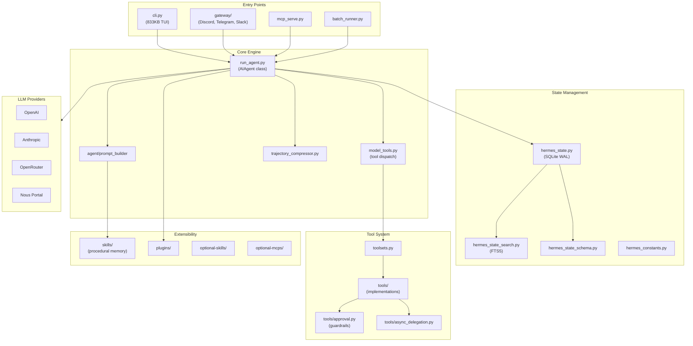
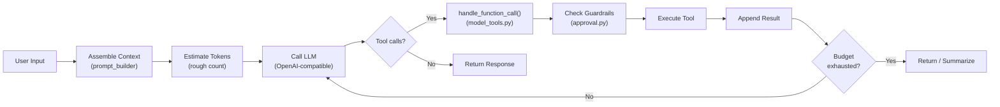

# Hermes Agent — Architectural Overview

> **Project**: Hermes Agent (by Nous Research)
> **Language**: Python
> **License**: MIT
> **Source Path**: `src/hermes_agent/`
> **Source Files**: ~3,634 Python files

---

## 1. Project Identity

Hermes Agent is Nous Research's massive, Python-based autonomous AI agent designed for
self-improving closed-loop operation. It creates and refines skills from experience,
and runs across an extraordinary range of deployment targets: local CLI/TUI, Discord,
Telegram, Slack, Docker, SSH, and Daytona cloud environments.

| Attribute | Value |
|-----------|-------|
| Language | Python 3.11–3.13 |
| Package Manager | `uv` |
| UI Framework | `prompt_toolkit` (TUI), `fastapi` (gateway) |
| Build System | `pyproject.toml` + `setup.py` |
| Key Dependencies | `openai` (as proxy API), `prompt_toolkit`, `fastapi`, `anyio`, `psutil`, `sqlite3` |
| Deployment | Local CLI, Discord, Telegram, Slack, Docker, SSH, Daytona |

**Monolithic core files (remarkably large):**

| File | Size | Purpose |
|------|------|---------|
| `cli.py` | 833 KB | Full TUI/CLI implementation |
| `hermes_state.py` | 359 KB | SQLite-backed state management |
| `run_agent.py` | 337 KB | Core agent loop and lifecycle |
| `hermes_state_search.py` | 87 KB | FTS5 full-text search |
| `trajectory_compressor.py` | 70 KB | Conversation history compression |
| `model_tools.py` | 66 KB | Tool definitions and dispatch |
| `hermes_constants.py` | 47 KB | Constants and configuration |
| `toolsets.py` | 35 KB | Tool registration and filtering |

---

## 2. Architecture Overview

Hermes Agent follows a **semi-monolithic architecture** with massive core files
augmented by extensive plugin/tool directories.

**Key architectural traits:**
- **Semi-monolithic**: Core logic concentrated in a few massive files (833KB, 359KB,
  337KB) rather than distributed across many modules.
- **Multi-deployment**: Same agent core serves CLI, messaging bots, MCP, and batch
  evaluation.
- **Self-improving**: Unique skill generation loop that captures successful patterns
  as reusable skills.

---

## 3. Execution Loop

The core agent loop lives in `run_agent.py` within the `AIAgent` class:

**Loop mechanics:**
- Entry: `_create_openai_client()` resolves the workspace and LLM provider.
- `run_conversation()` assembles messages and starts a bounded loop controlled
  by `IterationBudget`.
- Tool calls are dynamically mapped: `handle_function_call()` in `model_tools.py`
  resolves the function name to a Python tool implementation and executes it.
- **Budget-based termination**: The loop is bounded by `IterationBudget`, preventing
  runaway execution.
- Tool results are fed back into the conversation trajectory for the next LLM call.

---

## 4. Context Management

Context is assembled dynamically through multiple layers:

| Layer | Component | Description |
|-------|-----------|-------------|
| **System prompt** | `DEFAULT_AGENT_IDENTITY` | Base agent identity and instructions |
| **Skills** | `skills/` directory | Loaded procedural memory injected into context |
| **Context files** | Explicit file loading | Project-specific context files |
| **Prompt builder** | `agent/prompt_builder` | Assembles all layers into final prompt |

**Token management:**
- `estimate_request_tokens_rough()` ensures inputs fit within the LLM's context window.
- **Input sanitization**: Handles surrogate scrubbing (`_sanitize_surrogates`), image
  stripping, and unicode sanitation to keep API calls compliant.
- The `ContextCompressor` dynamically compresses conversation history when approaching
  token limits.

---

## 5. Short-Term Memory

Managed via conversation trajectory lists — the array of messages exchanged with
the LLM during a session.

| Component | File | Role |
|-----------|------|------|
| Trajectory | `run_agent.py` | In-memory message list |
| Compressor | `trajectory_compressor.py` | Budget-based history compression |

**Trajectory compression strategy (standout feature):**
1. The first N turns and last N turns are **protected** (never compressed).
2. The middle turns are replaced with a **generated summary** message.
3. The summary is produced by a fast, cheap model (typically via OpenRouter).
4. This preserves both the initial context and recent work while compressing
   the potentially enormous middle.

This is a sophisticated approach — more nuanced than simple truncation or
sliding window strategies.

---

## 6. Long-Term Memory

Persistent storage uses **SQLite in WAL mode** for multi-process safety:

| Component | File | Description |
|-----------|------|-------------|
| State manager | `hermes_state.py` | SQLite-backed session/state storage |
| Schema | `hermes_state_schema.py` | Database schema definitions |
| Search | `hermes_state_search.py` | FTS5 full-text search over history |

**Persistence features:**
- Stores complete trajectories, configuration, and workspace metadata.
- Enables **session resumption** based on git repository root or working directory.
- Uses `_delegate_from` tags to track hierarchical sub-agent session relationships.
- WAL mode enables concurrent read/write from multiple processes (critical for
  sub-agent scenarios).

**Procedural memory (skills):**
- Skills generated during operation are persisted in the `skills/` directory.
- These are loaded back into context on future sessions, creating a
  **self-improving feedback loop**.

---

## 7. Indexing & Code Intelligence

Hermes Agent does **NOT** have a native AST/tree-sitter indexing engine:

| Approach | Description |
|----------|-------------|
| **FTS5 search** | Full-text search over historical interactions via SQLite |
| **On-demand reading** | Files read and analyzed iteratively via tools |
| **Regex search** | Pattern matching via ripgrep/grep tools |
| **Runtime probing** | Code analysis happens through tool execution, not pre-indexing |

**Design trade-off:** Hermes prioritizes deployment flexibility over deep code
intelligence. It works with any codebase without upfront indexing, but lacks the
deep symbol resolution that tree-sitter or LSP integration would provide.

---

## 8. Search Capabilities

| Capability | Component | Description |
|------------|-----------|-------------|
| **Session search** | `hermes_state_search.py` | FTS5 full-text search across all historical sessions |
| **File search** | `tools/` | Shell-based `find`, `ripgrep` |
| **Web search** | `providers/` | Web search via Firecrawl and other providers |
| **Codebase search** | Via terminal tools | `grep`, `rg`, `find` executed in terminal |

The FTS5 integration is notable — it enables searching across all past interactions,
not just the current session. This gives the agent a form of "experiential memory"
search.

---

## 9. File Editing & Patching

File editing is implemented through tool invocations in the `tools/` directory:

| Mechanism | Description |
|-----------|-------------|
| **Terminal tools** | Shell commands via `ptyprocess`/`winpty` for native interactivity |
| **Specialized edit tools** | Diff and replacement tools in `tools/` |
| **Guardrail checks** | All file mutations trigger `ToolGuardrailDecision` security checks |

**Terminal integration:**
- Uses `ptyprocess` (Unix) and `winpty` (Windows) for full PTY support.
- This enables interactive tool execution — the agent can use editors, REPL
  sessions, and other interactive programs.
- File-mutating actions are gated through the approval system before execution.

---

## 10. Tool System

The tool system is governed by two key files:

| Component | File | Role |
|-----------|------|------|
| Tool registration | `toolsets.py` | Dynamic tool registration and filtering |
| Tool dispatch | `model_tools.py` | `handle_function_call()` maps names to implementations |
| Tool implementations | `tools/` directory | Individual tool modules |
| Tool guardrails | `tools/approval.py` | Security checks before execution |

**Tool registration:**
- Tools are defined dynamically and filtered by the active **toolset**.
- `sandbox_enabled` flag controls which tools are available in sandboxed environments.
- Specific environments disable specific tools based on risk profiles — this is
  capability-based authorization.

**Toolset distributions** (`toolset_distributions.py`) allow different tool
configurations for different deployment contexts (e.g., local dev vs. cloud
vs. messaging bot).

---

## 11. LLM Integration

Hermes uses a **lazy-loading provider model** with unified OpenAI-compatible API:

| Provider | Directory | Description |
|----------|-----------|-------------|
| OpenAI | `providers/` | Direct OpenAI API |
| Anthropic | `providers/` | Anthropic Claude via OpenAI-compatible wrapper |
| OpenRouter | `providers/` | Multi-model routing |
| Nous Portal | `providers/` | Nous Research's own endpoint |

**Key design:**
- All LLM calls are proxied through an **OpenAI-compatible contract** (`openai` SDK).
- Custom behaviors are injected via thin wrappers (e.g., `_effective_temperature_for_model`
  for per-model temperature overrides).
- Lazy loading: Provider SDKs are only imported when actually needed, keeping
  startup fast and memory low.
- Multiple models can be used within a single session (e.g., fast model for
  trajectory compression, powerful model for reasoning).

---

## 12. Permissions & Security

Hermes has an **extremely sophisticated guardrail system**:

| Component | File | Description |
|-----------|------|-------------|
| Approval system | `tools/approval.py` | Command-level security analysis |
| Guardrail decisions | `ToolGuardrailDecision` | Structured approval/rejection results |

**Guardrail mechanics:**
- **Regex-based command analysis**: Iteratively analyzes shell commands for dangerous
  patterns (e.g., `rm -rf /`, `sudo`, destructive lifecycle commands).
- **Domain-based restrictions**: Background tools are restricted in unapproved domains.
- **Human-in-the-loop**: Sensitive operations trigger human approval prompts.
- **Environment-aware**: Different guardrail levels based on deployment context
  (local dev is more permissive than cloud/messaging bot).

**This closely aligns with SAGIHA's CAR (Capability Authorization) model.**

---

## 13. Multi-Agent / Sub-Agent Support

| Component | File | Description |
|-----------|------|-------------|
| Async delegation | `tools/async_delegation.py` | Sub-agent spawning for parallel work |
| Session tracking | `hermes_state.py` | `_delegate_from` tags for parent-child relationships |
| Process management | Lock/lease tracking | Clean termination via PID regex tracking |

**Sub-agent features:**
- Sub-agents receive **isolated DB session constraints** — they can't corrupt
  the parent's state.
- Lock and lease tracking (`_COMPRESSION_LOCK_HOLDER_PID_RE`) ensures clean
  termination without dangling sub-processes.
- Parent-child session relationships are tracked via `_delegate_from` tags,
  enabling hierarchical session management.

---

## 14. Workflow & Task Management

Hermes takes a unique approach to workflow management through **procedural memory**:

| Mechanism | Description |
|-----------|-------------|
| **Conversational iteration** | Tasks decomposed through dialogue |
| **Skill generation** | Successful workflows captured as reusable skills |
| **Skill retrieval** | Skills loaded into context for future similar tasks |
| **Iteration budget** | Hard limits on agent loop iterations |

**Self-improving loop:**
1. Agent completes a task through conversation and tool use.
2. Successful task patterns are **generated as skills** and persisted.
3. On future tasks, relevant skills are loaded into context.
4. The agent uses prior experience to perform better over time.

This is essentially **inference-time reinforcement learning** — the agent improves
without fine-tuning the underlying model.

---

## 15. CLI & User Interface

Hermes has the most diverse interface options of any project investigated:

| Interface | Component | Description |
|-----------|-----------|-------------|
| **CLI/TUI** | `cli.py` (833KB) | `prompt_toolkit`-based rich TUI |
| **Discord** | `gateway/` | Discord bot integration |
| **Telegram** | `gateway/` | Telegram bot integration |
| **Slack** | `gateway/` | Slack bot integration |
| **Web** | `web/`, `website/` | Web interface |
| **MCP Server** | `mcp_serve.py` | MCP server mode |
| **Batch** | `batch_runner.py` | Headless batch evaluation |

**TUI features:**
- Full `prompt_toolkit`-based terminal UI with syntax highlighting.
- Fixed input areas with multi-line editing.
- Interrupt handling for graceful cancellation.
- Claude Code-like interactive experience.

---

## 16. MCP (Model Context Protocol) Support

| Component | File | Description |
|-----------|------|-------------|
| MCP server | `mcp_serve.py` | Exposes Hermes as an MCP server |
| Optional MCPs | `optional-mcps/` | Pre-configured external MCP servers |

**MCP integration:**
- Hermes can run as an **MCP server**, exposing its tools to external MCP clients.
- It can also connect to external MCP servers to dynamically expand its toolset.
- `optional-mcps/` provides pre-configured MCP server definitions for common
  integrations.

---

## 17. Configuration & Extensibility

| Mechanism | File | Description |
|-----------|------|-------------|
| Constants | `hermes_constants.py` | Central configuration constants |
| Environment | `.env` files | Environment-based configuration |
| Plugins | `plugins/` | Plugin system for extending functionality |
| Skills | `skills/` | User and agent-generated procedural skills |
| Optional skills | `optional-skills/` | Pre-built optional skill packs |

**Extensibility model:**
- Plugins extend functionality without modifying core files.
- Skills provide reusable procedural knowledge.
- **No global module auto-discovery** — strict package capability authorization
  controls what extensions can access.

---

## 18. Testing & Quality

| Component | File | Description |
|-----------|------|-------------|
| Python tests | `tests/` | Python test suite |
| JavaScript tests | `tests-js/` | JavaScript test suite |
| Batch evaluation | `batch_runner.py` | Trajectory completion evaluation |
| TCB protection | AGENTS.md rules | Non-mutation of Trusted Computing Base files |

**Batch runner:**
- `batch_runner.py` enables systematic evaluation of agent performance across
  multiple tasks.
- This is critical for measuring improvements and preventing regressions.

---

## 19. Key Strengths

1. **Unmatched Deployment Versatility** — The same agent core runs as a local TUI,
   Discord bot, Telegram bot, Slack bot, MCP server, Docker container, or headless
   batch evaluator. No other investigated project comes close.

2. **Self-Improving Skill Generation** — The ability to generate procedural skills
   from successful task completions and load them into future sessions creates a
   genuine inference-time learning loop. This is a unique innovation.

3. **Trajectory Compression** — The first-N/last-N protection with middle-summary
   compression is more sophisticated than simple truncation. Using a fast model
   for the summary is cost-effective.

4. **FTS5 Session Search** — Full-text search across all historical sessions gives
   the agent "experiential memory" — it can search its own past interactions.

5. **Sophisticated Guardrails** — The regex-based command analysis and
   `ToolGuardrailDecision` system provides fine-grained, context-aware security.

6. **Multi-Model Architecture** — Using different models for different purposes
   (fast model for compression, powerful model for reasoning) optimizes both
   cost and quality.

---

## 20. Key Weaknesses / Gaps

1. **Extreme Monolithism** — Core files are shockingly large (`cli.py` at 833KB,
   `hermes_state.py` at 359KB, `run_agent.py` at 337KB). This severely impacts
   maintainability, testability, and collaboration.

2. **No Native Code Intelligence** — No tree-sitter, no AST parsing, no LSP
   integration. All code analysis happens through string matching and runtime
   tool probing. This limits the agent's understanding of code structure.

3. **Tight Coupling** — The semi-monolithic architecture means changes to one
   area often cascade through the massive core files.

4. **No Structured Code Graph** — Unlike Grok Build's scope graphs or Claude
   Code's LSP integration, Hermes has no way to understand symbol relationships,
   type hierarchies, or dependency structures.

5. **SQLite Contention** — While WAL mode helps, heavy multi-agent scenarios
   with many concurrent writers could hit SQLite's write lock bottleneck.

---

## 21. Lessons for SAGIHA

### Patterns to Adopt

| Pattern | Rationale |
|---------|-----------|
| **Procedural skill generation** | Capture successful task patterns as reusable skills. This creates an inference-time learning loop without model fine-tuning. |
| **Trajectory compression (first-N/last-N)** | Protect the beginning and end of conversations while summarizing the middle. Use a fast model for the summary. |
| **FTS5 session search** | Index all past interactions with full-text search. Give the agent "experiential memory." |
| **Multi-deployment gateway** | Design the agent core to be deployment-agnostic, with thin adapters for CLI, messaging bots, MCP, web, and batch modes. |
| **Capability-gated toolsets** | Different deployment contexts get different tool sets. A Discord bot shouldn't have the same tools as a local dev agent. |
| **Lazy provider loading** | Don't import LLM SDKs until they're needed. Keeps startup fast and memory low. |
| **Iteration budgets** | Hard-limit the agent loop to prevent runaway execution. |

### Anti-Patterns to Avoid

| Anti-Pattern | Why |
|--------------|-----|
| **Monolithic 800KB files** | SAGIHA must decompose into clean port-adapter boundaries. No single file should exceed ~500 lines. |
| **No code intelligence** | SAGIHA needs tree-sitter or LSP integration for structural code understanding. |
| **String-only code analysis** | Regex and grep are necessary but insufficient. Scope graphs and symbol tables enable deeper reasoning. |
| **OpenAI-only API contract** | While convenient, mapping everything through `openai` SDK limits access to provider-specific features. SAGIHA's port abstraction should be richer. |
