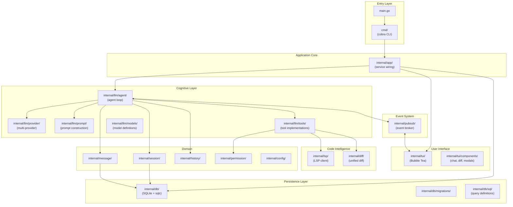
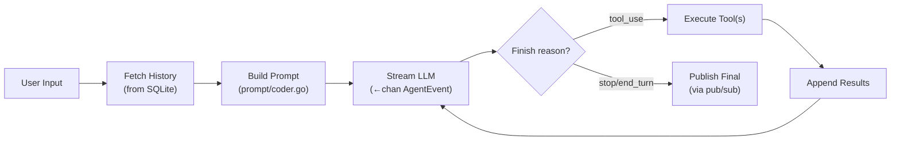
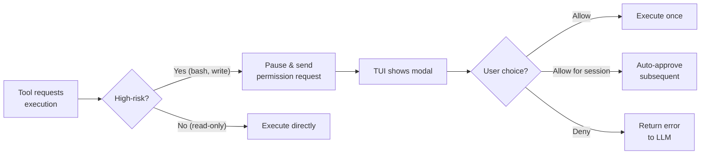

# Open Code — Architectural Overview

> **Project**: OpenCode
> **Language**: Go 1.24.0
> **License**: MIT
> **Source Path**: `src/open_code/`
> **Source Files**: 140 Go files
> **Status**: Archived (moved to successor project "Crush")

---

## 1. Project Identity

OpenCode is a terminal-based AI coding assistant written in Go, following clean
architecture principles. Despite being the smallest project investigated (140 files),
it demonstrates excellent engineering practices with a well-organized codebase
leveraging Go's `internal/` package convention. The project has been archived and
its successor is called "Crush."

| Attribute | Value |
|-----------|-------|
| Language | Go 1.24.0 |
| UI Framework | Bubble Tea (`charmbracelet/bubbletea` v1.3.5, `bubbles` v0.21.0) |
| Database | SQLite via `ncruces/go-sqlite3` v0.25.0 (pure-Go, CGO-free, backed by `tetratelabs/wazero`) + `goose` v3.24.2 migrations + `sqlc` build-time code-gen (no runtime dependency — generated code has no `sqlc` import) |
| CLI Framework | Cobra v1.9.1 (+ Viper v1.20.0) |
| Build System | Go modules |
| Key Dependencies | `bubbletea`, `ncruces/go-sqlite3`, `cobra`, `openai-go` v0.1.0-beta.2, `anthropic-sdk-go` v1.4.0, `google.golang.org/genai` v1.3.0 (Gemini/Vertex), `mcp-go` v0.17.0, `catppuccin/go`, `chroma/v2`, `fsnotify` |

---

## 2. Architecture Overview

OpenCode follows a **clean, event-driven port/adapter architecture** that leverages
Go's `internal/` convention for strict encapsulation.



**Key architectural traits:**
- **Event-driven decoupling**: The pub/sub broker completely decouples the TUI from
  the LLM processing stream — the UI never blocks agent execution.
- **Type-safe persistence**: `sqlc` generates Go structs from SQL queries, eliminating
  hand-written SQL parsing.
- **Clean package boundaries**: Go's `internal/` convention enforces encapsulation
  at the compiler level.

---

## 3. Execution Loop

The core agent loop lives in `internal/llm/agent/agent.go`:



**Loop mechanics** (`internal/llm/agent/agent.go`):
- `Run` (agent.go:198) spawns a goroutine that calls `processGeneration` (agent.go:219),
  returning a `<-chan AgentEvent` that yields exactly **one** final event to the
  caller — not a per-token stream. Token-level streaming happens *inside*
  `streamAndHandleEvents` (agent.go:322) via `provider.StreamResponse`, which
  yields a separate `<-chan provider.ProviderEvent` (`EventContentDelta`,
  `EventToolUseStart`, `EventComplete`, etc., `internal/llm/provider/provider.go:17-27`).
  `AgentEvent` is the outer event published to pub/sub once generation completes,
  distinct from the inner per-token `ProviderEvent` stream.
- `processGeneration` is a `for {}` loop: if `FinishReason() == message.FinishReasonToolUse`
  (agent.go:300) it executes tools, appends results, and loops again.
- **Auto-compaction lives in the TUI layer, not in the agent loop.** After every
  response, `internal/tui/tui.go:337-340` checks
  `tokens >= contextWindow * 0.95 && config.Get().AutoCompact` and dispatches
  `startCompactSessionMsg`, which calls `CoderAgent.Summarize(ctx, sessionID)`
  (agent.go:535). There is **no separate `SummarizeAgent` type** — `Summarize`
  is a method on the same `agent` struct as the coder, using a second internal
  provider client (`a.summarizeProvider`, built from the `config.AgentSummarizer`
  entry) for a single non-tool-looping call. The summary becomes a new message
  in the **same session**, and `session.SummaryMessageID` is set so the next
  `Run` truncates history to start from that summary — this is in-session
  context truncation, not a fresh spawned session.

---

## 4. Context Management

Context is constructed dynamically in `internal/llm/prompt/coder.go`, with sibling
files `task.go`, `title.go`, and `summarizer.go` providing distinct system prompts
for the other agent roles — `GetAgentPrompt(agentName, provider)` (`prompt.go:16`)
picks the right one.

| Layer | Content | Description |
|-------|---------|-------------|
| **Environment** | Working dir, git-repo bool, OS, date, **and live `ls` tool output** | `getEnvironmentInfo()` (coder.go:170-190) actually invokes `tools.NewLsTool()` and wraps its output in `<project>` tags — directory listing isn't a separate static layer |
| **LSP instructions** | When LSP enabled | `lspInformation()` (coder.go:197-215) tells the model it will receive `<file_diagnostics>`/`<project_diagnostics>` |
| **Project context** | `CLAUDE.md`, `CLAUDE.local.md`, `OpenCode.md`/`opencode.md` (+ `.local` variants), `.cursorrules`, `.cursor/rules/`, `.github/copilot-instructions.md` | Full list in `internal/config/config.go:108-119` (`defaultContextPaths`); loaded once via `sync.Once` in `prompt.go:47` and concatenated under a `# Project-Specific Context` heading. **Only `AgentCoder` and `AgentTask` receive this** — Title and Summarizer prompts never get project context files. |
| **Provider-specific** | Model-aware formatting | See design insight below |

**Design insight:** The system prompt only branches on **two** variants, not three —
`CoderPrompt` (coder.go:16-25) uses `baseOpenAICoderPrompt` for `models.ProviderOpenAI`
and falls through to `baseAnthropicCoderPrompt` for every other provider (Anthropic,
Gemini, Groq, Bedrock, Azure, Copilot, xAI, OpenRouter, local). There is no
Gemini-specific prompt variant despite Gemini being a first-class provider.

---

## 5. Short-Term Memory

Short-term memory is maintained through the database-backed message system:

| Component | File | Role |
|-----------|------|------|
| Messages | `internal/message/message.go` | Message creation and retrieval |
| History | `internal/history/` | Conversation history assembly |
| Sessions | `internal/session/` | Session lifecycle management |

**Mechanics:**
- Messages are associated with a `session_id` and persisted to SQLite.
- Before each LLM call, the agent fetches recent messages from the database.
- This means short-term memory **survives process restarts** — the agent can
  resume mid-conversation.

---

## 6. Long-Term Memory

All persistence is handled through **SQLite with `sqlc` code generation**:

| Component | File | Description |
|-----------|------|-------------|
| Database | `internal/db/` | SQLite via `go-sqlite3` |
| Migrations | `internal/db/migrations/` | `goose`-managed schema migrations |
| Queries | `internal/db/sql/*.sql` | SQL definitions code-generated to Go |

**Database tables** (`internal/db/migrations/20250424200609_initial.sql`, plus
a follow-up migration for the summary column):
- `sessions` — `id, parent_session_id, title, message_count, prompt_tokens,
  completion_tokens, cost, updated_at, created_at, summary_message_id`
  (`summary_message_id` added in `20250515105448_add_summary_message_id.sql`)
- `messages` — `id, session_id, role, parts` (JSON text, default `'[]'`)`,
  model, created_at, updated_at, finished_at`
- `files` — `id, session_id, path, content, version, created_at, updated_at`,
  unique on `(path, session_id, version)` — per-session file snapshots

Only two goose migrations exist; SQLite triggers auto-maintain `updated_at`
and `sessions.message_count`.

**Token tracking:**
- Token usage and cost are tracked **per session** in the database.
- This enables cost monitoring and budget enforcement.

**`sqlc` advantage:** SQL queries are defined in `.sql` files and `sqlc` generates
type-safe Go code. This eliminates runtime SQL parsing errors and provides
compile-time safety for all database operations.

---

## 7. Indexing & Code Intelligence

OpenCode uses **LSP (Language Server Protocol)** for code intelligence:

| Component | File | Description |
|-----------|------|-------------|
| LSP client | `internal/lsp/` | Connects to language servers |
| Protocol | `internal/lsp/protocol/` | LSP protocol types |
| Watcher | `internal/lsp/watcher/` | File system watching for LSP |

**LSP integration (standout feature):**
- Acts as an LSP **client** (`internal/lsp/client.go:22-49` manages an `exec.Cmd`
  subprocess over JSON-RPC, with a `diagnostics` cache keyed by document URI).
  Language servers are user-configured per-project in `.opencode.json`
  (e.g. `gopls`) — no server binary is hardcoded.
- **Intercepts LSP diagnostics** (linting, type-checking errors) and feeds them
  directly into the LLM's context within `<file_diagnostics>` /
  `<project_diagnostics>` tags, capped at 10 entries each with truncation
  (`internal/llm/tools/diagnostics.go`).
- Diagnostics aren't only available via an explicit `diagnostics` tool call —
  the `edit` and `write` tools automatically call `waitForLspDiagnostics` +
  `getDiagnostics` after every file modification and append the result to their
  own tool output (`internal/llm/tools/edit.go:166,168`,
  `internal/llm/tools/write.go:215,219`), so the model sees fresh diagnostics
  proactively after every change, not just on demand.
- No custom AST parsing, tree-sitter, or embedding-based indexing.

**Design insight:** Feeding LSP diagnostics to the LLM is a high-leverage pattern —
the agent gets real-time compiler feedback without building any code analysis
infrastructure.

---

## 8. Search Capabilities

Search is implemented as tools in `internal/llm/tools/`:

| Tool | Description |
|------|-------------|
| `glob` | Filename pattern matching |
| `grep` | Regex/literal text search within file contents |
| `ls` | Directory listing |
| `view` | Reads/views file contents — the primary file-read tool (`internal/llm/tools/view.go`) |
| `fetch` | Fetches a URL over HTTP and converts HTML to markdown (`internal/llm/tools/fetch.go`, via `html-to-markdown` + `goquery`) |
| `sourcegraph` | External code search integration |

**Notable:** The `sourcegraph` integration enables searching across external
codebases — useful for finding API usage patterns and library documentation.
`view` and `fetch` are easy to overlook since they live alongside the search
tools but aren't literally "search" — `view` in particular is the tool the
model uses to actually read file contents (there's no separate "read" tool).

---

## 9. File Editing & Patching

File modifications are handled through multiple strategies:

| Tool | Description |
|------|-------------|
| `edit` | Targeted file editing |
| `patch` | Unified diff-based patching |
| `write` | Full file creation/overwrite |

**Diff system:**
- Uses `aymanbagabas/go-udiff` and `sergi/go-diff` for diff computation
  (`internal/diff/`).
- File versions are tracked in the `files` SQLite table.
- This enables **rollback** to previous file states and diff visualization
  in the TUI.

**Design insight:** Tracking file versions in the database enables both undo
functionality and a visual diff history in the UI — showing the user exactly
what the agent changed.

---

## 10. Tool System

Tools follow a clean interface pattern in `internal/llm/tools/`:

```go
// Conceptual tool interface
type BaseTool interface {
    Info() ToolInfo      // Returns JSON schema of arguments
    Run(ctx, args) Result // Executes the tool
}
```

**Built-in tools** (`internal/llm/tools/*.go` unless noted):

| Tool | Purpose |
|------|---------|
| `glob` | File pattern matching |
| `grep` | Text search |
| `ls` | Directory listing |
| `view` | Read file contents |
| `edit` | Targeted file editing (auto-injects LSP diagnostics after edit) |
| `patch` | Diff-based patching |
| `write` | File writing (auto-injects LSP diagnostics after write) |
| `diagnostics` | Explicit LSP diagnostics lookup (only registered when LSP is configured) |
| `bash` | Shell execution (persistent shell state via `internal/llm/tools/shell/`) |
| `fetch` | Fetch a URL and convert HTML to markdown |
| `sourcegraph` | External code search |
| `agent` | Sub-agent delegation (`internal/llm/agent/agent-tool.go`, not in the `tools` package) |
| MCP tools | Dynamically loaded from MCP servers (`internal/llm/agent/mcp-tools.go`) |

**Tool schema:** Each tool provides a JSON schema via `Info()`, which is passed
to the LLM for structured invocation.

---

## 11. LLM Integration

Provider abstraction lives in `internal/llm/provider/` (7 client implementations:
`anthropic.go`, `azure.go`, `bedrock.go`, `copilot.go`, `gemini.go`, `openai.go`,
`vertexai.go`). Model definitions in `internal/llm/models/` cover a wider surface,
since several providers reuse an OpenAI/Anthropic/Gemini-compatible client:

| Provider | Client implementation |
|----------|------------------------|
| **OpenAI** | Native `openai.go` client |
| **Anthropic** | Native `anthropic.go` client |
| **Gemini** | Native `gemini.go` client |
| **Google Vertex AI** | Native `vertexai.go` client |
| **Azure OpenAI** | Native `azure.go` client |
| **AWS Bedrock** | Native `bedrock.go` client |
| **GitHub Copilot** | Native `copilot.go` client |
| **Groq, xAI, OpenRouter, Local/Ollama** | Model-definition wrappers (`models/groq.go`, `xai.go`, `openrouter.go`, `local.go`) reusing the OpenAI-compatible client, not separate `ProviderClient` implementations |

The doc's earlier 5-provider list undercounted the actual surface — 11 named
providers total across native clients and OpenAI-compatible wrappers.

**Key features:**
- Standardized input/output via a `<-chan provider.ProviderEvent` stream per
  request (distinct from the outer `AgentEvent` published to pub/sub — see
  §3).
- **Dynamic feature negotiation**, confirmed in `createAgentProvider`
  (`internal/llm/agent/agent.go:706-757`): reasoning-effort options are only
  appended for `models.ProviderOpenAI` or local models with `CanReason`, and
  Anthropic extended-thinking is only enabled when
  `model.Provider == models.ProviderAnthropic && model.CanReason && agentName == config.AgentCoder`
  — i.e. thinking mode is restricted to the coder agent only, never
  title/task/summarizer calls.
- The provider layer normalizes different API response formats into a unified
  event stream.

---

## 12. Permissions & Security

Managed by `internal/permission/`:



**Permission levels** (`internal/permission/permission.go`):
- **Allow**: One-time permission for this specific operation.
- **Allow for session**: `GrantPersistant` adds a `{ToolName, Action, SessionID, Path}`
  tuple to `sessionPermissions` (permission.go:91-96), auto-approving matching
  requests for the rest of the session.
- **Deny**: Returns a permission error to the LLM, which can adjust its approach.
- `Request` (permission.go:74) blocks on a response channel while the TUI shows
  its modal; non-interactive mode instead calls `AutoApproveSession(sessionID)`
  (permission.go:113) up front to skip all prompts — see §14.

---

## 13. Multi-Agent / Sub-Agent Support

OpenCode has only **two real hierarchical sub-agents** (separate `agent`-struct
instances with their own tool loop and session); "Title" and "Summarizer" are
better described as side-channel provider calls, not agents:

| Role | Type | Tools |
|------|------|-------|
| `AgentCoder` | Real agent, primary | All tools including `agent` (`CoderAgentTools`, `tools.go:14-41`): `bash`, `edit`, `fetch`, `glob`, `grep`, `ls`, `sourcegraph`, `view`, `patch`, `write`, `diagnostics` (if LSP enabled), MCP tools |
| `AgentTask` | Real agent, research sub-agent | Read-only (`TaskAgentTools`, `tools.go:43-51`): `glob`, `grep`, `ls`, `sourcegraph`, `view` |
| `AgentTitle` | Not an agent — a plain provider call | `generateTitle` (agent.go:154) uses a second provider client (`a.titleProvider`) on the coder's own struct |
| `AgentSummarizer` | Not an agent — a plain provider call | `Summarize` (agent.go:535) uses `a.summarizeProvider`, also on the coder's struct |

**Sub-agent design:**
- The `agent` tool (`internal/llm/agent/agent-tool.go:43-97`) creates a genuine
  new `agent` instance via `NewAgent(config.AgentTask, ...)`, runs it in an
  isolated **child session** (`sessions.CreateTaskSession`), waits synchronously
  for its single result, then rolls the child session's token cost up into the
  parent session. Its tool description explicitly states it "can not use Bash,
  Replace, Edit, so can not modify files" (agent-tool.go:32).
- `AgentTask` has **read-only** tools — it can search and view but not modify
  files. This keeps the main context window small and unpolluted by search
  results.
- Title/Summarizer are **not** hierarchical sub-agents: no child session, no
  tool loop, just a direct `SendMessages` call reusing the coder's own struct
  and a dedicated provider client configured for that role.

---

## 14. Workflow & Task Management

| Mechanism | Description |
|-----------|-------------|
| **User-driven** | Custom markdown commands with a `user:` prefix (`internal/tui/components/dialog/custom_commands.go:17`), loaded from `$XDG_CONFIG_HOME/opencode/commands` and `$HOME/.opencode/commands` |
| **Auto-compact** | Automatic context compression at 95% window capacity |
| **Session management** | Sessions persist to SQLite for resumability |
| **Headless / non-interactive mode** | `opencode -p "prompt" -f json` runs one turn with no TUI at all — see §20 |
| **`OpenCode.md` generation** | Built-in command (`internal/tui/tui.go:927-935`) that prompts the agent to analyze the codebase and produce/update its own memory file, also pulling in `.cursor/rules/`, `.cursorrules`, and `.github/copilot-instructions.md` |

**Auto-compact (standout feature):**
- When context length hits **95% of the model's context window**
  (`internal/tui/tui.go:337-340`, gated by `config.Get().AutoCompact`), the
  TUI dispatches `startCompactSessionMsg`, which calls `CoderAgent.Summarize`.
- The summary is appended as a new message in the **same session** — `session.SummaryMessageID`
  is set so the next run truncates history from that point. No new session is spawned.
- This prevents context overflow in long-running sessions without user intervention.

---

## 15. CLI & User Interface

Built on the Charm ecosystem (`charmbracelet/bubbletea`):

| Component | File | Description |
|-----------|------|-------------|
| TUI framework | `internal/tui/` | Bubble Tea application |
| Chat component | `internal/tui/components/chat/` | Main chat interface |
| Components | `internal/tui/components/` | Modals, diffs, session list |

**TUI features:**
- Full-screen terminal application with complex layout.
- Chat interface with streaming LLM output.
- Permission modals for interactive approval.
- Diff views for file change visualization.
- **Theme support**: 9 built-in themes (`internal/tui/theme/`): Catppuccin,
  Dracula, Flexoki, Gruvbox, Monokai, One Dark, native "opencode", Tokyo Night,
  and Tron.
- Session history browser.

---

## 16. MCP (Model Context Protocol) Support

Excellent MCP integration using `mark3labs/mcp-go`:

| Component | File | Description |
|-----------|------|-------------|
| MCP tools | `internal/llm/agent/mcp-tools.go` | MCP client integration |

**MCP features:**
- Acts as an **MCP client** supporting both `stdio` and `sse` transports.
- External MCP tool servers are configured via `.opencode.json`.
- MCP tools are registered alongside native tools transparently.
- Users can attach arbitrary external tool servers seamlessly.

---

## 17. Configuration & Extensibility

| Mechanism | File | Description |
|-----------|------|-------------|
| Config file | `.opencode.json` | Project-level configuration (in this repo, just `$schema` + `lsp.gopls.command` — usage is deliberately sparse) |
| Schema | `opencode-schema.json` | JSON Schema for IDE autocompletion |
| Schema generator | `cmd/schema/main.go` | Standalone program that generates `opencode-schema.json` from the `Config` struct via reflection |
| Internal config | `internal/config/` | Config parsing and defaults |

**Configuration includes:**
- Theme selection (9 built-in themes, see §15)
- Default shell for bash tool
- LSP server paths per language
- MCP server definitions
- Model selection and API keys

**JSON Schema advantage:** The explicit `opencode-schema.json` enables IDE
autocompletion when editing the config file — a thoughtful developer experience
touch, generated at build time by `cmd/schema/main.go` rather than hand-maintained.

---

## 18. Testing & Quality

Standard Go testing with `_test.go` files:

| Area | Description |
|------|-------------|
| Prompt tests | `internal/llm/prompt/prompt_test.go` — validates prompt generation logic |
| Tool tests | `internal/llm/tools/ls_test.go` — validates tool behavior |
| Theme tests | `internal/tui/theme/theme_test.go` |
| Custom command tests | `internal/tui/components/dialog/custom_commands_test.go` |
| Go conventions | Standard `go test` workflow |

Only **4 `_test.go` files out of 140 `.go` files total**. Testing is focused on
the most critical paths (prompt construction, tool execution, theming) rather
than exhaustive coverage.

---

## 19. Key Strengths

1. **Clean Architecture** — The cleanest codebase of all 4 projects. Go's `internal/`
   convention enforces proper encapsulation. The pub/sub broker elegantly decouples
   the UI from the agent.

2. **Type-Safe Persistence** — `sqlc` code generation (a build-time tool, not a
   runtime dependency) eliminates runtime SQL parsing errors. Database queries
   are compile-time verified. Combined with the pure-Go, CGO-free
   `ncruces/go-sqlite3` driver, this is a clean, portable Go-SQLite setup.

3. **LSP Diagnostics Feeding** — Intercepting LSP diagnostics and injecting them
   into the LLM context as `<file_diagnostics>` provides real-time compiler
   feedback without custom parsing.

4. **Pub/Sub Event Architecture** — The event broker prevents the TUI from ever
   blocking agent execution. Events flow asynchronously, enabling smooth
   streaming output.

5. **File Version Tracking** — Storing file versions in SQLite enables rollback
   and visual diff history — the user can see exactly what the agent changed.

6. **Auto-Compaction at 95%** — Automatic context compression prevents overflow
   without user intervention.

7. **Multi-Provider with Feature Negotiation** — The provider layer dynamically
   adapts to each model's capabilities (reasoning effort, extended thinking, etc.).

---

## 20. Key Weaknesses / Gaps

1. **Archived/Abandoned** — The project is no longer maintained, having moved to
   the "Crush" successor. This limits its value as a long-term reference.

2. **Read-Only Sub-Agents** — The `TaskAgent` sub-agent can only search, not modify
   files. No hierarchical task delegation or parallel file editing.

3. **Headless mode exists but is minimal** — `opencode -p "prompt" -f json`
   (`cmd/root.go`, `internal/app/app.go:100` `RunNonInteractive`) runs a single
   turn with no TUI, auto-approving all permissions and printing formatted
   output — so the doc's earlier claim of "no headless/API mode" was wrong.
   What's genuinely missing is a **long-running server mode**: no HTTP/RPC
   server, no messaging-bot integration, no batch/eval harness across many
   prompts — the CLI flag only covers one-shot scripted invocations.

4. **Limited Code Intelligence** — LSP diagnostics are reactive (errors after
   editing) rather than proactive (understanding code structure before editing).
   No symbol tables, scope graphs, or semantic search.

5. **No Skill/Learning System** — No mechanism for the agent to learn from past
   sessions or generate reusable procedures.

---

## 21. Lessons for SAGIHA

### Patterns to Adopt

| Pattern | Rationale |
|---------|-----------|
| **Pub/sub event broker** | Decouple the agent core from any UI via an event system. This aligns perfectly with SAGIHA's port-adapter architecture. |
| **sqlc code generation** | If using SQLite with Go/Python, generate type-safe database accessors from SQL definitions. Eliminate runtime SQL errors. |
| **LSP diagnostics injection** | Feed compiler/linter output directly into the LLM context. The agent gets real-time code quality feedback for free. |
| **File version tracking** | Store file snapshots in the database for rollback and diff visualization. |
| **Auto-compact at threshold** | Trigger automatic summarization when context hits 95% capacity. No user intervention needed. |
| **Provider feature negotiation** | Dynamically adapt to each model's capabilities rather than using a lowest-common-denominator API. |
| **JSON Schema for config** | Provide a JSON Schema for configuration files to enable IDE autocompletion. |
| **Read-only sub-agents for search** | Delegate search-heavy tasks to sub-agents with restricted (read-only) tools to keep the main context clean. |

### Anti-Patterns to Avoid

| Anti-Pattern | Why |
|--------------|-----|
| **One-shot-only headless mode** | OpenCode's `-p` flag proves a headless path is easy to bolt on, but it only runs a single turn with no server/session-resumption story. SAGIHA should support multiple deployment targets (CLI, long-running API/server, batch, MCP) from the start, not just a scripted single-shot CLI flag. |
| **No persistent learning** | SAGIHA needs cross-session learning (skills, preferences). Don't rely solely on config files. |
| **Reactive-only code intelligence** | LSP diagnostics are valuable but insufficient. Add proactive code understanding (scope graphs, symbol tables). |
