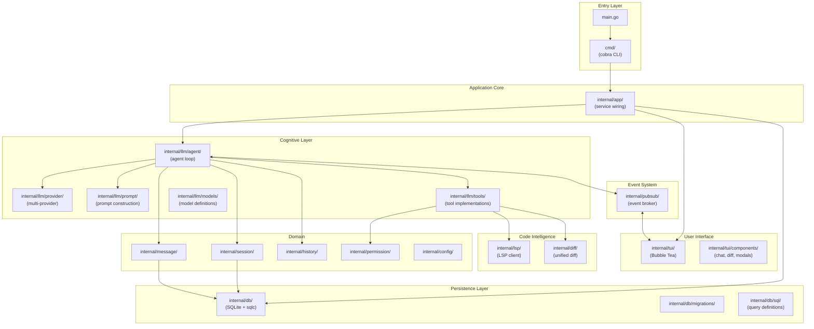
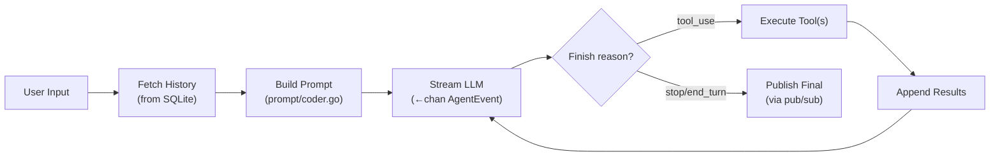
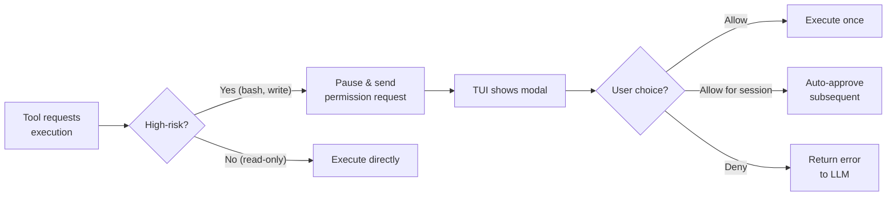

# Open Code — Architectural Overview

> **Project**: OpenCode
> **Language**: Go 1.24.0
> **License**: MIT
> **Source Path**: `src/open_code/`
> **Source Files**: ~137 Go files
> **Status**: Archived (moved to successor project "Crush")

---

## 1. Project Identity

OpenCode is a terminal-based AI coding assistant written in Go, following clean
architecture principles. Despite being the smallest project investigated (~137 files),
it demonstrates excellent engineering practices with a well-organized codebase
leveraging Go's `internal/` package convention. The project has been archived and
its successor is called "Crush."

| Attribute | Value |
|-----------|-------|
| Language | Go 1.24.0 |
| UI Framework | Bubble Tea (`charmbracelet/bubbletea`) |
| Database | SQLite via `go-sqlite3` + `goose` migrations + `sqlc` code-gen |
| CLI Framework | Cobra |
| Build System | Go modules |
| Key Dependencies | `bubbletea`, `go-sqlite3`, `sqlc`, `cobra`, `openai-go`, `anthropic-sdk-go`, `mcp-go` |

---

## 2. Architecture Overview

OpenCode follows a **clean, event-driven port/adapter architecture** that leverages
Go's `internal/` convention for strict encapsulation.



**Key architectural traits:**
- **Event-driven decoupling**: The pub/sub broker completely decouples the TUI from
  the LLM processing stream — the UI never blocks agent execution.
- **Type-safe persistence**: `sqlc` generates Go structs from SQL queries, eliminating
  hand-written SQL parsing.
- **Clean package boundaries**: Go's `internal/` convention enforces encapsulation
  at the compiler level.

---

## 3. Execution Loop

The core agent loop lives in `internal/llm/agent/agent.go`:



**Loop mechanics:**
- The `Run` method spawns a goroutine (`processGeneration`) for non-blocking execution.
- The provider streams events back via a `<-chan AgentEvent` channel.
- Tool results are appended to history and the loop continues until a non-tool
  finish reason is received.
- **Auto-compaction**: When context length hits **95% of the model's window**,
  a `SummarizeAgent` compresses the conversation and spawns a fresh session
  automatically.

---

## 4. Context Management

Context is constructed dynamically in `internal/llm/prompt/coder.go`:

| Layer | Content | Description |
|-------|---------|-------------|
| **Environment** | Working dir, git status, OS, date | Injected into system prompt |
| **Directory listing** | Quick `ls` output | Current directory structure |
| **LSP instructions** | When LSP enabled | Tells the model it will receive diagnostics |
| **Project context** | `OpenCode.md` / `.cursorrules` / `CLAUDE.md` | Persistent project instructions |
| **Provider-specific** | Model-aware formatting | System prompt varies by provider |

**Design insight:** The system prompt is **provider-aware** — it adjusts formatting
and instructions based on whether the model is OpenAI, Anthropic, or Gemini. This
optimizes prompt effectiveness per model.

---

## 5. Short-Term Memory

Short-term memory is maintained through the database-backed message system:

| Component | File | Role |
|-----------|------|------|
| Messages | `internal/message/message.go` | Message creation and retrieval |
| History | `internal/history/` | Conversation history assembly |
| Sessions | `internal/session/` | Session lifecycle management |

**Mechanics:**
- Messages are associated with a `session_id` and persisted to SQLite.
- Before each LLM call, the agent fetches recent messages from the database.
- This means short-term memory **survives process restarts** — the agent can
  resume mid-conversation.

---

## 6. Long-Term Memory

All persistence is handled through **SQLite with `sqlc` code generation**:

| Component | File | Description |
|-----------|------|-------------|
| Database | `internal/db/` | SQLite via `go-sqlite3` |
| Migrations | `internal/db/migrations/` | `goose`-managed schema migrations |
| Queries | `internal/db/sql/*.sql` | SQL definitions code-generated to Go |

**Database tables:**
- `sessions` — Session metadata and state
- `messages` — Full conversation messages with session association
- `files` — File version tracking for rollback and diff visualization

**Token tracking:**
- Token usage and cost are tracked **per session** in the database.
- This enables cost monitoring and budget enforcement.

**`sqlc` advantage:** SQL queries are defined in `.sql` files and `sqlc` generates
type-safe Go code. This eliminates runtime SQL parsing errors and provides
compile-time safety for all database operations.

---

## 7. Indexing & Code Intelligence

OpenCode uses **LSP (Language Server Protocol)** for code intelligence:

| Component | File | Description |
|-----------|------|-------------|
| LSP client | `internal/lsp/` | Connects to language servers |
| Protocol | `internal/lsp/protocol/` | LSP protocol types |
| Watcher | `internal/lsp/watcher/` | File system watching for LSP |

**LSP integration (standout feature):**
- Acts as an LSP **client** connecting to language servers like `gopls`,
  `typescript-language-server`, etc.
- **Intercepts LSP diagnostics** (linting, type-checking errors) and feeds them
  directly into the LLM's context within `<file_diagnostics>` tags.
- This means the agent automatically sees type errors, lint warnings, and
  compilation issues when working with files.
- No custom AST parsing, tree-sitter, or embedding-based indexing.

**Design insight:** Feeding LSP diagnostics to the LLM is a high-leverage pattern —
the agent gets real-time compiler feedback without building any code analysis
infrastructure.

---

## 8. Search Capabilities

Search is implemented as tools in `internal/llm/tools/`:

| Tool | Description |
|------|-------------|
| `glob` | Filename pattern matching |
| `grep` | Regex/literal text search within file contents |
| `ls` | Directory listing |
| `sourcegraph` | External code search integration |

**Notable:** The `sourcegraph` integration enables searching across external
codebases — useful for finding API usage patterns and library documentation.

---

## 9. File Editing & Patching

File modifications are handled through multiple strategies:

| Tool | Description |
|------|-------------|
| `edit` | Targeted file editing |
| `patch` | Unified diff-based patching |
| `write` | Full file creation/overwrite |

**Diff system:**
- Uses `aymanbagabas/go-udiff` and `sergi/go-diff` for diff computation
  (`internal/diff/`).
- File versions are tracked in the `files` SQLite table.
- This enables **rollback** to previous file states and diff visualization
  in the TUI.

**Design insight:** Tracking file versions in the database enables both undo
functionality and a visual diff history in the UI — showing the user exactly
what the agent changed.

---

## 10. Tool System

Tools follow a clean interface pattern in `internal/llm/tools/`:

```go
// Conceptual tool interface
type BaseTool interface {
    Info() ToolInfo      // Returns JSON schema of arguments
    Run(ctx, args) Result // Executes the tool
}
```

**Built-in tools:**

| Tool | Purpose |
|------|---------|
| `glob` | File pattern matching |
| `grep` | Text search |
| `ls` | Directory listing |
| `edit` | File editing |
| `patch` | Diff-based patching |
| `write` | File writing |
| `bash` | Shell execution |
| `agent` | Sub-agent delegation |
| `sourcegraph` | External code search |
| MCP tools | Dynamically loaded from MCP servers |

**Tool schema:** Each tool provides a JSON schema via `Info()`, which is passed
to the LLM for structured invocation.

---

## 11. LLM Integration

Provider abstraction lives in `internal/llm/provider/`:

| Provider | Description |
|----------|-------------|
| **OpenAI** | GPT models |
| **Anthropic** | Claude models |
| **Gemini** | Google models |
| **Groq** | Fast inference |
| **Bedrock** | AWS-hosted models |

**Key features:**
- Standardized input/output across all providers via streaming `AgentEvent` channels.
- **Dynamic feature negotiation**: Automatically appends provider-specific flags
  (e.g., reasoning effort for models that support extended thinking).
- The provider layer normalizes different API response formats into a unified
  event stream.

---

## 12. Permissions & Security

Managed by `internal/permission/`:



**Permission levels:**
- **Allow**: One-time permission for this specific operation.
- **Allow for session**: Auto-approves all subsequent similar operations in the
  same session.
- **Deny**: Returns a permission error to the LLM, which can adjust its approach.

---

## 13. Multi-Agent / Sub-Agent Support

OpenCode implements a focused sub-agent system via `internal/llm/agent/agent-tool.go`:

| Agent | Role | Tools |
|-------|------|-------|
| `CoderAgent` | Primary agent | All tools including `agent` tool |
| `TaskAgent` | Research sub-agent | Read-only: `glob`, `grep`, `ls` |
| `TitleAgent` | Session naming | Generates session titles |
| `SummarizeAgent` | Context compression | Summarizes conversations |

**Sub-agent design:**
- The main `CoderAgent` delegates heavy codebase searches to `TaskAgent` via
  the `agent` tool.
- `TaskAgent` has **read-only** tools — it can search but not modify files.
- This keeps the main context window small and unpolluted by search results.
- `SummarizeAgent` is triggered automatically for context compression.

---

## 14. Workflow & Task Management

| Mechanism | Description |
|-----------|-------------|
| **User-driven** | Custom markdown commands (e.g., `user:git:commit`) |
| **Auto-compact** | Automatic context compression at 95% window capacity |
| **Session management** | Sessions persist to SQLite for resumability |

**Auto-compact (standout feature):**
- When context length hits **95% of the model's context window**, the
  `SummarizeAgent` automatically compresses the conversation into a summary.
- A fresh session is spawned with the compressed context.
- This prevents context overflow in long-running sessions without user intervention.

---

## 15. CLI & User Interface

Built on the Charm ecosystem (`charmbracelet/bubbletea`):

| Component | File | Description |
|-----------|------|-------------|
| TUI framework | `internal/tui/` | Bubble Tea application |
| Chat component | `internal/tui/components/chat/` | Main chat interface |
| Components | `internal/tui/components/` | Modals, diffs, session list |

**TUI features:**
- Full-screen terminal application with complex layout.
- Chat interface with streaming LLM output.
- Permission modals for interactive approval.
- Diff views for file change visualization.
- **Theme support**: Built-in themes including Catppuccin and Dracula.
- Session history browser.

---

## 16. MCP (Model Context Protocol) Support

Excellent MCP integration using `mark3labs/mcp-go`:

| Component | File | Description |
|-----------|------|-------------|
| MCP tools | `internal/llm/agent/mcp-tools.go` | MCP client integration |

**MCP features:**
- Acts as an **MCP client** supporting both `stdio` and `sse` transports.
- External MCP tool servers are configured via `.opencode.json`.
- MCP tools are registered alongside native tools transparently.
- Users can attach arbitrary external tool servers seamlessly.

---

## 17. Configuration & Extensibility

| Mechanism | File | Description |
|-----------|------|-------------|
| Config file | `.opencode.json` | Project-level configuration |
| Schema | `opencode-schema.json` | JSON Schema for IDE autocompletion |
| Internal config | `internal/config/` | Config parsing and defaults |

**Configuration includes:**
- Theme selection (Catppuccin, Dracula, etc.)
- Default shell for bash tool
- LSP server paths per language
- MCP server definitions
- Model selection and API keys

**JSON Schema advantage:** The explicit `opencode-schema.json` enables IDE
autocompletion when editing the config file — a thoughtful developer experience
touch.

---

## 18. Testing & Quality

Standard Go testing with `_test.go` files:

| Area | Description |
|------|-------------|
| Prompt tests | `prompt_test.go` — validates prompt generation logic |
| Tool tests | `ls_test.go` — validates tool behavior |
| Go conventions | Standard `go test` workflow |

Testing is focused on the most critical paths (prompt construction, tool execution)
rather than exhaustive coverage.

---

## 19. Key Strengths

1. **Clean Architecture** — The cleanest codebase of all 4 projects. Go's `internal/`
   convention enforces proper encapsulation. The pub/sub broker elegantly decouples
   the UI from the agent.

2. **Type-Safe Persistence** — `sqlc` code generation eliminates runtime SQL errors.
   Database queries are compile-time verified. This is the gold standard for
   Go-SQLite integration.

3. **LSP Diagnostics Feeding** — Intercepting LSP diagnostics and injecting them
   into the LLM context as `<file_diagnostics>` provides real-time compiler
   feedback without custom parsing.

4. **Pub/Sub Event Architecture** — The event broker prevents the TUI from ever
   blocking agent execution. Events flow asynchronously, enabling smooth
   streaming output.

5. **File Version Tracking** — Storing file versions in SQLite enables rollback
   and visual diff history — the user can see exactly what the agent changed.

6. **Auto-Compaction at 95%** — Automatic context compression prevents overflow
   without user intervention.

7. **Multi-Provider with Feature Negotiation** — The provider layer dynamically
   adapts to each model's capabilities (reasoning effort, extended thinking, etc.).

---

## 20. Key Weaknesses / Gaps

1. **Archived/Abandoned** — The project is no longer maintained, having moved to
   the "Crush" successor. This limits its value as a long-term reference.

2. **Read-Only Sub-Agents** — The `TaskAgent` sub-agent can only search, not modify
   files. No hierarchical task delegation or parallel file editing.

3. **No Headless/API Mode** — Tightly coupled to the terminal UI. No server mode,
   no messaging bot integration, no batch evaluation mode.

4. **Limited Code Intelligence** — LSP diagnostics are reactive (errors after
   editing) rather than proactive (understanding code structure before editing).
   No symbol tables, scope graphs, or semantic search.

5. **No Skill/Learning System** — No mechanism for the agent to learn from past
   sessions or generate reusable procedures.

---

## 21. Lessons for SAGIHA

### Patterns to Adopt

| Pattern | Rationale |
|---------|-----------|
| **Pub/sub event broker** | Decouple the agent core from any UI via an event system. This aligns perfectly with SAGIHA's port-adapter architecture. |
| **sqlc code generation** | If using SQLite with Go/Python, generate type-safe database accessors from SQL definitions. Eliminate runtime SQL errors. |
| **LSP diagnostics injection** | Feed compiler/linter output directly into the LLM context. The agent gets real-time code quality feedback for free. |
| **File version tracking** | Store file snapshots in the database for rollback and diff visualization. |
| **Auto-compact at threshold** | Trigger automatic summarization when context hits 95% capacity. No user intervention needed. |
| **Provider feature negotiation** | Dynamically adapt to each model's capabilities rather than using a lowest-common-denominator API. |
| **JSON Schema for config** | Provide a JSON Schema for configuration files to enable IDE autocompletion. |
| **Read-only sub-agents for search** | Delegate search-heavy tasks to sub-agents with restricted (read-only) tools to keep the main context clean. |

### Anti-Patterns to Avoid

| Anti-Pattern | Why |
|--------------|-----|
| **TUI-only design** | SAGIHA must support multiple deployment targets (CLI, API, batch, MCP). Don't couple to one UI. |
| **No persistent learning** | SAGIHA needs cross-session learning (skills, preferences). Don't rely solely on config files. |
| **Reactive-only code intelligence** | LSP diagnostics are valuable but insufficient. Add proactive code understanding (scope graphs, symbol tables). |
