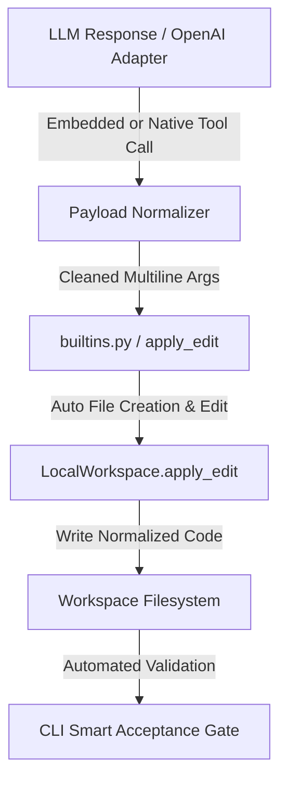

# 📋 Architectural Specification: LLM Payload Normalization & Smart Acceptance Gate Enforcement

**Status:** Proposed (Scheduled for Next Sprint Implementation)  
**Target Modules:** `sagiha.adapters.model.openai`, `sagiha.adapters.workspace.local`, `sagiha.cli`  
**TCB Impact:** Zero (TCB modules `sagiha.kernel.policy` and `sagiha.outer_loop.evaluator` remain strictly untouched).

---

## 1. Problem Statement & Motivation

During live model execution (`qwen2.5-coder:7b` via local Ollama and remote LLMs via OpenRouter), two key operational failure modes were identified:

1. **Escaped Newline Literals (`\n` String Serialization Bug):**
   Certain LLMs output double-escaped newlines (`\\n`) instead of actual newline bytes (`\n`) in `apply_edit` JSON payloads. When written to disk, the file consists of a single 1-line string. If the file starts with `#`, Python treats the entire file as a comment, rendering it non-executable.
2. **False-Positive Gate Admission (`admitted=True`):**
   When `--acceptance` is omitted on the CLI, SAGIHA defaults to `["true"]`. `/bin/true` always exits 0, resulting in `admitted=True` even when generated files are broken, syntactically invalid, or empty.

---

## 2. Technical Design & Architecture



### Component 1: Non-Rigid Payload Normalization (`sagiha.adapters.model.openai`)

Tool call arguments extracted from model responses will pass through a string normalizer.
- **Rule:** If a tool call argument string contains `\\n` literals AND contains no literal `\n` linebreaks, decode string escapes (`unicode_escape`).
- **Safety:** Multiline code strings already containing literal `\n` remain completely untouched.

```python
def normalize_tool_argument(val: Any) -> Any:
    """Safely decode escaped linebreaks in single-line LLM payload strings."""
    if isinstance(val, str) and "\\n" in val and "\n" not in val:
        try:
            return val.encode("utf-8").decode("unicode_escape")
        except Exception:
            return val.replace("\\n", "\n").replace("\\t", "\t")
    return val
```

---

### Component 2: Workspace Adapter Resilience (`sagiha.adapters.workspace.local`)

Fix `LocalWorkspace.apply_edit` to handle file creation cleanly:
- When `target.exists()` is False, treat original content as empty string `""` rather than throwing `FileNotFoundError`.
- Ensure new file creation via `apply_edit` (with `old_string=""`) creates parent directories automatically and applies clean multiline contents.

```python
async def apply_edit(self, request: EditRequest) -> EditResult:
    target = self._resolve(request.path)
    if target.exists():
        original = await asyncio.to_thread(target.read_text, encoding="utf-8")
    else:
        original = ""
    # ... apply edits on original
```

---

### Component 3: CLI Smart Default Acceptance Gate (`sagiha.cli`)

Enhance default acceptance check when `--acceptance` is omitted:
- Replace fallback `["true"]` with automatic syntax compilation check:
  - If Python files exist or were generated in the target workspace, execute:
    `python3 -c "import ast, sys, glob; [ast.parse(open(f).read()) for f in glob.glob('./**/*.py', recursive=True)]"`
  - If syntax compilation fails, the gate fails (`admitted=False`), preventing false positives.
- If `--acceptance` is explicitly provided by the user, run user's exact command.

---

## 3. Sprint Deliverables & Implementation Checklist

- [ ] Add `normalize_tool_argument` to `src/sagiha/adapters/model/openai.py`.
- [ ] Update `LocalWorkspace.apply_edit` in `src/sagiha/adapters/workspace/local.py` for missing file creation handling.
- [ ] Update `src/sagiha/cli.py` to auto-generate syntax check gates when `--acceptance` is omitted.
- [ ] Add unit tests in `tests/test_openai_adapter.py` and `tests/test_workspace.py`.
- [ ] Run `uv run lint-imports` to verify TCB architectural constraints.
