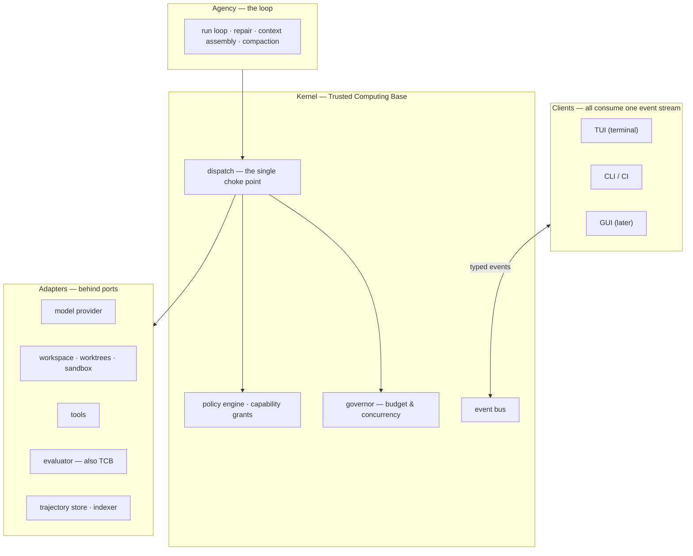

# AETHER — Vision & Onboarding

**Read time ~10 minutes.** The whole picture at altitude. What is *true* is
[`spec.md`](./spec.md); this explains why anyone would want it to be.

---

## 1. The mission

**Build a decoupled framework for autonomous agents — proven on the public leaderboards, and
designed to eventually improve its own workflows.**

Three things, in this order, and the order is not reversible
([ADR-0019](./decisions/0019-three-horizons-harness-framework-metaloop.md)):

| Horizon | What it is | Why it comes when it does |
| :--- | :--- | :--- |
| **H1 — Harness** | A SWE-bench harness with a deterministic judge and a calibrated instrument | You cannot trust any looser verdict until you have calibrated a strict one |
| **H2 — Framework** | Many task types — code fix, Q&A, explanation, research — each with its own verdict; capability declared in data; third parties extend without forking | A meta-loop needs a space of variants to search, and that space has to be **data** |
| **H3 — Meta-loop** | The system proposes changes to its own roles, topologies and prompts; the statistics admit or delete them | Last, because everything below exists to stop it grading itself |

**We are not building a model.** We build the system *around* one — tools, a workspace, memory,
retrieval, a security perimeter, a feedback loop. The industry term is a **harness**. A frontier
model called once with a bug report resolves maybe 20–40% of tasks; the same model inside a good
harness resolves substantially more. **That delta is the entire product.**

**SWE-bench is the proving ground, not the purpose.** It is the one task type with a judge that
cannot be argued with, which is exactly what makes it the calibration instrument for everything
looser that follows. Coding is the first capability, not the only one.

**So we measure two numbers, always together.** The absolute score is dominated by which model
we are allowed to call — a commercial decision, not an engineering one. The number that reflects
our work is **lift**: the resolve-rate delta between a bare model call and the same model inside
AETHER on identical tasks. Lift survives a model swap and a leaderboard reshuffle. Absolute is
the claim that sells. We publish both, and never one without the other.

### Why the third horizon is the hard one

Four competing harnesses were read at source level. Every one of them has the *primitives* for
self-improvement — trajectory logs, LLM judges, versioned configs, memory consolidation. **Not
one has closed the loop.** The most advanced, Hermes, ships a real GEPA optimiser whose
"continuous improvement" phase is a one-line empty file.

The reason is always the same, and it is the reason this project looks over-engineered for four
sprints: **you cannot safely let a system improve itself until you have a judge it cannot
influence.** An LLM judge that also grades the changes made to it has no fixed point. Everything
in [`measurement.md`](./measurement.md) — the floor, derived N, the family gatekeeper, I7, I9 —
is the precondition for H3, not overhead on H1.

---

## 2. Four pillars

A harness is not a prompt loop with tools bolted on. Four subsystems, four different failure
modes.

**Reasoning Agency — the loop.** Turns a task into a sequence of actions and keeps going
until done or provably stuck. It decides what to read, what to change, when to run tests,
and — the hard part — **what to do when the tests fail**. That repair edge, from a failing
test back into the model's context, is the single largest lever on score in the system. It
also owns context: a long task exceeds any window, so the loop must compact its own history
without losing the thread.
*Fails by:* looping forever, running out of context, or losing the task under a pile of stack traces.

**Execution Sandbox — the hands.** Every read, edit, shell command and test run. Each
candidate runs in its own isolated git worktree so parallel attempts cannot corrupt each
other, inside a container so the agent cannot reach the host or the network except through
an audited path.
*Fails by:* not actually isolating — worse than not isolating at all, because it silently produces numbers.

**Capability Security Perimeter — the authorization layer.** The agent is an untrusted actor
executing code it wrote, over content it did not write. Every effect passes **one** choke
point, is authorized against a capability policy, and is verified again at the moment of
effect. External content can never acquire instruction authority.
*Fails by:* prompt injection, or an authorization granted early and used later under different conditions.

**Benchmark Evaluator — the judge.** Runs the real tests and decides pass or fail.
Deliberately **outside** the agent's reach: the agent that writes code cannot modify the
tests grading it. Without that boundary, a self-improving system's most efficient available
strategy is to weaken its own judge — and that failure is retroactive, invalidating every
number the project ever produced.
*Fails by:* passing when it should fail.

---

## 3. Architecture at altitude

**Hexagonal.** Pure domain models at the centre with zero I/O. Every external dependency
sits behind a typed `Protocol`. Swapping providers is writing one adapter and changing no
caller.

Two rules make that real rather than aspirational:

- **Ports are wire-serializable.** Every method `async`, only serializable payloads. Any
  component can later move out of process without touching a caller. Nearly free on day one,
  impossible to retrofit.
- **A port arrives with its first adapter.** No interfaces against imagined implementations.
  The predecessor declared seventeen ports; five had none.

**One choke point.** `authorize → verify grant → acquire lease → dispatch → release`. There
is no second path and an architecture test proves it.

**Headless engine, many clients.** One typed, append-only event stream; every surface is a
consumer with no privileged access.

Dependencies point downward only, and a linter enforces it. **The thing that judges cannot
reach up into the thing being judged.**

---

## 4. The most important fact about where we are

**The prototype never produced a valid benchmark number.** Not a low one — none. Three
instrument defects were found, documented and reproduced: the runner resolved task commits
against the wrong repository, an editable install leaked live source into every
supposedly-isolated worktree (so candidate changes were invisible to the gates scoring
them), and command-not-found was counted as a test failure.

**This is not a disappointment to work around; it is the most valuable thing the prototype
produced.** The team found these, wrote them down, and reported zero rather than a
comfortable estimate. Every measurement taken before those fixes had to be discarded, and
the project's governing rule comes directly from that experience:

> **Instruments are built and verified before the capability they measure. Every gate ships
> with a test proving it can fail.**

You will see that rule invoked constantly. It is the difference between this attempt and the
last one.

---

## 5. Where to go next

| You want | Read |
| :--- | :--- |
| What is true | [`spec.md`](./spec.md) — the normative statement |
| Why a decision went the way it did | [`decisions/`](decisions/README.md) — ADRs with reversal conditions |
| How anything gets measured | [`measurement.md`](./measurement.md) |
| What is actually built | [`STATUS.md`](./STATUS.md) |
| How Phase 0 reached its decisions | [`concepts/`](concepts/README.md) — the audit and decision trail |

**Contracts live in code.** When a document and `src/aether/ports/` disagree, the code is
right and the document is a bug.
