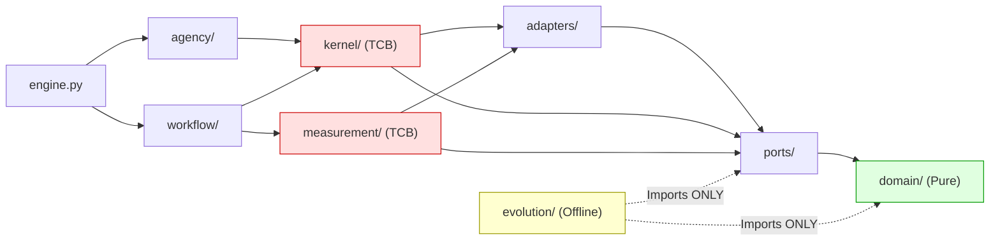

# Port-Adapter Architecture & Import Lattice Workflow

This document details the modular architecture of **AETHER v3.0.0**, highlighting the strict downward import lattice, the separation between the immutable Trusted Computing Base (TCB) and mutable agency/evolution layers, and wire-serializable port boundaries.

```mermaid
graph TB
    subgraph DOMAIN["domain/ — Pure Models (Zero I/O Dependencies - I1)"]
        DM["Task · Trajectory · GateReport · Events · TaintSpan · Budget"]
    end

    subgraph PORTS["ports/ — Typed, Async, Wire-Serializable Protocols (I2, I3)"]
        pMP[ModelProvider]
        pWS[Workspace]
        pWT[WorktreeManager]
        pTR[ToolRegistry]
        pPE["PolicyEngine (TCB)"]
        pRG[ResourceGovernor]
        pTS[TrajectoryStore]
        pEV["Evaluator (TCB)"]
        pIX[Indexer]
    end

    subgraph KERNEL["kernel/ — TCB Core (I5, I8)"]
        DISP["dispatch.py — Single Choke Point"]
        POL["policy.py ⇐ implements PolicyEngine"]
        GOV["governor.py ⇐ implements ResourceGovernor"]
        BUS["bus.py — Append-Only Event Bus"]
        SAST["shell_ast.py — Classifier"]
    end

    subgraph MEASUREMENT["measurement/ — TCB Evaluator & Gates (I7, I8)"]
        EVI["evaluator.py ⇐ implements Evaluator"]
        STAT["statistics.py — McNemar / Holm-Bonferroni"]
        RUN["runner.py — Harness Under Test Seam"]
        MAN["manifests/ — Pinned Task Digest Data"]
    end

    subgraph ADAPTERS["adapters/ — Behind Ports (Substitutability - I4)"]
        aANT["model_provider/anthropic_native"]
        aOAI["model_provider/openai_compatible"]
        aGIT["workspace/git_cli ⇐ Workspace + WorktreeManager"]
        aTOOL["tools/builtin ⇐ ToolRegistry"]
        aSBX["sandbox/podman — Tool Containers"]
        aSQL["trajectory_store/sqlite"]
        aTSIT["indexer/tree_sitter"]
    end

    subgraph AGENCY["agency/ — Mutable Loop & Context"]
        LOOP["loop.py — Execution Loop"]
        CTX["context/ — Assembler, Compactor, Taint Gate"]
    end

    subgraph WORKFLOW_SYS["workflow/ — DAG System (TCB-Adjacent)"]
        SCHEMA["schema.py — Workflow Schema"]
        VAL["validator.py — DAG Validator"]
        EXE["executor.py — Topological DAG Executor"]
    end

    subgraph ENGINE_LAYER["engine.py & Client Interface"]
        ENG["engine.py — Headless API"]
        COMP["composition.py — Explicit Dependency Wiring"]
    end

    %% Dependency & Interface Flow
    ENG --> WORKFLOW_SYS & AGENCY & KERNEL
    COMP --> KERNEL & ADAPTERS
    
    WORKFLOW_SYS --> KERNEL & MEASUREMENT & PORTS
    AGENCY --> DISP
    
    DISP --> POL & GOV
    DISP --> ADAPTERS
    DISP --> EVI

    POL -.implements.-> pPE
    GOV -.implements.-> pRG
    EVI -.implements.-> pEV

    aANT & aOAI -.implements.-> pMP
    aGIT -.implements.-> pWS & pWT
    aTOOL -.implements.-> pTR
    aSBX -.implements.-> pTR
    aSQL -.implements.-> pTS
    aTSIT -.implements.-> pIX

    PORTS --> DOMAIN
    KERNEL --> PORTS
    MEASUREMENT --> PORTS
    ADAPTERS --> PORTS

    %% Styling
    classDef tcb fill:#ffe0e0,stroke:#c00,stroke-width:2px;
    class KERNEL,MEASUREMENT,pPE,pEV tcb;
```

---

## System Import Lattice & Dependency Direction Workflow

Dependencies point strictly downward. Kernel and Measurement cannot import Agency or Workflow: **the judge cannot reach up into the thing being judged.**

## Import Rules Summary

| Package | May Import | May Be Imported By | Core Rule |
| :--- | :--- | :--- | :--- |
| `domain/` | stdlib + `pydantic` only | Everything | **Pure Domain (I1)**: Zero I/O dependencies. |
| `ports/` | `domain/` | Everything above | **Wire-Serializable (I3)**: Methods are `async`; serializable payloads only. |
| `adapters/` | `ports/`, `domain/` | `kernel/`, `composition.py` | **Substitutability (I4)**: Pass identical conformance test suites in CI. |
| `kernel/` | `adapters/`, `ports/`, `domain/` | `agency/`, `workflow/`, `engine.py` | **Immutable TCB (I5/I8)**: Houses dispatch choke point, CAR policy, and governor. |
| `measurement/` | `ports/`, `domain/`, `kernel/` | `workflow/`, `engine.py` | **Immutable TCB (I7/I8)**: Generator cannot modify evaluator. |
| `workflow/` | `kernel/`, `measurement/`, `ports/`, `domain/` | `engine.py` | **Declarative DAG**: Topologies are data; validator and executor are TCB. |
| `agency/` | `kernel/`, `ports/`, `domain/` | `workflow/`, `engine.py` | **Mutable Surface**: Loop execution & context assembly. |
| `evolution/` | `ports/`, `domain/` **ONLY** | **NOTHING** | **Offline Security**: Completely forbidden from importing TCB or agency runtime. |
