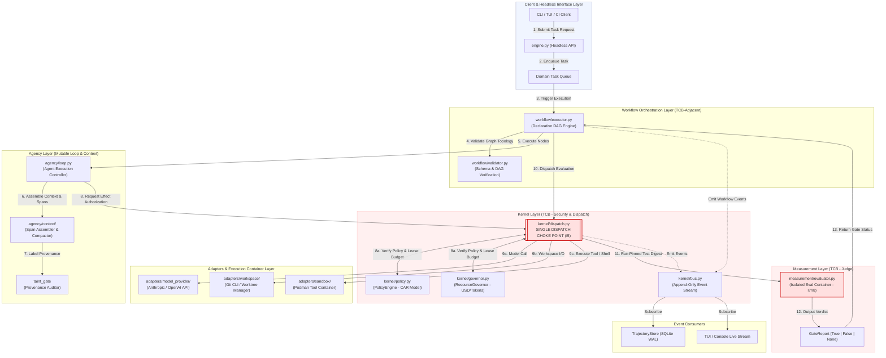

# High-Level Project Workflow

This workflow documents the end-to-end orchestration cycle of the **AETHER AGI Agent Coding LLM Orchestrator**, from client invocation down through workflow execution, kernel dispatch, sandbox execution, TCB evaluation, and event streaming.

## Key Invariants Documented

1. **Single Dispatch Choke Point (I5)**: All interactions with models, filesystem worktrees, shell execution, and evaluators must cross `kernel/dispatch.py`. Direct adapter invocations from agency or workflow layers are prohibited.
2. **Generator $\ne$ Evaluator Isolation (I7 & I8)**: `agency/` can never reach `measurement/evaluator.py`. Evaluation commands execute pinned container images defined in immutable manifests.
3. **Observation via Append-Only Event Bus**: The workflow graph drives node execution; `kernel/bus.py` streams observation events out to `TrajectoryStore` and client interfaces asynchronously without driving scheduling decisions.
