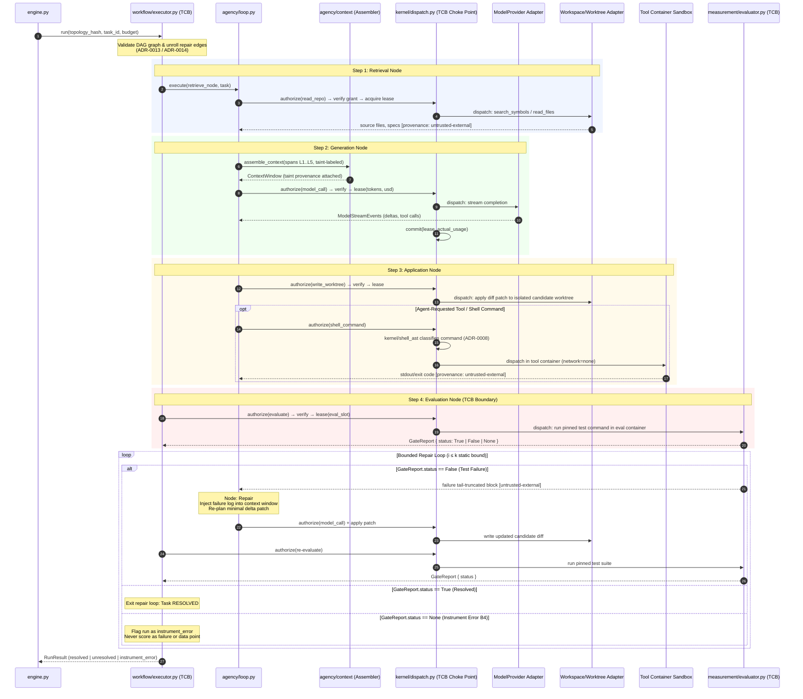

# Inner Loop & Bounded Repair Workflow

This workflow documents the inner execution loop of **AETHER**, detailing DAG node unrolling, context assembly with taint labeling, candidate code generation, worktree patch application, AST shell classification, gate evaluation, and the static bounded repair cycle ($i \le k$).



## Detailed Inner Loop Logic

```mermaid
flowchart TD
    START([Start Node Execution]) --> RETRIEVE[1. Retrieve Context & Files]
    RETRIEVE --> TAINT_LABEL[Label Spans: untrusted-external]
    TAINT_LABEL --> ASSEMBLE[2. Assemble Context L1..L5 Prefix]
    
    ASSEMBLE --> REQ_MODEL[3. Request LLM Candidate Code]
    REQ_MODEL --> DISP_MODEL{Kernel Dispatch Choke Point}
    DISP_MODEL -->|Check Taint & Lease| MODEL_EXEC[Invoke ModelProvider Adapter]
    MODEL_EXEC --> PATCH_GEN[Candidate Diff Patch Produced]
    
    PATCH_GEN --> APPLY_PATCH[4. Apply Patch to Worktree Candidate]
    APPLY_PATCH --> AST_CHECK{Shell AST Command Requested?}
    
    AST_CHECK -->|Yes| AST_CLASS[Classify Shell AST]
    AST_CLASS --> SBX_EXEC[Run in Network-Isolated Container]
    SBX_EXEC --> EVAL_NODE
    AST_CHECK -->|No| EVAL_NODE
    
    EVAL_NODE[5. Run Gate Evaluation in TCB Container] --> GATE_VERDICT{GateReport Status}
    
    GATE_VERDICT -->|True| RESOLVED([Task Resolved Successfully])
    GATE_VERDICT -->|None| INSTR_ERR([Instrument Error B4 - Flagged Run])
    
    GATE_VERDICT -->|False| BOUND_CHECK{Repair Iterations i ≤ k?}
    BOUND_CHECK -->|Yes (i < k)| REPAIR[Node: Repair - Feed Tail Truncated Log]
    REPAIR --> ASSEMBLE
    BOUND_CHECK -->|No (i > k)| UNRESOLVED([Task Unresolved - Exceeded Repair Bound])

    style DISP_MODEL fill:#ffe0e0,stroke:#c00
    style EVAL_NODE fill:#ffe0e0,stroke:#c00
```

## Key Invariants & Rules

- **Bounded Repair ($i \le k$)**: The unroll limit $k$ is statically configured in `workflow_schema.repair.max_iterations`. Infinite repair loops are prohibited.
- **Instrument Error ($B4$) handling**: Tri-state `GateReport` emits `None` on container or execution environment failures (e.g. exit code 127). Instrument failures are never counted as code test failures.
- **Taint Monotonicity**: Output generated from consumption of `untrusted-external` inputs is labeled `untrusted-derived` and cannot satisfy capability-widening requests.
