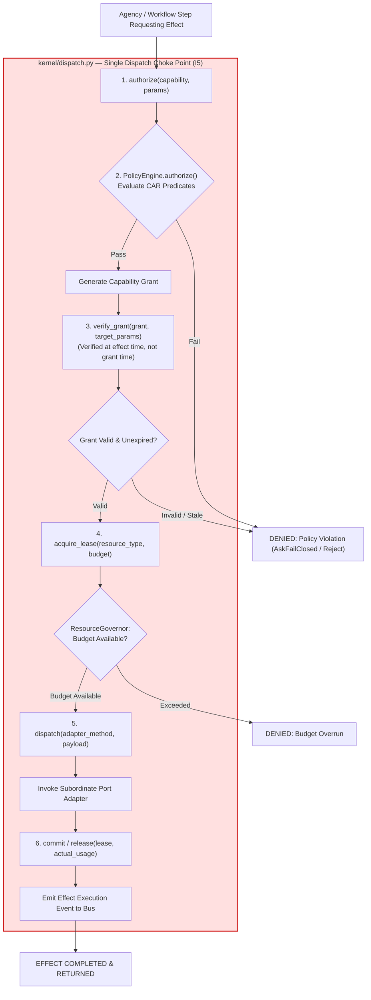
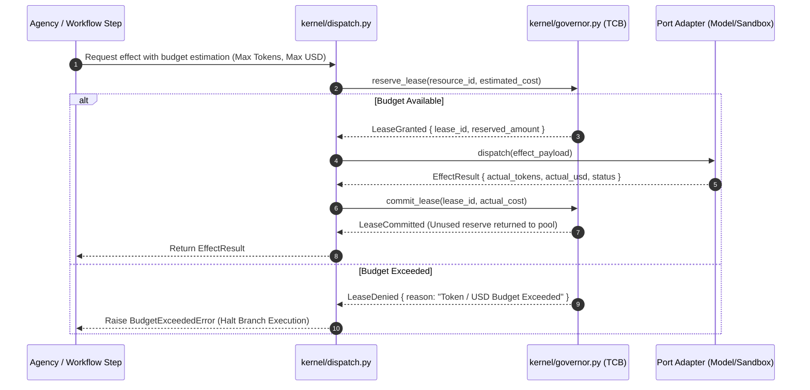
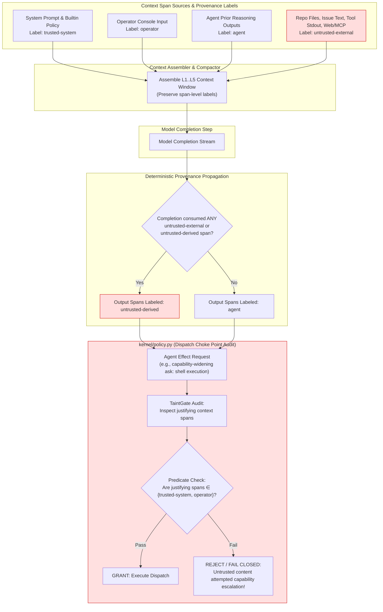

# Core Backend Features Workflow

This document details the primary backend features of the **AETHER LLM Orchestrator Harness**, including:
1. **Capability Authorization (CAR Model)** & Kernel Dispatch Lifecycle (`authorize` $\rightarrow$ `verify grant` $\rightarrow$ `acquire lease` $\rightarrow$ `dispatch` $\rightarrow$ `release`).
2. **Resource Governor** token & USD reservation workflow.
3. **TaintGate Security Propagation** & Untrusted Content Containment (Invariant **I11**).

---

## 1. Kernel Dispatch & CAR Model Authorization Workflow

Every side effect in AETHER must pass through the single dispatch choke point in `kernel/dispatch.py`. Verification occurs at the point of effect execution—not authorization time—preventing stale grant re-use.

---

## 2. Resource Governor Reserve-Commit-Release Workflow

Budget is reserved before execution to handle fan-out branch allocations correctly, rather than accounting after effects complete.

---

## 3. TaintGate Provenance & Capability Security Workflow (Invariant I11)

Context spans carry provenance labels. Untrusted spans (e.g. repo code, issue text, web search results, shell stdout) produce `untrusted-derived` LLM outputs. Untrusted content can *inform* work, but can **never satisfy policy predicates that grant or widen execution authority**.

## Key Feature Invariants

- **Grant Verification at Effect Time (I5)**: Capability grants are checked right before dispatching the effect, avoiding authorization race conditions.
- **Pre-Execution Budget Reservations**: `ResourceGovernor` reserves estimated costs to prevent runaway parallel branch overruns.
- **Taint Security Boundary (I11)**: Prompt injections in repo files or issues cannot hijack execution authority because untrusted-derived spans fail capability-widening policy predicates closed.
