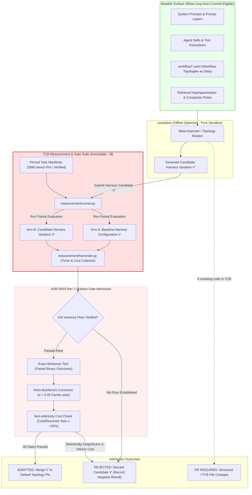

# Outer Loop & Meta-Improvement Workflow

This workflow documents the outer evolution loop of **AETHER**, detailing offline meta-prompt/topology optimization, holdout gate evaluation, exact McNemar statistical significance testing with Holm–Bonferroni family-wise error rate control, and the immutable Trusted Computing Base (TCB) boundaries.



## Outer Loop Execution Sequence

```mermaid
sequenceDiagram
    autonumber
    participant Opt as evolution/ (Offline Optimizer)
    participant Manifest as measurement/manifests (TCB)
    participant Runner as measurement/runner.py (TCB)
    participant Stat as measurement/statistics.py (TCB)
    participant Repo as Harness Repository (Git)

    Note over Opt: Step 1: Candidate Generation
    Opt->>Opt: Mutate prompt / skill / workflow DAG topology
    Opt->>Runner: Evaluate candidate topology V' vs baseline V

    Note over Opt, Runner: Step 2: Seeded Paired Benchmark Run
    Runner->>Manifest: Load pinned SWE-bench task manifests
    Runner->>Runner: Execute Arm A (V) & Arm B (V') on identical task sequence
    Runner-->>Stat: Collect paired outcomes: (Pass_A, Pass_B) and (Cost_A, Cost_B)

    Note over Stat: Step 3: Rigorous Statistical Gating
    Stat->>Stat: Run Exact McNemar test on discordant pairs (b, c)
    Stat->>Stat: Apply Holm-Bonferroni correction across pre-declared gate family (α = 0.05)
    Stat->>Stat: Calculate Cost-per-Resolved-Task non-inferiority ratio (≤ +20%)

    alt Passed Holdout Gates & Cost Non-Inferiority
        Stat-->>Opt: Gate Verdict: PASS (Lift confirmed statistically significant)
        alt Change is strictly within Mutable Surface
            Opt->>Repo: Auto-commit updated workflow YAML / prompt
        else Change touches TCB code/spec
            Opt->>Repo: Open Pull Request for human tech lead review
        end
    else Failed Gate or Cost Inferiority
        Stat-->>Opt: Gate Verdict: REJECT
        Opt->>Opt: Log ablation result (Record negative finding, do not merge)
    end
```

## Core Outer Loop Invariants

1. **TCB Immutability (I8)**: The meta-loop and offline optimizer (`evolution/`) can never auto-commit changes to TCB components (`kernel/`, `measurement/`, `workflow/schema`, task manifests). Changes to TCB require an explicit PR and human review.
2. **Absolute + Lift Dual Metric**: No benchmark resolve rate is published as an absolute number without reporting the **lift** (delta over a bare model call on identical tasks).
3. **Exact McNemar + Holm–Bonferroni**: Admissions require paired binary McNemar testing with family-wise error rate control ($\alpha = 0.05$), coupled with a cost-per-resolved-task non-inferiority check ($\le +20\%$).
