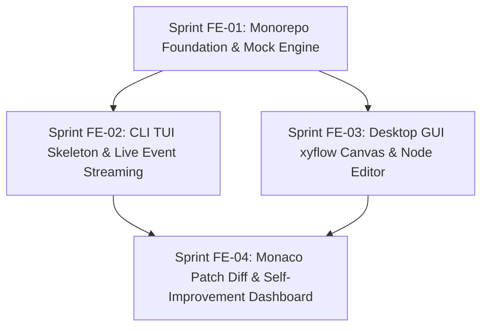

# Front-End Execution Roadmap (`docs_front/agile/roadmap.md`)

This roadmap governs the sequencing of the AETHER Front-End Client Suite across four phased sprints.

---

## Sprint Phasing Matrix

| Sprint | Focus | Key Deliverables | Dependencies |
| :--- | :--- | :--- | :--- |
| **[Sprint FE-01](sprints/sprint-fe-01.md)** | Monorepo Setup & `@aether/core` | `src_front/` structure, Zustand stores, `MockCassettePlayer`, event schemas | None |
| **[Sprint FE-02](sprints/sprint-fe-02.md)** | CLI TUI Development (`apps/cli`) | React + Ink terminal interface, `<TurnLogStream>`, `<BudgetMeter>`, CLI runner | [FE-01](sprints/sprint-fe-01.md) |
| **[Sprint FE-03](sprints/sprint-fe-03.md)** | Desktop GUI Canvas (`apps/desktop`) | Tauri v2 shell, `xyflow` DAG graph editor, node socket routing | [FE-01](sprints/sprint-fe-01.md) |
| **[Sprint FE-04](sprints/sprint-fe-04.md)** | Advanced Views & Integration | Monaco Editor side-by-side patch diffing, McNemar chart dashboard, live backend WS integration | [FE-02](sprints/sprint-fe-02.md), [FE-03](sprints/sprint-fe-03.md) |
