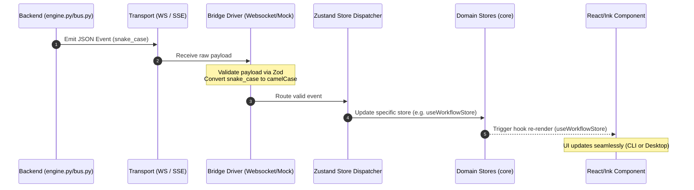
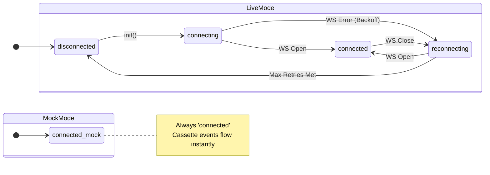
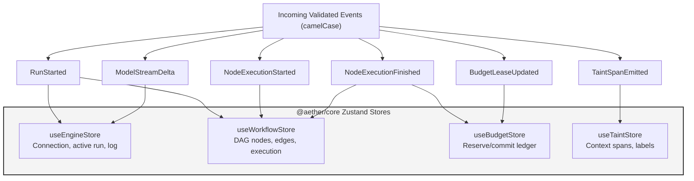
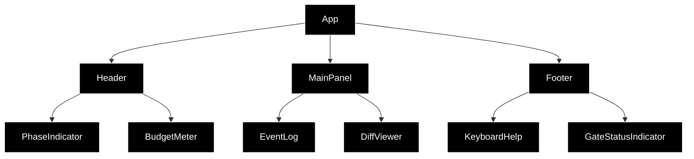
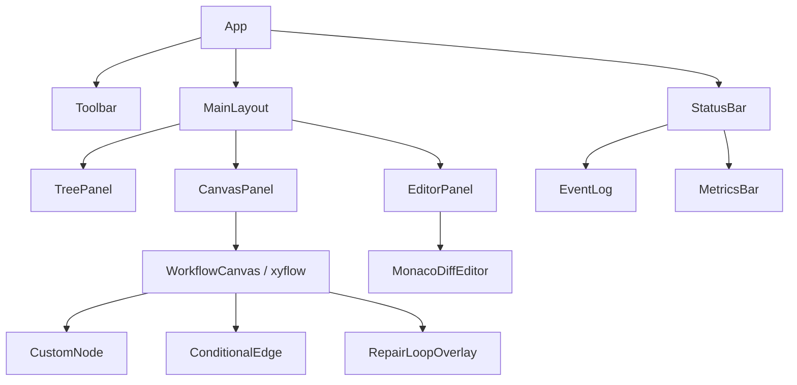
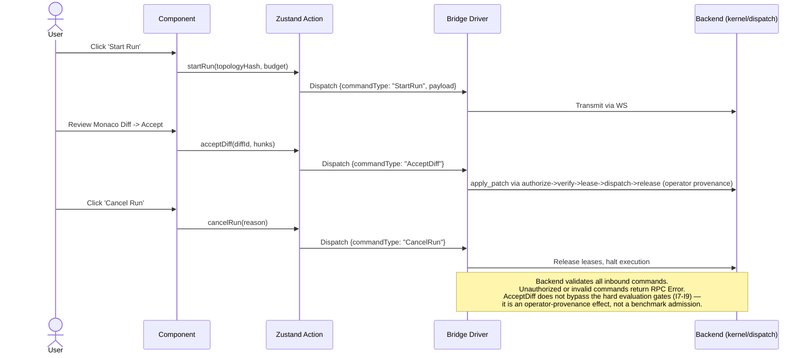
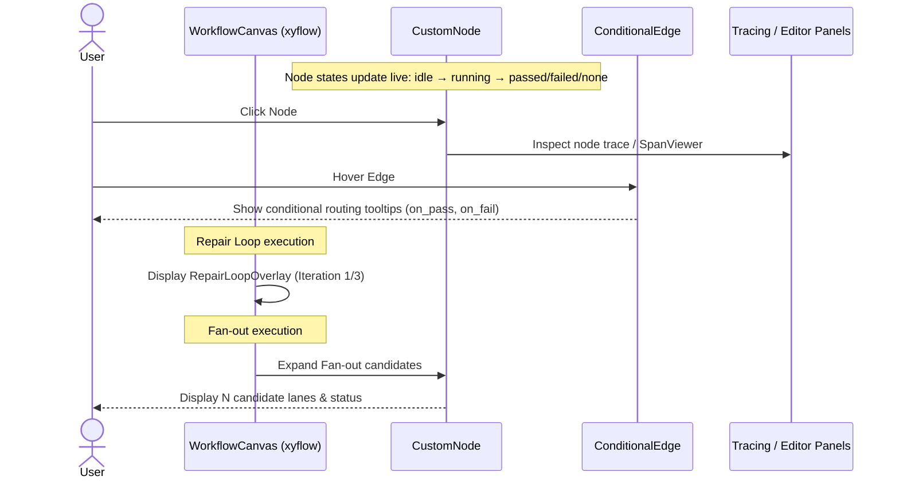

# SYSTEM_WORKFLOWS_AND_DIAGRAMS — Front-End Component Spec

This document details the visual flows, data pipelines, state management dispatching, and interaction models of the AETHER front-end applications (`apps/cli` and `apps/desktop`). 

---

## Diagram 1 — Event Stream Flow (Engine → Store → Component)

This sequence diagram illustrates the unidirectional data flow (FI-1) from the headless backend out to the React and Ink view layers. Notice that events are validated and normalized before hitting the state stores.



---

## Diagram 2 — Bridge Driver State Machine

The client drivers manage the connectivity lifecycle securely and transparently. In Mock mode, network states are bypassed to maintain component determinism (FI-3).



---

## Diagram 3 — Store Dispatch Topology

All shared logic lives in `@aether/core` (FI-2). The bridge driver dispatches backend events directly to the appropriate decoupled Zustand stores, updating different slices of the application state asynchronously.



---

## Diagram 4 — CLI Component Hierarchy

The TUI CLI is powered by React 19 + Ink. It renders purely text-based Flexbox layouts designed for constrained terminal window sizes while tapping into the exact same hooks as the desktop counterpart.



---

## Diagram 5 — Desktop GUI Component Hierarchy

The Desktop app utilizes Tauri v2 for native framing, rendering a React 19 SPA optimized for deep visibility into system execution, patching, and tracing.



---

## Diagram 6 — User Command Flow (Client → Engine)

When the operator decides to intervene, authorize patches, or stop a run, actions flow backwards to the engine (FI-4) via structured JSON-RPC command primitives.



---

## Diagram 7 — Mock vs Live Mode Switching

Seamless testing and parallel development is enforced by the injection of the underlying stream implementation (FI-3). Both the live WS client and the mock cassette player fulfill the same contract.

```mermaid
flowchart TD
    INIT[App Startup]
    CHK{Check Env / Config}
    
    INIT --> CHK
    
    CHK -- "Mode = Live" --> LM[AetherWebsocketClient]
    CHK -- "Mode = Mock" --> MM[MockCassettePlayer]
    
    LM -- "Real WS Events" --> HOOK[useAetherStream]
    MM -- "Cassette JSON Events" --> HOOK
    
    HOOK --> COMP[React View Components]
    
    Note right of COMP: No conditional logic<br/>inside components.
```

---

## Diagram 8 — DAG Canvas Interaction Flow (Desktop)

The `xyflow` graph is the primary interactive surface for the user to understand what the orchestration loop is doing. Actions on the DAG directly expose telemetry.


