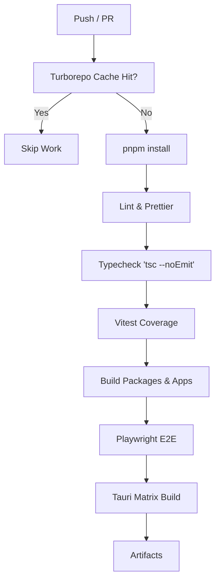

# Front-End TECH_STACK_AND_INFRASTRUCTURE — Pre-Phase 1 Engineering Specification

**Owners**: Principal Frontend Documentation Specialist · Principal Architect
**Standing**: `rationale`. Nothing here overrides `../architecture.md` or the ADRs; where a choice below can be a contract in code, the code is the contract and this file navigates. Every selection carries a **rejection trigger** — the measured condition under which it is replaced — in keeping with the backend's `../../docs/development/tech_stack_and_infra.md` philosophy.

---

## 1. Runtime & Build Toolchain

The foundational build system and runtime environments. We prioritize strictness, zero-bloat, and exact reproducability across all CI/CD pipelines.

| Item | Decision | Justification | Rejection trigger |
|:--|:--|:--|:--|
| Runtime | **Node.js LTS** (pin `>=22.x`) | LTS releases provide stable ABIs for native modules (e.g., Tauri IPC, canvas rendering). | Security deprecation or native module incompatibility across Windows/Linux matrix. |
| Language | **TypeScript 5.x** (pin `~5.5`) | Strict static analysis is mandated by FI-5. | Significant compiler performance regressions without mitigation. |
| UI Framework | **React 19** | Concurrent rendering features and ecosystem scale. Shared across CLI and Desktop. | Fundamental architectural drift making hook reuse impossible between Ink and React DOM. |
| Package Manager | **pnpm 9.x** | Workspace support, strict hoisting by default, fast isolated `node_modules`. | Broken symlink resolution in Tauri build pipelines on Windows. |
| Task Runner | **Turborepo** (`turbo`) | Granular caching for monorepo tasks (build, lint, test). Essential for fast CI. | Cache poisoning bugs affecting reproducible CI builds. |

---

## 2. Library & Dependency Matrix

The bar for entry: **zero-bloat; a dependency enters only when it is load-bearing for an invariant or a measured gate.** Every row names its owner seam so no library leaks across a port (FI-2, FI-4).

| Concern | Library | Version pin | Owner seam | Justification / notes |
|:--|:--|:--|:--|:--|
| UI Core | **React** | `~19.0.0` | `@aether/core`, `apps/*` | Shared across both applications. Concurrent mode enabled. |
| State Management | **Zustand** | `~5.0.0` | `@aether/core` | Minimal boilerplate, hook-based, external to React tree. Redux rejected due to verbosity. |
| Event Validation | **Zod** | `~3.23` | `@aether/core/schemas` | Strict parsing of WS events (FI-5). `yup` rejected for TS inference weakness. |
| CLI UI Rendering | **Ink** | `~5.0.0` | `apps/cli` | React renderer for terminal. (ADR-F002). |
| Desktop Canvas | **xyflow (React Flow)** | `~12.0.0` | `apps/desktop/canvas` | Industry-standard DAG rendering. (ADR-F003). |
| Code Editor | **@monaco-editor/react** | `~4.6.0` | `apps/desktop/diff` | VSCode-grade editor for diffs. `CodeMirror` rejected for inferior TS support. |
| Desktop Styling | **Tailwind CSS** | `~4.0` | `@aether/ui-components` | Utility-first. JIT mode. Emotion/Styled-components rejected due to runtime cost. |
| Desktop Shell | **Tauri v2** (`@tauri-apps/api`) | `~2.0.0` | `apps/desktop` | Rust shell for OS integration. Electron rejected due to bundle size ($<15$MB target). |
| WS Transport | **ws** (Node) / Native | `~8.17` | `@aether/core/client` | Bridge transport. Engine neutral. |
| CLI Bundler | **tsup** | `~8.0` | `apps/cli` | Zero-config esbuild wrapper for Node CLIs. |
| Desktop Bundler | **Vite** | `~6.0` | `apps/desktop` | Fast HMR for React DOM. Webpack rejected due to speed. |
| Unit Testing | **Vitest** | `~2.0` | All packages | Vite-native, API compatible with Jest. Jest rejected due to ESM complexity. |
| Desktop Testing | **React Testing Library** | `~16.0` | `apps/desktop` | DOM testing for the Tauri webview logic. |
| CLI Testing | **ink-testing-library** | `~3.0` | `apps/cli` | Assertions for Ink TUI nodes. |
| E2E Testing | **Playwright** | `~1.45` | `apps/desktop/e2e` | Cross-browser, webview testing for Tauri apps. Cypress rejected due to architecture. |

---

## 3. Monorepo Configuration

The monorepo leverages `pnpm` workspaces and Turborepo for strict boundary enforcement and fast builds, defined in ADR-0001.

### 3.1 pnpm-workspace.yaml

```yaml
# F:\Coding\Harness-D-power\src_front\pnpm-workspace.yaml
packages:
  - "packages/*"
  - "apps/*"
```
*Justification*: Strict isolation. The `core` logic must not depend on `apps`.

### 3.2 turbo.json Pipeline Configuration

```json
{
  "$schema": "https://turbo.build/schema.json",
  "pipeline": {
    "build": {
      "dependsOn": ["^build"],
      "outputs": ["dist/**", "build/**"]
    },
    "test": {
      "dependsOn": ["^build"],
      "outputs": ["coverage/**"]
    },
    "lint": {
      "outputs": []
    },
    "typecheck": {
      "dependsOn": ["^typecheck"],
      "outputs": []
    },
    "dev": {
      "cache": false,
      "persistent": true
    }
  }
}
```

### 3.3 Root package.json Scripts

```json
{
  "name": "aether-front-monorepo",
  "version": "1.0.0",
  "private": true,
  "scripts": {
    "dev": "turbo run dev",
    "build": "turbo run build",
    "test": "turbo run test",
    "lint": "turbo run lint",
    "typecheck": "turbo run typecheck",
    "clean": "turbo run clean && rm -rf node_modules"
  },
  "devDependencies": {
    "turbo": "^2.0.0",
    "typescript": "~5.5.0",
    "eslint": "^8.0.0"
  }
}
```

### 3.4 Workspace Dependency Hoisting Rules
We utilize pnpm's strict isolation (`shamefully-hoist=false`). A package can only access dependencies explicitly declared in its own `package.json`. No phantom dependencies are allowed to cross the `apps/` boundary.

---

## 4. TypeScript Configuration

Strict typing is mandatory to guarantee alignment with the backend event schemas (FI-5).

### 4.1 Strict Mode Settings
All packages inherit from a base `tsconfig.base.json`.

```json
{
  "compilerOptions": {
    "strict": true,
    "noImplicitAny": true,
    "strictNullChecks": true,
    "exactOptionalPropertyTypes": true,
    "noUncheckedIndexedAccess": true,
    "skipLibCheck": true,
    "forceConsistentCasingInFileNames": true,
    "isolatedModules": true,
    "moduleResolution": "bundler",
    "esModuleInterop": true
  }
}
```

### 4.2 Path Aliases
Path aliases are strictly controlled. They resolve exclusively to the workspace packages. Incremental builds via project references (`composite: true`) are used within the workspace.

```json
{
  "compilerOptions": {
    "paths": {
      "@aether/core/*": ["../../packages/core/src/*"],
      "@aether/mock-server/*": ["../../packages/mock-server/src/*"],
      "@aether/ui-components/*": ["../../packages/ui-components/src/*"]
    }
  }
}
```

### 4.3 ESLint Configuration & Import Boundaries
We enforce FI-1 and FI-2 through strict ESLint boundaries using `eslint-plugin-import`.
- `apps/cli` cannot import `apps/desktop`.
- View components cannot contain conditional mock logic (FI-3) — restricted via custom ESLint rule banning `@aether/mock-server` imports inside `.tsx` view files.

```javascript
module.exports = {
  plugins: ['import'],
  rules: {
    'import/no-restricted-paths': [
      'error',
      {
        zones: [
          {
            target: './apps/cli/src',
            from: './apps/desktop/src',
            message: 'CLI cannot import Desktop logic.'
          },
          {
            target: './packages/core/src',
            from: './apps',
            message: 'Core logic must remain agnostic to applications.'
          },
          {
            target: './apps/**/*.tsx',
            from: './packages/mock-server/src',
            message: 'FI-3: No conditional mock logic in view components.'
          }
        ]
      }
    ]
  }
};
```

---

## 5. Zustand Store Typings & Boundary (FI-1 & FI-2)

As detailed in `../architecture.md`, the front-end maintains six distinct Zustand stores within `@aether/core`. The core abstraction enforces FI-1 (All UI state derives from events over the bridge).

### 5.1 Event Schemas (Zod)

The bridge boundary is secured via Zod schemas, generated strictly from the backend's `domain/events.py`.

```typescript
import { z } from "zod";

export const NodeGateStatusSchema = z.enum(["IDLE", "RUNNING", "PASSED", "FAILED", "NONE"]);
export type NodeGateStatus = z.infer<typeof NodeGateStatusSchema>;

export const EngineEventSchema = z.discriminatedUnion("type", [
  z.object({
    type: z.literal("NODE_STATUS_CHANGED"),
    nodeId: z.string(),
    status: NodeGateStatusSchema,
    timestamp: z.number(),
  }),
  z.object({
    type: z.literal("BUDGET_RESERVED"),
    leaseId: z.string(),
    dims: z.object({
      usdMicros: z.number().int(),
      promptTokens: z.number().int(),
      completionTokens: z.number().int(),
      wallClockMs: z.number().int(),
      concurrencySlots: z.number().int()
    })
  })
]);
export type EngineEvent = z.infer<typeof EngineEventSchema>;
```

### 5.2 Store Interfaces

The Zustand stores hold derived state. They are updated solely by the bridge adapter subscribing to `EngineEventSchema`.

```typescript
// packages/core/src/stores/useWorkflowStore.ts
import { create } from 'zustand';

export interface WorkflowState {
  topologyId: string | null;
  nodes: Array<{ id: string, kind: string, status: NodeGateStatus }>;
  edges: Array<{ source: string, target: string, condition: 'always' | 'on_pass' | 'on_fail' }>;
  repairLoops: Array<{ fromNode: string, viaNodes: string[], maxIterations: number }>;
  
  // Internal actions triggered by Event Dispatcher
  _updateNodeStatus: (nodeId: string, status: NodeGateStatus) => void;
}

export const useWorkflowStore = create<WorkflowState>((set) => ({
  topologyId: null,
  nodes: [],
  edges: [],
  repairLoops: [],
  _updateNodeStatus: (nodeId, status) => 
    set((state) => ({
      nodes: state.nodes.map(n => n.id === nodeId ? { ...n, status } : n)
    }))
}));
```

### 5.3 Bridge Driver Interfaces
The core package exports generic interfaces for bridge drivers, allowing the application entry point to inject either a real WebSocket client or the Mock Cassette player without the store layer ever knowing.

```typescript
export interface AetherEventStreamDriver {
  connect: (url?: string) => Promise<void>;
  disconnect: () => void;
  sendAction: (action: any) => void;
  onEvent: (callback: (event: EngineEvent) => void) => () => void;
}
```

---

## 6. Tauri v2 Configuration

Tauri provides the native desktop shell for the visual workflow application.

### 6.1 tauri.conf.json Structure

```json
{
  "$schema": "../node_modules/@tauri-apps/cli/schema.json",
  "build": {
    "beforeBuildCommand": "pnpm run build",
    "beforeDevCommand": "pnpm run dev",
    "devUrl": "http://localhost:1420",
    "frontendDist": "../dist"
  },
  "app": {
    "security": {
      "csp": "default-src 'self'; connect-src ws://localhost:* http://localhost:*;"
    },
    "windows": [
      {
        "title": "AETHER Orchestrator",
        "width": 1200,
        "height": 800,
        "resizable": true,
        "fullscreen": false
      }
    ]
  }
}
```

### 6.2 Capability-based Permissions
By default, Tauri v2 blocks all OS integrations. We explicitly grant:
- `fs:read` for the local workspace directories, allowing the Monaco editor to mount local git patches.
- `shell:open` for opening external links.
- No arbitrary remote HTTP fetching (enforced by CSP).
- `http:request` strictly bounded to localhost for fetching backend resources if needed.

### 6.3 Build Targets & Webviews
- **Windows**: MSVC toolchain, targeting `x86_64-pc-windows-msvc`. Renders via WebView2. Installer size is kept under 15MB.
- **Linux**: GNU toolchain (`x86_64-unknown-linux-gnu`). Renders via WebKitGTK.

### 6.4 Cargo.toml Dependencies
The Rust backend for the frontend shell is kept intentionally minimal to prevent logic leakage.
```toml
[package]
name = "aether-desktop"
version = "1.0.0"
description = "AETHER Orchestrator Desktop Client"
authors = ["AETHER Project"]
edition = "2021"

[dependencies]
tauri = { version = "2.0.0", features = [] }
tauri-plugin-shell = "2.0.0"
tauri-plugin-fs = "2.0.0"
serde = { version = "1.0", features = ["derive"] }
serde_json = "1.0"
```

### 6.5 Asset Bundling
All assets are aggressively optimized via Vite during the production build. SVGs are inlined, and fonts are self-hosted to ensure offline viability. Tauri embeds these into the final binary.

---

## 7. Testing Strategy

All logic is rigorously tested to maintain deterministic behavior against the event stream. The frontend strictly follows the reproducible philosophy of the backend harness.

### 7.1 Unit Tests
- **Tool**: Vitest.
- **Scope**: Zustand stores, core React hooks, WS client adapters, Zod schema validation.
- **Goal**: 100% coverage on all state transitions within `@aether/core`. The core test suite executes without DOM emulation.

### 7.2 Component Tests
- **Desktop**: React Testing Library for verifying node renders, diff viewers, and UI components.
- **CLI**: `ink-testing-library` for asserting terminal output sequences.

### 7.3 Integration Tests
- **Mock Cassette Replay**: Utilizing `@aether/mock-server`. A pre-recorded JSON cassette of a backend session is played through the complete `useEngineStore` pipeline. Tests assert the final DAG state and UI render. 
- *Rejection Trigger*: If a UI state cannot be deterministically reproduced via a cassette, the component violates FI-1.

### 7.4 E2E Testing
- **Playwright** is used to launch the built Tauri binary (via electron/CDP bridge adaptations) and verify the critical path: connecting to a mock port, expanding a node, and rendering a diff.

### 7.5 Screenshot Regression
CI runs visual regression tests on the xyflow canvas against frozen states to catch unintended CSS or node layout regressions.
- Coverage Targets: > 90% for `@aether/core`, > 85% for UI components.

---

## 8. CI/CD Pipeline

The monorepo relies on GitHub Actions for strict CI enforcement.

### 8.1 Pipeline Structure



### 8.2 Tauri Build Matrix
GitHub Actions matrix runs on `windows-latest` and `ubuntu-latest`.
- Linux requires `webkit2gtk-4.1` dependencies pre-installed on the runner.
- Windows uses pre-installed MSVC tools.

### 8.3 Packaging and Artifacts
- **CLI**: Published via `npm publish` and executable via `npx aether-cli`.
- **Desktop**: Artifacts generated include `.msi` (Windows) and `.deb` / `.AppImage` (Linux). Uploaded to GitHub Releases.

---

## 9. Development Workflow

The local developer loop prioritizes speed and parallel iteration.

### 9.1 Parallel Dev Servers
Running `pnpm dev` at the root invokes Turborepo, parallelizing:
- Vite HMR server for `apps/desktop` (port 1420).
- Ink hot-reload watcher for `apps/cli`.
- `tsc -w` for `@aether/core`.

### 9.2 Mock Mode by Default
To adhere to FI-3 and enable parallel front-end/back-end dev, the front-end always defaults to "Mock Mode". It uses `@aether/mock-server` to stream cassette data simulating a real session.

```typescript
// Example instantiation within apps/desktop/src/main.tsx
import { initMockDriver } from '@aether/core';

if (import.meta.env.MODE === 'development' && !import.meta.env.VITE_LIVE_WS_URL) {
  // FI-3 compliance: This logic resides in the entry point, NEVER inside view components.
  initMockDriver('swe_bench_pass.json');
}
```

### 9.3 Live Mode Connections
Setting `VITE_LIVE_WS_URL=ws://localhost:8000/stream` switches the transport layer to the live WebSocket backend. The stores (`useWorkflowStore`, etc.) remain completely unaware of this switch, ensuring absolute separation of concerns.
Hot Module Replacement (HMR) seamlessly applies view updates without interrupting the active live connection in the desktop GUI.

---

## 10. Budget Ledger Visualization (FI-1)

Following the backend's strict budget handling (reserve/commit/release), the UI visualizes these operations through `useBudgetStore`.

### 10.1 Store State & BudgetDims

```typescript
// packages/core/src/types/budget.ts
export interface BudgetDims {
  usdMicros: number;
  promptTokens: number;
  completionTokens: number;
  wallClockMs: number;
  concurrencySlots: number;
}

// packages/core/src/stores/useBudgetStore.ts
export interface BudgetState {
  reserved: BudgetDims;
  committed: BudgetDims;
  remaining: BudgetDims;
  overruns: Array<{ id: string, amount: BudgetDims, timestamp: number }>;
}
```

### 10.2 Rendering Metrics
The GUI implements a dual-bar visualization (reserved vs committed) to instantly highlight overruns. The CLI implements this as a compact horizontal textual gauge. Both derive purely from the backend's exact measurements.

---

## 11. Explicitly Rejected Technologies

(Recorded so they are not re-litigated, matching the backend convention)

1. **Redux / RTK**: Rejected for state management. Verbosity and boilerplate outweigh the benefits for a localized, domain-specific DAG viewer. Zustand provides equivalent DevTools integration with a fraction of the code.
2. **Webpack**: Rejected for bundler. Vite's esbuild-powered dev server and Rollup production build are significantly faster.
3. **Electron**: Rejected for desktop shell. A memory and binary size overhead that contradicts our lightweight harness principles. Tauri v2 meets all requirements.
4. **Native Rust TUIs (Ratatui, Cursive)**: Rejected. We forfeit sharing UI domain logic with the web view. React+Ink allows us to reuse 100% of the Zustand stores and hooks.
5. **Tailwind CSS v3**: Rejected. We enforce Tailwind v4 for its CSS-first configuration model and removal of `tailwind.config.js` bloat.
6. **CodeMirror**: Rejected. Inferior built-in TypeScript support compared to Monaco Editor for diff viewing and syntax highlighting.
7. **yup / Joi**: Rejected. Zod is structurally superior for TypeScript inference, aligning directly with our FI-5 mandate for rigid bridge boundaries.
8. **Cypress**: Rejected. Playwright's native cross-browser and webview integration fits Tauri's architecture seamlessly, whereas Cypress struggles with non-standard DOM environments.
9. **Yarn / npm**: Rejected as primary package manager. `pnpm`'s strict hoisting prevents phantom dependencies, which is critical for ensuring UI components don't accidentally import server/node-only logic.
