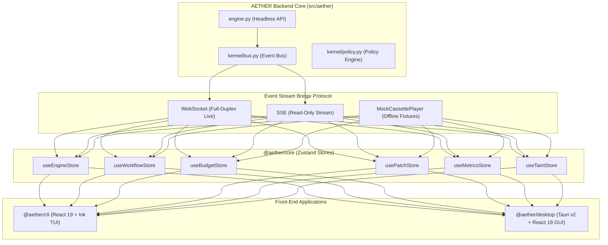

# AETHER Front-End Visual Workflows & Diagrams (`docs_front/workflows`)

Welcome to the visual documentation suite for the **AETHER Front-End Client Suite**. This directory contains comprehensive **Mermaid workflow diagrams** capturing system architecture, monorepo topology, event stream contracts, visual DAG routing, security audit trails, and self-improvement loops.

---

## 🗺️ Visual Workflows Index

| Diagram Document | Scope | Description |
| :--- | :--- | :--- |
| [`architecture_and_topology.md`](./architecture_and_topology.md) | Architecture | High-level system altitude, monorepo package lattice (`src_front/`), and Zustand store topology. |
| [`event_stream_bridge.md`](./event_stream_bridge.md) | Transport | Dual-mode WebSocket/SSE client and `MockCassettePlayer` deterministic replay event streams. |
| [`dag_execution_routing.md`](./dag_execution_routing.md) | Workflow DAG | Visual node graph rendering, tri-state `GateStatus` routing, repair loops, and Best-of-N fan-out lanes. |
| [`security_and_taint_audit.md`](./security_and_taint_audit.md) | Security | TaintGate provenance span labeling, unprivileged consumer rules, and policy authorization choke points. |
| [`patch_review_and_metrics.md`](./patch_review_and_metrics.md) | Advanced Views | Monaco side-by-side patch diff reviewer and McNemar statistical self-improvement A/B test dashboard. |

---

## 🎨 System Architectural Overview

