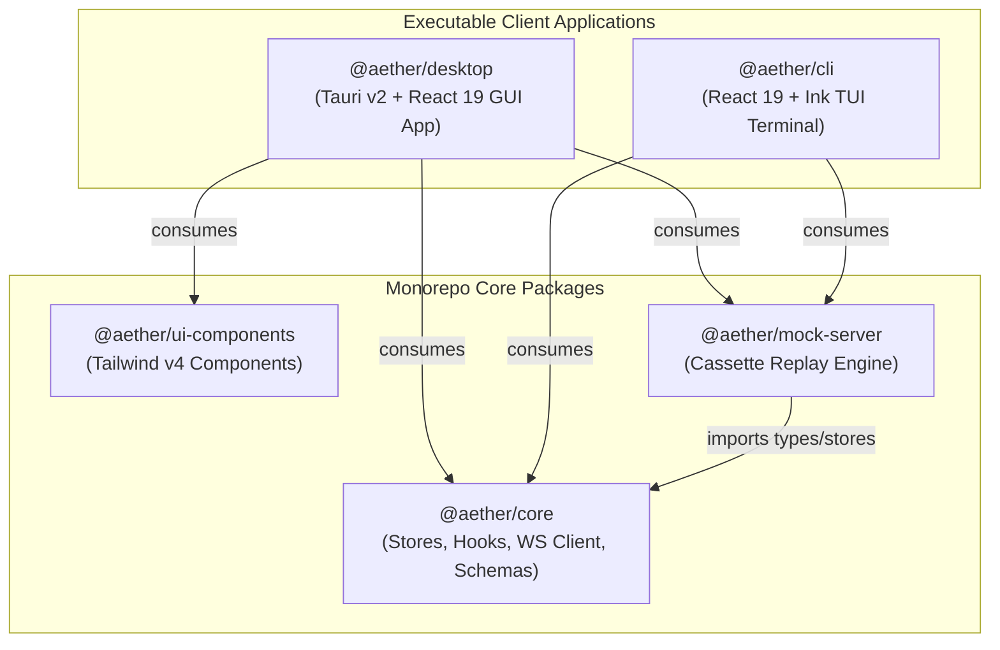
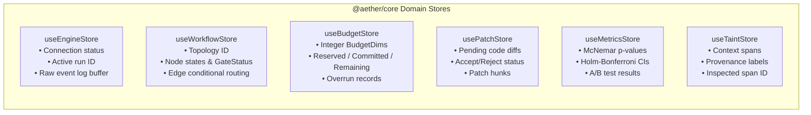
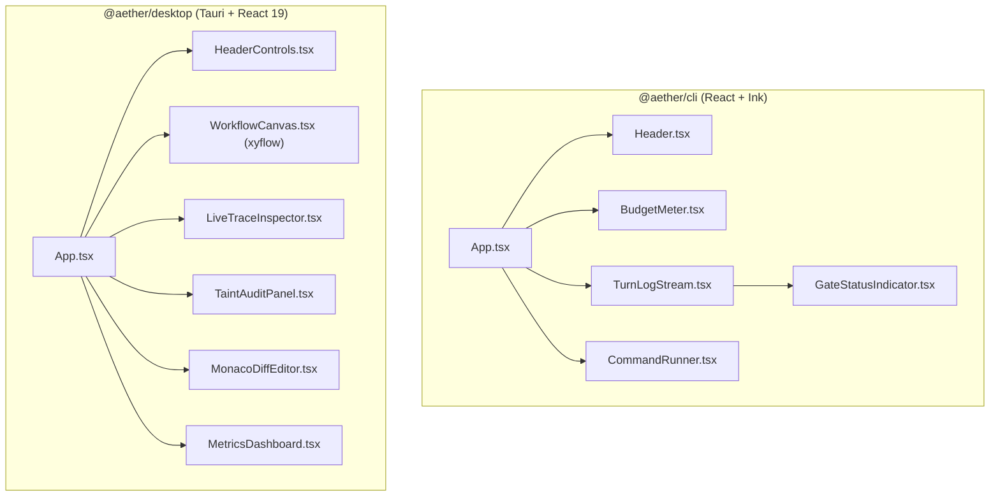

# Architecture & Monorepo Topology Workflows (`docs_front/workflows/architecture_and_topology.md`)

This document visually details the monorepo package structure, dependency rules, and Zustand state store topology across `src_front/`.

---

## 1. Monorepo Package Lattice & Import Boundaries

All code resides in `src_front/` managed via **pnpm workspaces** and **Turborepo**. Direct imports from backend `src/aether/` are strictly forbidden (FI-1 invariant).

---

## 2. Partitioned Zustand Domain Store Topology

State management in `@aether/core` is partitioned into **six independent domain stores** to prevent cross-store re-render pollution.

---

## 3. UI Component Hierarchy & View Wiring

