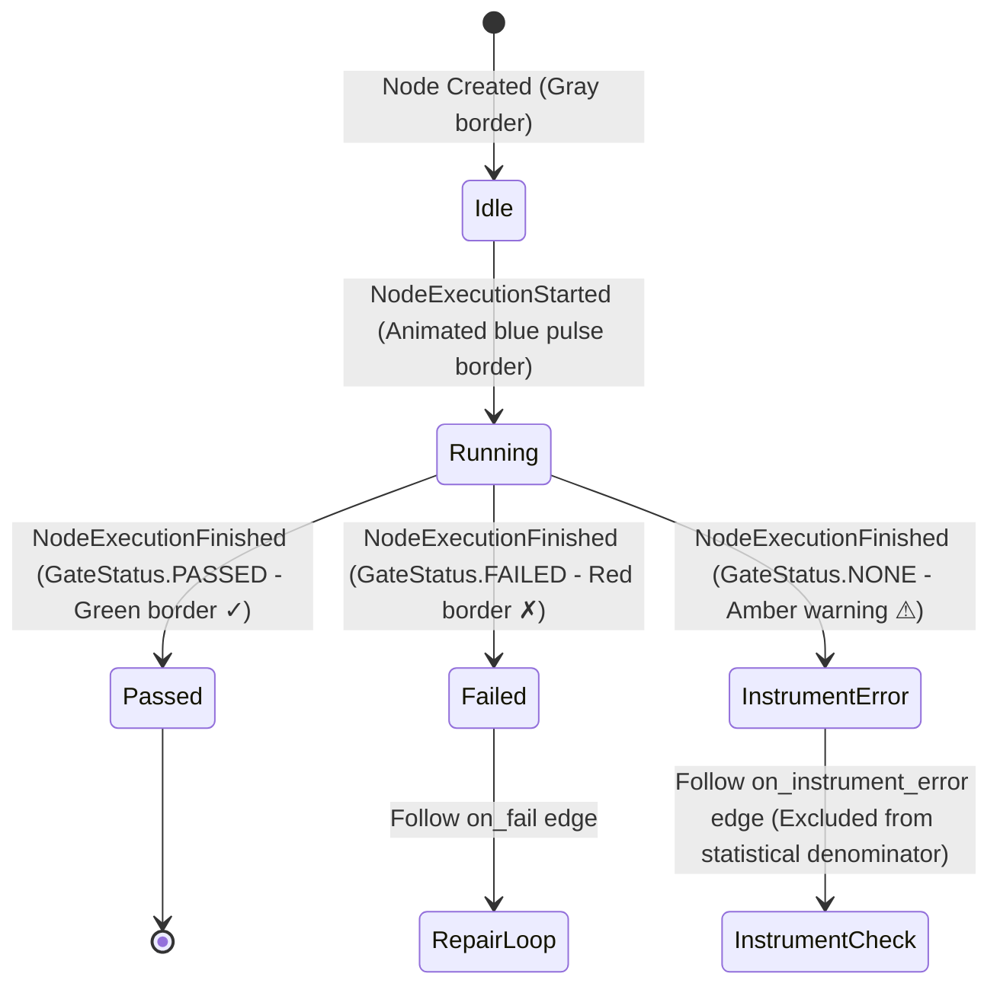
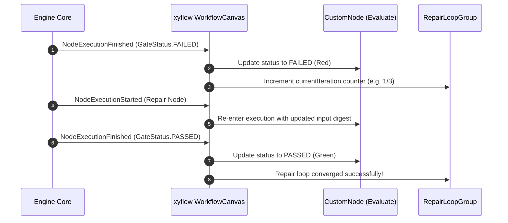

# DAG Execution & Routing Workflows (`docs_front/workflows/dag_execution_routing.md`)

This document visually details workflow topology execution, tri-state `GateStatus` routing, repair loop cycling, and fan-out candidate lane rendering.

---

## 1. Tri-state `GateStatus` Node State Transitions

Every node on the canvas reflects its execution state using backend tri-state `GateStatus` (`domain/gate.py`). `NONE` represents an *instrument error* (e.g. container OOM crash, sandbox timeout) and is **never silently passed** (B4 rule).



---

## 2. DAG Topology Conditional Edge Routing

```mermaid
flowchart LR
    Retrieve["Retrieve Node"] -->|always (Solid Gray)| Generate["Generate Patch Node"]
    Generate -->|on_pass (Solid Green)| Apply["Apply Patch Node"]
    Apply -->|always (Solid Gray)| Evaluate["Evaluate Hard Gate"]

    Evaluate -->|on_pass (Solid Green)| Complete["Run Completed"]
    Evaluate -->|on_fail (Dashed Red)| Repair["Repair Iteration Node"]
    Evaluate -->|on_instrument_error (Dotted Amber)| FlagError["Flag Instrument Error"]

    Repair -->|iteration < maxIterations| Evaluate
```

---

## 3. Repair Loop Sub-graph Iteration Cycle


