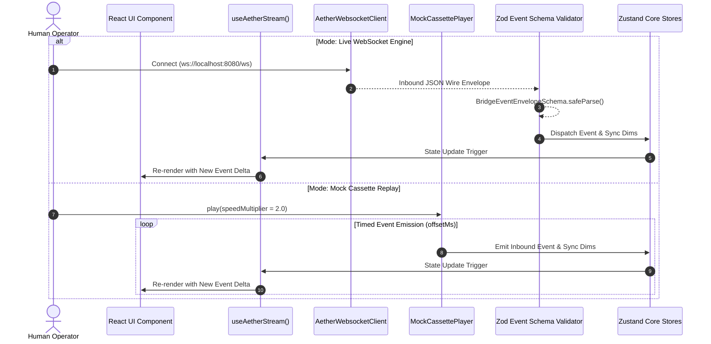
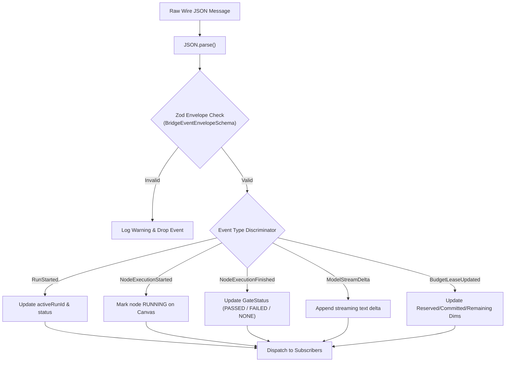

# Event Stream Bridge Workflows (`docs_front/workflows/event_stream_bridge.md`)

This document visually details the event stream protocol, Zod wire deserialization, and dual-mode execution (Live WebSocket vs Mock Cassette Replay).

---

## 1. Dual-Mode Stream Ingestion Sequence

Every UI component in `@aether/cli` and `@aether/desktop` consumes stream events via the unified `useAetherStream` hook, remaining transparent to whether events come from live WebSocket or mock cassette replay (FI-3 invariant).

---

## 2. Inbound Wire Event Payload Processing Flow

