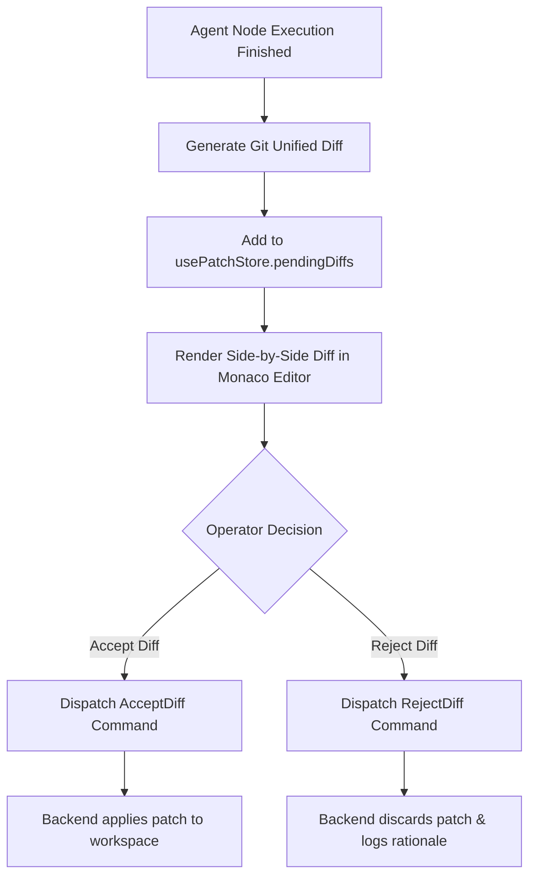
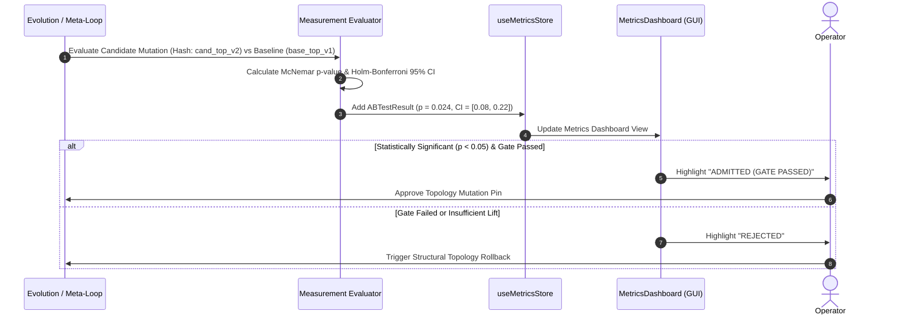

# Patch Review & Metrics Workflows (`docs_front/workflows/patch_review_and_metrics.md`)

This document visually details Monaco Editor patch diff review workflows and McNemar statistical self-improvement A/B testing loops.

---

## 1. Monaco Side-by-Side Patch Review & Patch Decision Workflow

When an agent node produces code modifications, the diff is stored in `usePatchStore` and rendered inside `MonacoDiffEditor.tsx` before committing.

---

## 2. McNemar Statistical Self-Improvement A/B Test Loop

When the meta-loop proposes topology, prompt, or skill mutations, A/B benchmark evaluation is conducted. The front-end renders McNemar statistical tests and Holm–Bonferroni confidence intervals ($\alpha = 0.05$).

