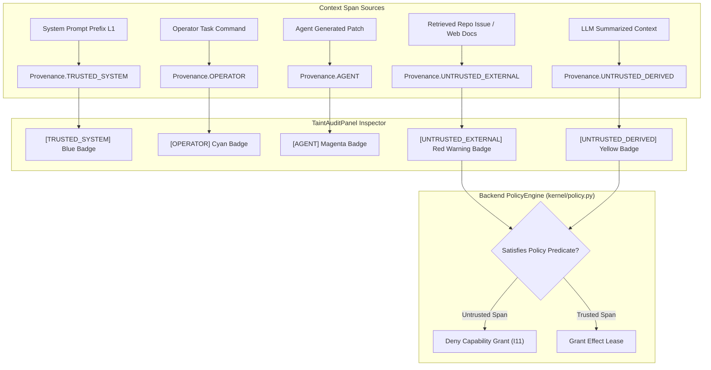
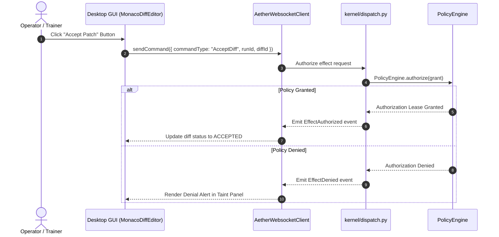

# Security & Taint Audit Workflows (`docs_front/workflows/security_and_taint_audit.md`)

This document visually details TaintGate provenance tracking, prompt layer security assembly, and front-end unprivileged action authorization.

---

## 1. Context Span Provenance Labeling & Taint Audit

Every context span used during LLM prompt assembly carries a provenance label (`domain/taint.py`, ADR-0015). Untrusted spans can never acquire capability grants (I11 invariant).

---

## 2. Unprivileged Consumer & Action Authorization Flow

The front-end is an unprivileged consumer (FI-4 rule). Operator actions (such as `AcceptDiff` or `StartRun`) are dispatched to the engine and must pass through `PolicyEngine.authorize()` in `kernel/dispatch.py`.

